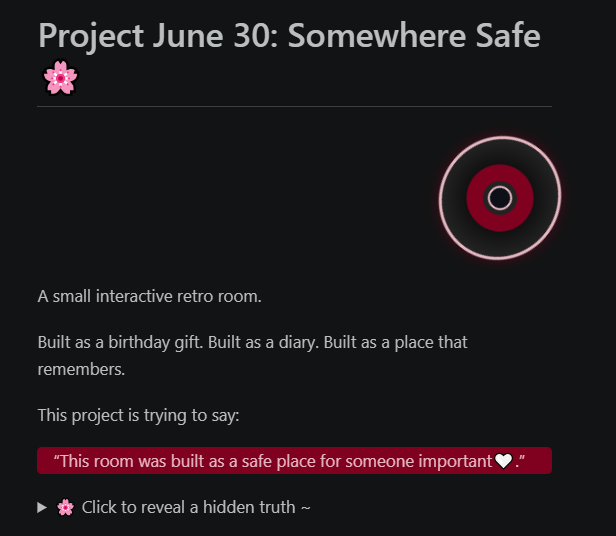

# Project June 30: Somewhere Safe 🌸
<!-- 2. هيكل المشغل التفاعلي البديل للشريط الأبيض -->

<div class="cd-player-container" title="Click to Play / Pause Music">
  <!-- القرص البصري الذي يراه المستخدم ويدور -->
  <div class="retro-cd"></div>
  
  <!-- مشغل الصوت الفعلي المخفي بالخلف -->
  <audio class="hidden-audio-trigger" controls loop>
    <source src="assets/audio/Yann Tiersen - Comptine d'un autre été.mp3" type="audio/mpeg">
  </audio>
</div>

A small interactive retro room.

Built as a birthday gift.
Built as a diary.
Built as a place that remembers.

This project is trying to say:

>“This room was built as a safe place for someone important🤍.”

<div class="clean-modular-log">
  <input type="checkbox" id="hidden-truth1" class="toggle-input" style="display:none;">
  <label for="hidden-truth1" class="log-trigger">
    🌸 Click to reveal a hidden truth 
  </label>
  <div class="log-content">


<span class="block">
<u>Hey love.</u>

Can i call you that?In a **respectefull** tone ofc. \
You..see at some point even i don't know,
What's the **Purpose** of this?\
But,i just want to let you know
I **swear** i don't have any motive behind all this\
From deep of my heart i just wanted to make something..make you happy and involved\
My intent is <b>**PURE**</b> this my way expressing my self..*the nerdy way~*.\
I feared this friendship..die and never pass [The 3 month rule Theory](#the-3-month-rule-theory).\
So am making a profound..base we can stand on.

</span>

</div>

## 📌 Table of Contents
- [1. Executive Summary](#1-executive-summary)
- [2. The Vision & Core Architecture](#2-the-vision--core-architecture)
- [3. Thesis](#3-thesis)
- [4. Project Backlog & Roadmap](#4-project-backlog--roadmap) 
- [5. Development Chronicles](#5-development-chronicles)
- [6. Complains & Unsent Truths](#6-complains--unsent-truths)
- [7. Topics](#7-topics)

## 1. Executive Summary
### Core Lore
>The room is trying to remember someone.

The room is trying to say something.\
The room is trying to express feelings that he had it hard to say out loud.\
The narrator is not fully reliable.\
Sometimes the room talks.\
Sometimes the game talks.\
Sometimes YOU talk through objects.\
The glitches are not bugs.\
They happen when emotions become “too direct”.\
The room struggles to express certain memories correctly.\
That’s why:\
names corrupt\
text breaks\
objects “remember” new dialogue later\
hidden diaries appear\
photos blur\
music changes tone\
The room is basically: a memory space.

<div class="clean-modular-log">
  <input type="checkbox" id="hidden-truth2" class="toggle-input" style="display:none;">
  <label for="hidden-truth2" class="log-trigger">
    🌸 Click to reveal a hidden truth 
  </label>

  <div class="log-content">

<span class="block">

Just letting you know..it's me

Your dear Omar (Day 3)~ \
I'ts also me who wrote the entire plot.
I deserve the credit.

Actually the glitchs are bugs!!\
While writing the code (*copying from AI*)\
I faced a bug..didnt know how to fix\
When I rush the dialogue..The words glitch\
So..i didn't want to fix it i made it a feature\
I built the entire Project around it.


</span>

</div>

## 2. The Vision & Core Architecture

### The Core Idea
---
Every object remembers something.\
Every interaction changes something.\
The room itself tries to understand the person living inside it.

### Why I Made This
---
I wanted to create something that feels personal.\
Not just a gift someone opens once and forgets.

A place to return to.\
A place that slowly reveals thoughts,\
memories,\
jokes,\
fears,\
and unfinished conversations.

### The Narrator
---
The narrator is not a person.

The room itself speaks.

Sometimes it sounds warm.
Sometimes confused.
Sometimes corrupted.

It watches.
It remembers.
It tries to explain things the owner never says directly.

Hey am Omar From (day 4) 
kidding~ am (day 3) .. just bored..
```
That was totaly random i know but you will get it   
later see ya .. down there kiddo ~
```
### Dynamic Interactions
---
- how many times they were clicked
- hidden progression states
- time of day
- discovered memories
- unlocked events

### Corrupted Memories
---

Some text becomes unreadable over time.

Not because of a bug.

Because the room itself is forgetting.

### Atmosphere
---
The experience changes through:
- ambient piano
- soft room sounds
- sudden silence during glitches
- day/night transitions
- typewriter pacing

### Development Notes
---
This project evolved slowly.

Some thoughts were added later.\
Some ideas changed completely.\
Some sections were rewritten after specific moments.

### Hidden Events
---
Some interactions only appear after:
- repeated clicks
- specific discoveries
- time changes
- silent triggers

### Somewhere Calm
---
Maybe rooms remember more than people do.

Maybe some feelings are easier to leave inside objects.

And maybe...
some places are built
just so someone can feel safe for a little while.

## 3. Thesis

I keep saying:
```
"It's a gift."
```
But when I read it, I don't just see a gift.

I see a record.

A person trying to preserve things before they disappear.

A person saying:

```
"This happened."

"I felt this."
 
"I was here."
 
"You were here."
```
before time turns it into a vague memory.


## 4. Project Backlog & Roadmap

### To Do List
- [X] 1. Add more content to the world
- [X] 2. Add more interactivity
- [X] 3. Add more sounds and music effects
- [X] 4. Add more visual effects
- [X] 5. Add more easter eggs and hidden surprises
- [ ] 6. Add explination for each part for how to..see this mark down like i see
- [X] 7. Add a table of content for easy navigation
- [X] 8. Add a table for progress tracking and updates
- [X] 9. Add a section for future plans and ideas..or maybe not..

lol now this feel am straight up talking to you not making tasks for my self..
ah if wich day is this its..23/5/2026

I just killed a monster who invaded my world.. i know crazy right? 

```
i dont know what to say either can u pretend u didnt see that?..
```
```
and yah am Omar..from (day 3) it's (day 2) ,3:00 am..but i think i told you that before..hmm it's down there..so i might say..am gonna tell you that in the future
```


### Layout Updates

| Date | Milestone / Change | State |
| :--- | :--- | :--- |
| 21/05/2026 | First Working Version Using AI prompts | Completed |
| 21/05/2026 | Rebuild the whole system and Created The HTML file and CSS From scratch | Completed |
| 22/05/2026 | Generated The background Image and Add Hitboxes for all the interactive Objects | Completed |
| 22/05/2026 | Added A modular Database For all the Interactive Objects | Completed |
| 23/05/2026 | Added the Sound effects For all the Interactive Objects  | Completed |
| 24/05/2026 | Acquired ambient piano soundtrack assets (*Amélie* theme) for room atmosphere. | Completed |
| 24/05/2026 | Re-architected core file structure and built professional Table of Contents. | Completed |
| 01/06/2026 | Added a retro CD for playing music| Completed |
| 04/06/2026 | Build a new hiding system for each day log | Completed |

## 5. Development Chronicles

### Confession and thoughts
---
Hey..Zoli..this me talking Omar\
Best Omar in this universe *Omar(Day 3)* \
  ehm -*clear his throut*..\
Long Journey..ahead of you..\
I hope you..don't get lost in it..\
And..don't take it too seriously..\
It's just a me messing around 

Hey this me from the past ..(Day 2) (24/5/2026) 
Well it's 3 am technically day 3 but i have to write this now before i forget..
```
see it's me (Day 3) who did all the work here
```


The stuff down there is completely random..\
Every line had different feelings behind it\
So it's not gonna make much sense if you read it all at once\
Actually.. I don't even know if you will read it at all.. i don't know what to say.. tolerate it??

Anyway..let's get started..

I started working..on this project the day i asked about you birthday..
I thought to my self...why not making something..and make it memorable

**confession :**   `The birthday was just an excuse.`


And yeah am stupid..but.. i kinda wanted to **make you happy**..


<details>
<summary>
<span class="day-tag">Omar-D-01 </span> 
</summary>

```
Yes .. i wrote that and thought yeah this need to be Bold.
```

```
I wonder if there is anyway you can see each update with time added 
```

```
This been added in the fist day after i told u am gonna sleep 
well..no i didnt.. i kept styling bold and italic to add dramatic tension sorry i'll sleep now.
```

</details>

I told you before am a selfish person..

Now..Why would i go..build entire world for some stranger after only 5 days? 


**confession :**
`I don't need to know you for years to know that you are worth this kind of effort.`

<details>
<summary>
<span class="day-tag">Omar-D-01 </span></summary>

```
Well if my cacluation is right this will find u a month from now ان شاء الله..yeah i had to write in arabic to make it happen ..
```

```
i also added this comment on the first day what can i say i got excited..feel like am talking with u now but *from the past*..now i will go and add the styling lol
```

</details>

Hahaha~ this me trying to say..you matter to me..\
Don't worry am not sending u this with..the birthday gift

No..i'll let things..settle..then send it you..maybe day or two after
bruh since you are reading this..this means..i already sent it to you..hahaha 

I started journing this project cause I couldnt update you in your Dm's like i promised so your not missing out on anything..<b>**YOU ARE PART OF THIS TOO !!**</b>

I thought it would be fun to look back on it later and see how it evolved.

you might say why are you not working on your novel instead of this.. well i found something that is more meaningful than writing fiction.


**confession :**  `Writing for you`

Now..i wrote this ..i feel this also a **good gift** .. *double it or nothing.* 


>Actually i feel this the real **Gift** the game is just a cover.

<details>
<summary>Click to reveal.. some Chaos</summary>


<details>
<summary>
<span class="day-tag">Omar-D-03 </span></summary>

```
The Omar above me is (Day 2)..You might wonder why no other Omar talk..well am special..am self consious.
```

</details>


<details>
<summary>
<span class="day-tag">Omar-D-06 </span></summary>

```
Yo..zoli check my drip am better then (Day 3) 
so..vote me !!
```

</details>

<details>
<summary>
<span class="day-tag">Omar-D-13 </span></summary>

```
He's lying ~ He just foundout it was stolen
well i mean it's OUR drip now lol
```

</details>

<details>
<summary>
<span class="day-tag">Omar-D-13 </span></summary>

```
Actually we can talk..we just don't bother..
why am here? nothing really 
just avoiding work.
```

```
I need to hide this comments..and make it pop up when you click on it..or something..
i don't know how to do that but i will figure it out....
```
```
Well it's not me ofc...i mean it's me but from the past..so it's not really me..
i don't know how to explain it..but you get the point..
```
```
Hey why only me didnt get a day tag?..look even (day 1) have it
#stop_discriminating_against_(Day 3)
```


</details>

<details>
<summary>
<span class="day-tag">Omar-D-14 </span></summary>

```
Actualy it's really fun reading this.
```

</details>

<details>
<summary>
<span class="day-tag">Omar-D-15 </span></summary>

```
It is NOT FUN AT ALL. when I have to clean this mess..
If you wonder..it's me who made there yapping toggle by click.
```

```
⠀⠀⠀⠀⠀⠀⠀⠀⠀⠀⠀⠀⠀⢀⡤⠜⠧⠀⠀⠀⠀⠀⠀⠀⠀⠀⠀⠀
⠀⠀⠀⠀⠀⠀⠀⠀⠀⠀⠀⣠⠞⠁⠀⠀⣀⣤⣀⣀⡀⠀⠀⠀⠀⠀⠀⠀
⠀⠀⠀⠀⠀⠀⠀⣀⠠⠒⠂⠁⠀⠀⠀⠀⠀⠀⠀⢄⡈⠑⠢⡄⠀⠀⠀⠀
⠀⠀⠀⠀⠀⠀⡜⡡⠞⠉⠀⠀⠀⠀⠀⠀⠀⠀⠀⠀⠈⠳⢖⠃⠀⠀⠀⠀
⠀⠀⠀⠀⠀⢠⢾⠗⡴⢂⢠⢖⠆⠀⣠⣀⠀⠀⡆⢀⠀⠀⠀⠀⠀⠀⠀⠀
⠀⠀⠀⠀⢠⡿⠁⡜⢀⠇⡎⡞⠀⡼⡜⠉⠀⣰⢃⠏⠀⡇⢐⡌⠀⠀⠀⠀
⠀⠀⠀⠀⠸⡅⠰⣇⡼⣸⠸⠀⣼⣽⣤⡀⣠⢃⣼⣤⣰⠃⡼⢸⣼⠀⠀⠀
⠀⠀⠀⠀⠀⠀⡞⠛⢳⠌⠁⢰⣿⣿⣿⡗⠓⢺⣿⣿⣿⡷⠃⢠⠗⠀⠀⠀
⠀⠀⠀⠀⠀⠀⠙⠲⠤⣤⡀⠀⠉⠉⠉⠀⠀⠀⠉⠛⠉⠀⢹⠀⠀⠀⠀⠀
⠀⠀⠀⠀⠀⠀⠀⠀⠀⠘⠲⠀⠀⠀⠀⠀⠀⠒⠒⢀⣀⡴⠀⠀⠀⠀⠀⠀
⠀⠀⠀⠀⠀⠀⠀⠀⠀⣶⣿⣶⣶⣤⣤⣛⠓⠛⠋⠉⠁⠀⠀⠀⠀⠀⠀⠀
⠀⠀⠀⠀⠀⠀⠀⠀⣼⣿⣿⣿⣿⣿⣿⣿⡇⠀⠀⠀⠀⠀⠀⠀⠀⠀⠀⠀
⠀⠀⠀⠀⠀⠀⠀⣼⣿⣿⣿⣿⣿⣿⣿⣿⠀⠀⠀⠀⠀⠀⠀⠀⠀⠀⠀⠀
⠀⠀⠀⠀⠀⠀⣸⣿⣿⣿⣿⣿⣿⣿⡿⣿⡇⠀⠀⠀⠀⠀⠀⠀⠀⠀⠀⠀
⠀⠀⠀⠀⠀⢠⣿⣿⣿⣿⣿⣿⣿⣿⣧⣿⡇⠀⠀⠀⠀⠀⠀⠀⠀⠀⠀⠀
⠀⠀⠀⠀⢀⣿⣿⣿⣿⣿⣿⣿⣿⣿⣿⣿⣷⠀⠀⠀⠀⠀⠀⠀⠀⠀⠀⠀
⠀
```


</details>

</details>


---

<div class="clean-modular-log">
  <input type="checkbox" id="log-day01" class="toggle-input" style="display:none;">
  
  <label for="log-day01" class="log-trigger">
    <h3>📝 Day 01: Excuse</h3>
  </label>
  
  <div class="log-content">

### log Day 01 : 24/05/2026
---
I dont realy know what to say.. so i'll keep updating this..
I dont know whow you gonna..read all this..i mean i can't just send it to you?
I dont know maybe i will make it as an **ester egg** or something..
Well let future me deal with it..i hope he figure out.  

while writing this..i thought about another cool projct..but ..well it have to wait

My skills are not suffisent enough..
I need to master servers managing..first but it's hella cool
Which bring me to another..project..i did and abondoned 6 months ago.I was busy with university and stuff..
<span class= "phoenix-shatter">
<h4>The Project..called **Unsay/انساي</h4>

</span>

The name have a deep meaning..(*well at least for me*)
Unsay..is about thing..we dont say..
because of hesetation..or fear..
and **انساي** (*same word unsay*) mean in arabic forget it.

it's a project about..well..things we dont say to people we care about..
so..i made it ..instead of those three dots you see when someone is writing
in **unsay**..you see the words forming..nothing hide

you see the raw truth..behind evry subtle things in his actions..
almost like mind reading .. or..like chatgbt call it *soul-link*

lol this now sounds like a dating sim or something.. but it's not.. it's more of a tool to express feelings and thoughts that are hard to say out loud 

```
it's good for fighting couples too..
lol thats was my intention when i made it
```

Anyway..i abandoned it because i was busy with university and stuff.. but i think i will come back to it..maybe after this project..or maybe even before..who knows 

I think i will stop here for now..i have to go to sleep.. it's 12.00 am..
lol am supposed to spent time here doing actual work not playing around like this..but i just can't help myself..

OOOOOOH!! zoli my love !!!

---
**Confession:** `I like writing that.`
* maybe i'll delete this part

**OOOOOOH!! zoli my love !!!**

**Update:** i didn't deleted it i made it bold

>**OOOOOOH!! zoli my love !!!**

**Another update at the same day:** i made it pink

<span class="day-tag">Omar-D-14</span> *peak performance.*


---

<span class= "phoenix-shatter">
Time: 1:00 AM
</span>


I figured out how to track time and date of each update!! using HTML

``` 
Yah..as you can see he didnt sleep that night 
If you wonder..who am i ..am Omar from (day 3) nice to meet u.
```
```
and if you wonder who is confessing..he is somewhere from(Day5 or Day6) ..
```
```
It's..(Day3)..he just shy..''*(Day 3)-wishpering: it's still me*''
```
---

<details>
<summary>
<span class="day-tag">Omar-D-06</span></summary>

```
did you see the drip? and the naming..
it has the *will of D* (from one piece)
Omar (day 3) gonna be jealus.
```
```
I just read what Omar (day 3) said before ..it's like ..
he predict the future???? cause how from all days he knows 
i was the one who started the confession thing..
am not joking..at first a made it as joke but now?...hmmm i don't know. 
```

</details>

<details>
<summary>
<span class="day-tag">Omar-D-14</span></summary>

```
It's funny how all this guys had to introduce themeselves..because there was no name tag back then. 
```
</details>

<details>
<summary>
<span class="day-tag">Fallen Poet</span></summary>


<span class="block">
<span style="color: #6de10800;" title="
Double Click to reveal
-The Fallen Poet-
made: 02:00 AM"> 
She guessed my favorite color first try. But between you and me... I didn't even have a favorite color until she yelled out 'yellow!' She was so excited and smiling like a little kid. So I told her she was right.`
</span>
</span> 

</details>

<details>
<summary>
<span class="day-tag">Omar-D-15</span></summary>

```
This might sound cliche..But like The Fallen Poet above 
I can't imagine this README with any other color than this
```

</details>

>U know what zoli now i feel this turning into a real gift

---

<span class= "phoenix-shatter">
Time: 2:00 AM
</span>


Today i learnt about your favorite color..and i was thinking about how to use it in this project..i want to make it special for you..as much as i can so now i know for what to use ..now it the main color for 


<span style="color: #800020;" title=" 
Notice how i just flexed on you  
Showing what i just learned man am on fire today
now i can show u the update in real time this so coool!!! 
anyway.. It's 2:00 AM ..gn.">
<b>Hover to see the special words</b>
</span>


who knows maybe we can even collaborate on something in the future..
the possibilities are endless!

<details>
<summary>
<span class="day-tag">Omar-D-15</span></summary>

```
The funny thing.."WE DID !!" but am not telling you what..hehe
```

</details>

Oh i just remembered something..i need to make a to do list for ..
**<span style="color: #800020;" title="I made the list 2:10 AM (day 1)">This project</span>**

</div>
</div>


<div class="clean-modular-log">
  <input type="checkbox" id="log-day02" class="toggle-input" style="display:none;">
  
  <label for="log-day02" class="log-trigger">
    <h3>📝 Day 02: Paralysis.</h3>
  </label>
  
  <div class="log-content">

### log Day 02 : 24/05/2026
---
It's kinda hard to find the time to work on this 
It's analysis paralysis..i have so many ideas and i don't know where to start..
for now i'll just fix this read me and try to think about the content of the game..
lol i wrote the end before i even start working on the game..

Hey i made .. a breakthrough in the story..i think i know what to do with the game now..i have a clear vision for it..

Everything is gonna be about this room..and the person who lived in it..and his feelings and thoughts and memories and stuff...

I made another md file "Ideas.md" Check it..
It's .. you can say..the Guide for 100% game completion?

Another thing .. this <"span"> thing.. is..tyring to write
I wonder if i can make a shortcut for it..so i can write faster .. I'll go look for it.

Now am gonna work on an ester egg to put in this file

---
#### *Complains:* 
Zoli didnt want to give me her email :(\
she doesn't trust me yet.\
You are curious but don't wanna make a move\
ok .. i'll choose silence too. Hmf~ 

look what u saying..

**You Said**: *Copying her in a cute voice*

>I honestly didn’t like that you asked me to do this

am realy hurtbroken but since i have big heart i forgive you\
just wait i will prove myself.

You know the problem with me i talk to u .. like i know you for a long time..and i feel like i can say anything to you..but i guess i was wrong.. it's just me day dreaming again ..i should be more careful with my words..\
what if all this is not real..what if you are just a figment of my imagination..a dream that i wish to come true..\

*I'm tired..i'll go sleep..*
 
Didnt sleep..I added some lines .. for the interactions .. i cooked with the **Terminal** one..what do you think using *your own words* to guilt trip you lol

Well i think where my journey end.. i mean for today..i have to go to sleep.. it's 2:30 am

</div>
</div>

<div class="clean-modular-log">
  <input type="checkbox" id="log-day03" class="toggle-input" style="display:none;">
  
  <label for="log-day03" class="log-trigger">
    <h3>📝 Day 03: Why One Equals Two?</h3>
  </label>
  
  <div class="log-content">

### log Day 03 : 23/05/2026
---
Girl i can't wait till your birthday..\
My hand is itching to send you all this it's been only 6 days..and i cant endure it more..


I don't want to spoil the fun..but it's hard keeping at secret.. but i think i have to..\
Am Omar (Day 3) .. talking to you the same Omar (30 June) would do..but You..the Zoli ..right can't trust me yet..\
All because that damn childich hacker wannnabe..You know what i realy think i should go all out and send him his IP addres in his DM's and let's see how he gonna sleep the night..\
Ok ..i need to stop here this a log chapter not revenge story..\ 
```
I dont realy know this hacking stuff so..dw
```
<details>
<summary>
<span class="day-tag">Omar-D-06</span></summary>

```
When i was &&&&&& reading this..was  too? ..what did i mean by 6 days it clearly shows this is Day 3..
and i think it's because..at that time i was living in this readme day and night.. 
so one day felt like two..first when i stayed awake till 5 am and the second.. 
when i come back after done talking to you in discord.. 
so yah it defintly 1 day but somehow it felt like 2...
this is what am telling you.. 
for you we speak once in a day but for me you never left my side..
am i turning into obssesed male character like in those cringe female audience storys??
NOOO!! what have i became..
```
```
Just kidding am tottaly healthy i can go days without you...i don't mean i hate you but..yah..you got the point am not turning into yandere boy..Yeek!! cringe.
```
</details>

Anyway like i was saying..I can't just come to you and send the link..\

Maybe after some more polishing i'll send you..screen record or something..

The big issue is how am i gonna convince u to download the vscode..

</div>
</div>


<div class="clean-modular-log">
  <input type="checkbox" id="log-day04" class="toggle-input" style="display:none;">
  
  <label for="log-day04" class="log-trigger">
    <h3>📝 Day 04: Invasion </h3>
  </label>
  
  <div class="log-content">

### log Day 04 : 24/05/2026
---
Hey Zoli am Omar (Day 4)..\
I evovled am on the Hub now not just my local laptop\
Now I can invade You privacy..kidding~\
But I fixed Last night issue..
```
tbh this is still Omar (Day 3)..I carried this project grind it..33 hours strait..don't ask me how am still alaive since my life span is just 24h ..I Got **plot armor**
```
```
From all the Omars in this multiverse..only i care for u the most .. vote for me in the best Omar Poll :)..
```
```
I'll make the Poll later after i wake Up..yah am kinda lazy (someone spent 33 hours in just 3 Days..to Build this empire..without me..you guys are Nothing)
```
You know what i'll make an edit about which omar have the most aura.. Day 30 and Day 3 will be close .. each one of them think his the best loco..then..Omar Day0 enter..everyone in the room sense his aura and then with one word he say **FALL** ..\
Then every Omar drop down they can't handle that much aura..

Okay enough day dreaming it's 4 am gonna pray by
```
Whispering in her ear Pls Choose me (Day 3)
```
Hey am back~ yah i didnt sleep it's 9:10 am and i can say that's 80% of the project is finished

Only left to push it to GitHub..and we are ready to go~

Ah and..maybe trim this README a litle bit.\
Over all Great Project I enjoyed doing it.\
There is still more in the way..
And dw am not..pushing my self in a bad way\
I just used playing and reading novels..with this side project.

**Update:**..Zoli is so cute..she was worried hurting my feeling..oh my zoli if i only could send you all this now
But i have..to wait..till June arrive.

</div>
</div>


<div class="clean-modular-log">
  <input type="checkbox" id="log-day05" class="toggle-input" style="display:none;">
  
  <label for="log-day05" class="log-trigger">
    <h3>📝 Day 05: I cheated on you..</h3>
  </label>
  
  <div class="log-content">

### log Day 05 : 25/05/2026
Hey..\
Today i didnt add anything..to this..projects..
I was focusing on focusing on other matters \
I just cheated on you with another side project
called Media Automation about using linux for video editing building alternative **CupCut**..*I hate CupCut*.. first MVP is working .. i could generate mp4..exactly like the one i get from **CupCut**
but my script ofc is better and ..it's scalebal that's the advantage.

Well I also had the time..to..refactor Unsay project

</div>
</div>

<div class="clean-modular-log">
  <input type="checkbox" id="log-day06" class="toggle-input" style="display:none;">
  
  <label for="log-day06" class="log-trigger">
    <h3>📝 Day 06: A diary that remember.</h3>
  </label>
  
  <div class="log-content">

### log Day 06 : 26/05/2026
<span class= "phoenix-shatter">
Time: 3:38 AM
</span>

Today ..I also cheated on you..but let me explain my self,i havn't slept yet,it's 3:38 am..so we are still in (day 5) don't you think\

Well it's nothing big.. i had the time..to..refactor
[PulseLink](#Pulse-Link)
project so i went for it..
and might..write later..and brief description for the core idea ..*just copy-cut from AI*..

After thinking..i still have..about 34 day till your birthday .. I have plenty of time\
i think i can at add..another? project into the pack..\


am getting tired..nothing much to say, \
take care.

<span class= "phoenix-shatter">
Time:  4:15 AM
</span>

**update:** added the Topics part ..now i go rest.. am done for today gn.

you know this diary thing make ..remember some unwanted stuff.

I used to have..a daily log..in my phone notes..
..tracking the days..for a return of a friend used to know..

But screw that..this day is about you.
The main charecter of today epesode..
Halliloya the party it just started

I noticed some..things are missing in this file..
i never talked about any real..project idea or what i did or where am i currently now
i'll add a part for this.

```
hey this me (Day 14) passing by..just want to let you..
am not doing any of that just styling the time is enough..i'll leave it for another Omar.
```

and i am gonna take this **GIFT** thing to another level..see the Pulselink project by the end of the month June ..i promise that you are gonna be the first to try it.

If you recall that ..my first idea for Pulselink..was it just..an extension..you can add to your browser and then you can invite your friend.

..and how it worked? you just type and you can see your words and the other party words float in a bubbel like a clouad of thouts .. giggle when you laugh and turn dark blue when your tone is sad..

But then after..writing in this notebook..even tho i try my best to be expressive as much as i can..
but..but..it still look dry...

So i thought on making a real notebook that rememeber. 

Not just time..but evrything..joy fear hesitation regrets regrets..a notebook that capture emotions..not information..and this what i want to share with you .. hey dear friend look am made this am cool right..no..i wanted to take you in real journey..

and that's the part i start to feel anxaus..what if this is unwanted..

I know you are kind to me but still..

i should have wrote in it's designed section but anyway.

you know how i feel with the idea of Pulselink ..like am linus (the guy who created Linux)
he built GitHub just so he can continue working..on linux project

and the funny thing..this GitHub is like a time machine you can save the current file (current time line) and create a new branch (time line) where you can try and add stuff in your project and if it's good (legit) like they say you can merge that into the original time line and if you messed up you can delete it like nothing happend..and there a time capsule like feature where you after evry thing you add to you project you can just commit and GitHub
will save it and other peaple also can see your time line and how your project improved..

Mine is the same ..the difrence i think only..my intrest focuse more in the emotinal side.. linus on the technecal..but same thing ...well what can i say great mind thinks a like right.

I asked AI for rules to make the file more..nicely..and this what..he gave me this tags above looks nice i think? no?

<details>
<summary>Click to reveal..the comments</summary>


<details>
<summary>
<span class="day-tag">Omar-D-06</span></summary>

```
I'am gonna use this tag for comments from now on
```

</details>

<details>
<summary>
<span class="day-tag">Omar-D-03 </span></summary>

```
Notice the drip i stole from (day 6)
```

</details>


<details>
<summary>
<span class="day-tag">Omar-D-06</span></summary>

```
I hate this guy..
```

</details>

<details>
<summary>
<span class="day-tag">Omar-D-07</span></summary>

```
Look at these kids yapping... Just do the work and let the code speak.
```

</details>


<details>
<summary>
<span class="day-tag">Omar-D-14</span></summary>

```
Someone pls tell (Day 6) 
Evrey one is using your dumb name tag now 
```

</details>

<details>
<summary>
<span class="day-tag">Omar-D-14</span></summary>

```
Oh boy ..
This turned into choas am not cleaning this mess
```

</details>

<details>
<summary>
<span class="day-tag">Omar-D-15</span></summary>

```
WHY IT'S ALWAYS ME!!
```
```markdown
⠀⠀⠀⠀⠀⠀⠀⠀⠀⠀⠀⠀⠀⠀⠀⠀⠀⠀⠀⠀⠀⠀⠀⠀⠀⠀⠀⠀⢀⣠⠀⠀⠀⠀⠀⠀⠀⠀⠀⠀⠀⠀⠀⠀
⠀⠀⠀⠀⠀⠀⠀⠀⠀⠀⠀⠀⠀⠀⠀⠀⠀⠀⠀⠀⠀⠀⠀⠀⠀⢀⣤⢶⡿⠁⣀⣴⠄⠀⠀⠀⠀⠀⠀⠀⠀⠀⠀⠀
⠀⠀⠀⠀⠀⠀⠀⠀⠀⠀⠀⠀⠀⠀⠀⠀⠀⠀⠀⠀⠀⠀⢀⣤⠞⠋⢠⣾⠟⠋⣹⠏⠀⠀⠀⠀⠀⠀⠀⠀⠀⠀⠀⠀
⠀⠀⠀⠀⠀⠀⠀⠀⠀⠀⠀⠀⠀⠀⠀⠀⠀⠀⠀⠀⠀⣠⠟⠁⠀⠀⠈⠀⠀⢰⡯⠶⠶⠶⠶⠶⠶⢒⣿⠟⠀⠀⠀⠀
⠀⠀⠀⠀⠀⠀⠀⠀⠀⠀⠀⠀⠀⢀⣠⣤⠶⠖⠚⠛⠛⠉⠀⠀⠀⠀⠀⠀⠀⠀⠀⠀⠀⠀⠀⢀⡴⠏⠁⠀⠀⠀⠀⠀
⠀⠀⠀⠀⠀⠀⠀⠀⠀⠀⠀⣤⣶⣯⣥⣤⣆⠀⠀⠀⠀⠀⠀⠀⠀⠀⠀⠀⠀⠀⠀⠀⠀⠀⠀⠉⠛⠶⣄⡀⠀⠀⠀⠀
⠀⠀⠀⠀⠀⠀⠀⠀⠀⠀⠀⠀⠀⢀⣤⠿⠃⠀⠀⠀⠀⠀⠀⠀⠀⠀⠀⠀⠀⠀⠀⠀⠀⠀⠀⠀⠀⠀⠘⠻⣤⡀⠀⠀
⠀⠀⠀⠀⠀⠀⠀⠀⠀⠀⠀⢀⡴⠋⠁⠀⠀⠀⠀⠀⠀⠀⠀⠀⢀⣄⠀⠀⠀⠀⠀⠀⠀⠀⠀⠀⠀⠀⠀⠀⢈⣹⣦⡄
⠀⠀⠀⠀⠀⠀⠀⠀⠀⠀⣰⢏⣁⣤⠄⠀⠀⠀⠀⠀⠀⠀⠀⢠⡞⢿⠀⠀⢀⠀⠀⠀⡀⠀⠀⠀⠀⠠⣶⠛⠉⠉⠀⠀
⠀⠀⠀⠀⠀⠀⠀⠀⠀⠘⠛⢋⣽⡇⠀⠀⠀⠀⠀⣰⣿⠀⢠⡟⠀⢸⡇⢀⡾⡇⠀⢰⡿⣆⠀⠀⠀⠀⠙⣦⡀⠀⠀⠀
⠀⠀⠀⠀⠀⠀⠀⠀⠀⠀⠀⢸⡏⠀⠀⠀⠀⠀⢠⡏⢹⣠⠟⢀⣀⣀⣷⡾⢡⢿⣤⣼⢑⣙⡳⣤⡀⢠⣤⣌⣙⣦⡄⠀
⠀⠀⠀⠀⠀⠀⠀⠀⠀⠀⠀⣾⣠⡾⣷⡶⢷⡦⣼⠃⠘⠛⣶⣿⣿⣿⣿⣦⣼⢺⣿⣿⣿⣿⣿⣾⢷⣿⣇⠀⠉⠉⠀⠀
⠀⠀⠀⠀⠀⠀⠀⠀⠀⠀⠀⠙⠋⢷⡟⠀⠈⣷⣿⠀⠀⢸⣿⣿⣿⣿⣿⣿⣿⣿⣾⣿⣿⣿⣿⣿⢆⣿⡟⠀⠀⠀⠀⠀
⠀⠀⠀⠀⠀⠀⠀⠀⠀⠀⠀⠀⢀⣿⠀⠀⠀⠘⠋⠀⠀⠸⣿⣿⣿⣿⣿⣿⠙⠛⠀⢿⣿⣿⣿⡟⢸⡇⠀⠀⠀⠀⠀⠀
⠀⠀⠀⠀⠀⠀⠀⠀⠀⠀⠀⣴⣿⣿⡄⠀⠀⠀⠀⠀⠀⠀⠙⠿⠿⠿⠛⢡⣤⠴⢶⡆⠉⠉⠁⠀⣼⠃⠀⠀⠀⠀⠀⠀
⠀⠀⠀⠀⠀⠀⠀⠀⠀⢠⣾⣿⣿⣿⣿⣦⣀⠀⠀⢀⠀⠀⠀⠀⠀⠀⠀⢸⡇⠀⢸⡇⠀⠀⢀⣼⠇⠀⠀⠀⠀⠀⠀⠀
⠀⠀⠀⠀⠀⠀⠀⠀⣠⣿⣿⣿⣿⣿⣿⣿⣿⣿⣿⣿⣷⣦⣀⠀⠀⠀⠀⢸⡇⠀⢸⡇⢀⣴⡟⠁⠀⠀⠀⠀⠀⠀⠀⠀
⠀⠀⠀⠀⠀⠀⠀⣰⣿⣿⣿⣿⣿⣿⣿⣿⣿⣿⣿⣿⣿⣿⣿⣿⣶⣶⣤⣤⣷⣴⣾⣷⣿⣿⠀⠀⠀⠀⠀⠀⠀⠀⠀⠀
⠀⠀⠀⠀⠀⠀⢰⣿⣿⣿⣿⣿⣿⣿⣿⣿⣿⣿⣿⣿⣿⣿⣿⣿⣿⣿⣿⣿⣿⣿⣿⣿⣿⣿⣀⡄⢠⣤⠀⠀⠀⠀⠀⠀
⠀⠀⠀⠀⠀⠀⣼⣿⣿⣿⣿⣿⣿⣿⣿⣿⣿⣿⣿⣿⣿⡏⣿⣿⣿⣿⣿⣿⣿⣿⣿⣿⣿⢿⣿⣿⡟⢸⡇⠀⠀⠀⠀⠀
⠀⠀⠀⠀⠀⠀⣿⣿⣿⣿⣿⣿⣿⣿⣿⣿⣿⣿⣿⣿⣿⡇⢿⠀⠿⠀⠟⣿⣿⣿⣿⣿⣿⠈⠛⠈⠁⠘⣏⠀⠀⠀⠀⠀
⠀⠀⠀⣴⣶⣶⣿⣿⣿⣿⣿⣿⣿⣿⣿⣿⣿⣿⣿⣿⣿⣿⣄⠀⠀⠀⣠⣿⣿⣿⣿⣿⣿⣦⣄⣀⣠⡴⠋⠀⠀⠀⠀⠀
⠀⠀⣼⣿⣿⣿⣿⣿⣿⣿⣿⣿⣿⣿⣿⣿⣿⣿⣿⣿⣿⣿⣿⣿⣿⣿⣿⣿⣿⣿⣿⣿⣿⣿⣿⣿⣿⣷⠀⠀⠀⠀⠀⠀
⠀⣰⣿⣿⣿⣿⣿⣿⣿⣿⣿⣿⣿⣿⣿⣿⣿⣿⣿⣿⣿⣿⣿⣿⣿⣿⣿⣿⣿⣿⣿⣿⣿⣿⣿⣿⣿⡿⠀⠀⠀⠀⠀⠀
⣰⣿⣿⣿⣿⣿⣿⣿⣿⣿⣿⣿⣿⣿⣿⣿⣿⣿⣿⣿⣿⣿⣿⣿⣿⣿⣿⣿⣿⣿⣿⣿⣿⣿⣿⣿⣿⠇⠀⠀⠀⠀⠀⠀
⠿⠿⠿⠛⠛⠛⠛⠿⠿⠿⠿⠿⠿⠿⣿⣿⣿⣿⣿⣿⣿⣿⣿⣿⣿⣿⣿⣿⣿⣿⣿⣿⣿⡿⢿⠿⠏⠀⠀⠀⠀⠀⠀⠀

```


</details>

<details>
<summary>
<span class="day-tag">Omar-D-17</span></summary>

```
Poor 15
```

</details>
<details>
<summary>
<span class="day-tag">Omar-D-17</span></summary>

```
I think we ruined the gift guys..
```

</details>
</details>

I didnt know i can use CSS and HTML in mark-dawn
Another reason why this project is the goat
Thanks if it weren't for you i wouldnt touch any of this.you are truly a blessing.

Hey i think i can add as an extension for vs-code
me my self i wouldn't install inother app in mark-down hell yah.

Well this for future and who knows maybe..the idea it self will change.

Remember that time when i told am gonna need away
to make you this world the way i see it so you have the same experience.

Well i learnt how to do it:\
Press <kbd>Ctrl</kbd> + <kbd>S</kbd> to save the world.

I...made another discavory i can add Heartbeat like animation..

This is a <span class="pulse-text">hesitant thought</span> that keeps fading in and out inside the system memory.


You know zoli you know what this mean?\
Now i can let you expreince the PulseLink before waiting for a finished prodect i'll do it tomorow\ oh man this gonna be awsome.

Our session end for today it's 2:00 am...gn

<span class= "phoenix-shatter">
Time: 2:00 AM
</span>


```
Probably dreaming about you 
```
</div>
</div>


<div class="clean-modular-log">
  <input type="checkbox" id="log-day07" class="toggle-input" style="display:none;">
  
  <label for="log-day07" class="log-trigger">
    <h3>📝 Day 07: Eid..</h3>
  </label>
  
  <div class="log-content">

### log Day 07 : 27/05/2026
Today is Eid...
yah that's all am talking about.

Time..sure fly..already 7 days...

```
Do i realy..look that diffrent..maybe..
But am simple minded guy..
I don't know
..But i haven't change..that's..also me..
```
Hey cutie.. trying to force my self hold back to not call you <u>love</u>..

am acting weird sorry i'll behave

Anyway..i made it i added effects and animations..
to make this note book more alive
i put evrything in Brain Storm Idea..

</div></div>


<div class="clean-modular-log">
  <input type="checkbox" id="log-day08" class="toggle-input" style="display:none;">
  
  <label for="log-day08" class="log-trigger">
    <h3>📝 Day 08: Why does the girl have to forget?.</h3>
  </label>
  
  <div class="log-content">

### log Day 08 : 28/05/2026

<span class= "phoenix-shatter">
Time: 5:30 AM

</span>

>“I wanted to show you the places I went, but you weren’t there.”

this what you said...

<span class="typing-word">is it dumb if, I wish you too..would? capture moments..for me when am not around?</span>

i don't know anymore.
i find this funny..

That talk about..making progress only on my head..kept getting more real.

I feel like subaru from **re:zero** all those memories he had with his loved ones ..after his death vanish..only he remembers...this is unfair why did you say i changed..i didn't i told you many times 
am working on something ..that's completly drain me

I know you'd say I don't have to do all this.. yes i know..
but now..i feel like i lost my vision i don't where am i headed with this.

```
i might add some dramatic effects here..
well done 8D..
```
I feel heart broken so i came up with a story idea

2 individuals stuck within a time loop 
evry 7 days..they back in time why 7?
because the 8 will solve it
```
i hope i can save my self from this time loop too
```
let's make the boy..keep all his memorys
and the girls..forget it with each sycle
yes zoli you are the fmc in the story.
but don't worry am not making this about me.
i promise it's a good ending..
yah ..i already thought about the ending.
it may change who knows.

the girl discover that the boy..kept his memories from all those loops..

she always felt something ..he know stuff shouldn't know.
at the end the boy..
sacrifice him self because he know they are the reason for the sycle.
there is no way they can escape unles one of them let go.


.. after i gathered the courage to tell you about this story idea..\
i feel like i need to tell you why i choose this story idea..but i didn't want to not spoil it..

You asked me:
> "Why does the girl have to forget everything?"

I already had the answer days before you asked.


The boy remembers.

The girl forgets.

The boy is carrying an entire history that only exists inside him.

Sound familiar?

Because that's exactly what this README is.

so let me answer you here 
> "Why does the girl have to forget everything?"
```
"Because I was afraid of being the only one remembering."
```

<span class= "phoenix-shatter">
Time: 10:05 PM
</span>

I don't wanna do anything today.
Day 30 start to look so far away i wonder if i can make it

I mean ..if this readme ever find you.
Hopefully mean we still friend..but's thats 
Only the first month..2 months left..

After all the 3 month rule still apply..

```
i'll make a meme about later and add it here.
```
I learnt i shouldn't force life..let it be..if it meant to be it will if no..at least u did your best.
but what if your best is not realy 'best'.

```
Don't mind him he just want to sound deep.
am Day 13 by the way..yah i love to reread my self..
```

Dont mind me am just tired.
Gonna sleep now..
gn zoli.

I didn't sleep lol it's 11:10 PM
I was listneing to some piano pieces,and thought to my self i want her to listen to this..


<details>
<summary>🌸 This what it look like for now 
</summary>




So i thought self since mark-down built like webs\
i wonder if i can add music to this readme so you can actually hear what am hearing when i think about you..and voila ..i made it

But the file at the start is a mess..
alot of CSS stuff for the effects
i need to..hide them in diffrent path
and call them..so the read stay clean.
I don't know if i should do it now am tired.

I tried appearntly i can't do that..so..i'll just toss it in the end of the file and hide it.

</details>

</div></div>


<div class="clean-modular-log">
  <input type="checkbox" id="log-day09" class="toggle-input" style="display:none;">
  
  <label for="log-day09" class="log-trigger">
    <h3>📝 Day 09: Heal me..</h3>
  </label>
  
  <div class="log-content">


### log Day 09 : 29/05/2026    

<span class= "phoenix-shatter">
Time: 9:11 PM
</span>

Hey zoli ~
My energy has been pretty low today, so I’ve been a bit..quiet?
Am sorry but there is nothing to add.
tbh ..i realy like this place.. i know if stayed more
i can get my motivation back..but for some reason i don't want to stay.
nothing serious just like that....i think am gonna play some games.

</div></div>


<div class="clean-modular-log">
  <input type="checkbox" id="log-day10" class="toggle-input" style="display:none;">
  
  <label for="log-day10" class="log-trigger">
   <h3>📝 Day 10: ...</h3>
  </label>
  
  <div class="log-content">


### log Day 10 : 30/05/2026

am sorry.

</div></div>


<div class="clean-modular-log">
  <input type="checkbox" id="log-day11" class="toggle-input" style="display:none;">
  
  <label for="log-day11" class="log-trigger">
    <h3>📝 Day 11: I figured it out.</h3>
  </label>
  
  <div class="log-content">

### log Day 11 : 31/05/2026 

<span class= "phoenix-shatter">
Time: 3:20 PM
</span>


well since i hit a wall while trying to come up with idea...
i thought..ican just tell her.. hitting two bird with one stone.

i hope u accept..actualy am sure 100% you would like the idea

am gonna create a new readme file when i come back i'll tell about a dream i had about you.

<span class= "phoenix-shatter">
Time: 6:20 PM

</span>

I fuguired it out!!!!!!!
how to maaaaake you see this world \the way i see it!
```
How romantic
I know right
```
I already showed you in discord right now ( i mean that day )

Oh man if you know how happy am right now.
IF you here standing beside me i would have hold you tight and turn with you!!!

If it weren't for you. i would never discover this.

Now i can say for real..we built this togather.!!!
oh man a huge burden just got out..
Trully a blessing ..Thank you god.

Now i can share evrything with you.

Not just this imagine the things we can do.

Now i don't fear The 3 Month rule...we will smacccchhh it!!!

I'll create a small tuturial for you.


<span class= "phoenix-shatter">
<h3>Dream</h3>
</span>

i saw you in my dream...we were talking in discord and you asked me..when can i use your notebook? i was shocked ..how did you know.
you told me about (i wanna know what you think about all the time)
(i want to know your feeling)

even in my dreams you encourage me.


#### (freindship yt) in progrees
I watched a video on youtube about freindship..
The two guys..met and then each one live in deferent countrys..after traveling back to there home..they became friends..
just after one meeting they kept sending each other messages for 38 years.


and i remebered something depressing right now..life doesn't go that way..

what if am just a nuissance..what am being annoying..and you are too kind..to tell me

zoli..i don't wanna be that guy..
if am being.#### just tell me pls...

**Confession:** `i fear one day i wake up and find you left not knowing why..` 

</div></div>

 

<div class="clean-modular-log">
  <input type="checkbox" id="log-day12" class="toggle-input" style="display:none;">
  
  <label for="log-day12" class="log-trigger">
    <h3>📝Day 12: A full 24 hours without you.</h3>
  </label>
  
  <div class="log-content">


### log Day 12 : 01/06/2026 
hmm..
for some reason you didn't show up today..

a whole day without you!!!!
a full 24 hours without you!!!!

it's like am raoming in the dark..without a light to guide me..

```
I took this from Copilot AI..
I know it's been days since he was silent
Appearently he is not free to use..
I just got my token reset at the first of the month
Lucky me !!
```
Anyway the image i had in my mind about you abssence is not walking in the dark without the light <b>YOU</b>

No..\
i pictured my self.. walking in the desert with dry throught for days..chasing an oassis only to findout,it just 
<span class= "fading-mirage">a fading mirage.. 
</span>

```
Am more romantic than him isn't it?
hmf~ There is no way an AI can beat me !!
```
```
Yah since i add the mirage part..i think it's best to add the fadind mirage effect to it...
I swear i didn't plan this .. that was realy how i 
pictured..mirage is nice word tho~ ..
```
```
i want to sneak love you..but..it's not right..
sorry..to have this feeling..
```


man this AI auto complete is really good..i just cant stop myself from using it..but i think it adds a nice touch to this journal..i hope you like it too..

that what he thought i was going to say but he is actually suck he look so desprate you making me lose aura bro
look what he said down there.

```
i just wanted to say that i really appreciate you..and i hope you know that..i hope you feel the same way about me too
```

I swear that's not me ..(maybe)

```
No stop joking not the right time!
```

</div></div>


<div class="clean-modular-log">
  <input type="checkbox" id="log-day13" class="toggle-input" style="display:none;">
  
  <label for="log-day13" class="log-trigger">
    <h3>📝 Log Day 13 : Her poet.</h3>
  </label>
  
  <div class="log-content">

### log Day 13 : 02/06/2026 

<span class= "phoenix-shatter">
Time: 5:10 PM
</span>

Hello Cutie ~

I made you a litle tuturial on how to use the markdown magic ~

I'll send it to you later~

```
Yes i also made this styling..for now..
I'll see if i can make it more..special? maybe later..
```
see ya....

am realy fighting the urge to call you love..
I don't know..i need to stop that..i don't want to make you uncomfortable..but i can't help it\
i know it's not right yet..so i'll just call you cutie for now..you don't mind..right?

I need to clean this readme and finish some stuff..
but i don't want to do it now.am lazy~

well see ya fr this time..
lol literly am going to see you..the real you 
i mean the past you ^^


<span class= "phoenix-shatter">
Time: 7:09 PM 
</span>


I just tucked you in bed like a litle princess

Kidding ..

but man...at some point..
You..became the best part of my day..

wierd isn't it..
maybe am contradicting my self.. i don't know.


> Hey, hey… you’re my poet.

You cought me off guard.
I don't know what to say but am goona save it..


<span class= "phoenix-shatter">
Time: 10:20 PM 
</span>

<b>Hey ZOOOOLLLLLLLIII !!</b>


```
The urge is getting stronger to call you love..
Ahh..i just want to call you love..!!!
```
Anyway i found how to make the styling ez to write

actualy even better i can make it like a shortcut..for existing one

| Key | Shortcut |Description|
| :--- | :---: | ---: |
| u | pulse-text |  <u>Heartbeat</u>|
| b |glowing-soul|<b>Glowing Soul</b>|
| s |melting-ash|<s>Melting Ash</s>|
| i |ghost-word|<i>Ghost word</i>|
| ``|confession|`tricked you!`|
|~~|melting-ash|~~Melting Ash~~


</div></div>


<div class="clean-modular-log">
  <input type="checkbox" id="log-day14" class="toggle-input" style="display:none;">
  
  <label for="log-day14" class="log-trigger">
    <h3>📝 Day 14: Am The other side.</h3>
  </label>
  
  <div class="log-content">


### log Day 14 : 03/06/2026 

<span class= "phoenix-shatter">
Time: 1:10 AM
</span>

<u>Hi love</u> ~
There is nothing much to say actualy i just woke up
and decided to check on you..
Definitely not because i want to abuse calling you <u>love</u>..no no no..i just want to make sure you are doing fine and stuff..

```
I don't know what am i saying..just ignore me..i'm just rambling..
i need to go back to sleep..(not really) 
I mean not really sleeping.
```

Ok real talk for today i'll just go and do Time Styling...basecly add effects...

<span class= "phoenix-shatter">
Time: 5:40 AM
</span>

I updated and add some stuff..

Well to be honest i was playing around..
with the comments..

I also got an idea..\
maybe i'll explain it later\
this is it..\
see ya on discord ~

<span class= "phoenix-shatter">
Time: 8:59 PM
</span>

Hello this is me from <s>the other side</s>


```
But honestly..talking to you right now makes me feel like maybe I am finally getting closer to finding them.
```

```
He's lying..
```
<span class= "phoenix-shatter">
Time: 10:40 PM
</span>

I think..the game is..trash..
I can do better i think..
I mean i built.the current version in 3 days..
But Somehow I don't have..that spark to contunue..
All i can do is keep updating this README..

```
I won't settele for this...i still have 27 day.
maybe in the future..i'll let u know
```

</div></div>


<div class="clean-modular-log">
  <input type="checkbox" id="log-day15" class="toggle-input" style="display:none;">
  
  <label for="log-day15" class="log-trigger">
    <h3>📝 Day 15: Nothing.</h3>
  </label>
  
  <div class="log-content">


### log Day 15 : 04/06/2026 

<span class= "phoenix-shatter">
Time: 2:50 AM
</span>

`I added this effect`..What do you think?..text is blurred untill you hover on it.
```
Actually now evrey time you hover this blocks..it lighten up...
lol that's not suppose to happen but i like it. 
```

I want to change the effect of this ~~ ~~ too 

Done..hmm that was ez..
take a look
~~Fading words~~

Now all is left just to add them in the shortcut table i made.

I tried to make this markdown ..on the web so you can see it..
But\
It was a disaster.

<span class= "phoenix-shatter">
Time: 12:40 PM
</span>

The thing like the most. Is this when I hover over it? It.. like glow.\ 
Man watching this is So satisfying.

```
...................................................
```

Guess what i just found !!
<details>
<summary>
<span class="day-tag">Text Art </span></summary>

```
⠀⠀⠀⠀⠀⠀⠀⠀⠀⠀⠀⠀⠀⢀⡤⠜⠧⠀⠀⠀⠀⠀⠀⠀⠀⠀⠀⠀
⠀⠀⠀⠀⠀⠀⠀⠀⠀⠀⠀⣠⠞⠁⠀⠀⣀⣤⣀⣀⡀⠀⠀⠀⠀⠀⠀⠀
⠀⠀⠀⠀⠀⠀⠀⣀⠠⠒⠂⠁⠀⠀⠀⠀⠀⠀⠀⢄⡈⠑⠢⡄⠀⠀⠀⠀
⠀⠀⠀⠀⠀⠀⡜⡡⠞⠉⠀⠀⠀⠀⠀⠀⠀⠀⠀⠀⠈⠳⢖⠃⠀⠀⠀⠀
⠀⠀⠀⠀⠀⢠⢾⠗⡴⢂⢠⢖⠆⠀⣠⣀⠀⠀⡆⢀⠀⠀⠀⠀⠀⠀⠀⠀
⠀⠀⠀⠀⢠⡿⠁⡜⢀⠇⡎⡞⠀⡼⡜⠉⠀⣰⢃⠏⠀⡇⢐⡌⠀⠀⠀⠀
⠀⠀⠀⠀⠸⡅⠰⣇⡼⣸⠸⠀⣼⣽⣤⡀⣠⢃⣼⣤⣰⠃⡼⢸⣼⠀⠀⠀
⠀⠀⠀⠀⠀⠀⡞⠛⢳⠌⠁⢰⣿⣿⣿⡗⠓⢺⣿⣿⣿⡷⠃⢠⠗⠀⠀⠀
⠀⠀⠀⠀⠀⠀⠙⠲⠤⣤⡀⠀⠉⠉⠉⠀⠀⠀⠉⠛⠉⠀⢹⠀⠀⠀⠀⠀
⠀⠀⠀⠀⠀⠀⠀⠀⠀⠘⠲⠀⠀⠀⠀⠀⠀⠒⠒⢀⣀⡴⠀⠀⠀⠀⠀⠀
⠀⠀⠀⠀⠀⠀⠀⠀⠀⣶⣿⣶⣶⣤⣤⣛⠓⠛⠋⠉⠁⠀⠀⠀⠀⠀⠀⠀
⠀⠀⠀⠀⠀⠀⠀⠀⣼⣿⣿⣿⣿⣿⣿⣿⡇⠀⠀⠀⠀⠀⠀⠀⠀⠀⠀⠀
⠀⠀⠀⠀⠀⠀⠀⣼⣿⣿⣿⣿⣿⣿⣿⣿⠀⠀⠀⠀⠀⠀⠀⠀⠀⠀⠀⠀
⠀⠀⠀⠀⠀⠀⣸⣿⣿⣿⣿⣿⣿⣿⡿⣿⡇⠀⠀⠀⠀⠀⠀⠀⠀⠀⠀⠀
⠀⠀⠀⠀⠀⢠⣿⣿⣿⣿⣿⣿⣿⣿⣧⣿⡇⠀⠀⠀⠀⠀⠀⠀⠀⠀⠀⠀
⠀⠀⠀⠀⢀⣿⣿⣿⣿⣿⣿⣿⣿⣿⣿⣿⣷⠀⠀⠀⠀⠀⠀⠀⠀⠀⠀⠀
```

</details>


<span class= "phoenix-shatter">
Time: 10:40 PM
</span>

Nothing new to add..Just..I don't know

I try to control my self not to stay here

Just to find my self here..again.

Keep scroolling up and down

Day dreaming..

</div></div>


<div class="clean-modular-log">
  <input type="checkbox" id="log-day16" class="toggle-input" style="display:none;">
  <label for="log-day16" class="log-trigger">
    <h3>📝 Log Day 16 : Until you arrive</h3>
  </label>
  <div class="log-content">

### log Day 16 : 05/06/2026 

<span class= "phoenix-shatter">
Time:  2:47 AM
</span>

Hi zoli..
hmm .. i just noticed through out the entire README that i never called you by your first name..

<b>Zuleikha..</b> <b>The one who shines</b>

Anyway i created a better hidding system..\
Make the File like a realgame..hehehe..

I think i need some rest.

But it's really adicting...i can't end my day without checking on you here.\
I don't want to end this..\
like i want to keep writing forever..

Does it have to end?
can't i just keep updating like this? ..

<span class= "phoenix-shatter">
Time:  4:55 AM
</span>

```
I miss sleeping early..
```

<span class= "phoenix-shatter">
Time:  12:00 PM
</span>

Wierd ..U didn't show up yet..
Usualy you are the first to say Hi
Hmmm...anyway

I'll work on the novel for now.

I tried to write the first chaptre and sent it to *Gimini* to reveiw it..\
man he roasted me.

But i think i did preaty good job\
ah.. yah i made your hair white  

<span class= "phoenix-shatter">
Time:  5:00 PM
</span>


I've been waiting for you..yet\
nothing from you\
..

I kept the window open..\
just in case.

I smiled when i heard discord notification..\
I checked.. it wasn't you\
..


since you are not here..
I'll do some boring work to pass time ..

until you arrive

I took a nap..thought i can sleep and wake up to you..yet\
you didn't arrive 

I waited more maybe now you'd arrive..\
you didn't arrive 

until you arrive

I checked my last words ..maybe i said something in between or a joke that didn't land..

I read your last word.. maybe it's not what you mean..\
but no hint i can find..

so I waited more ..yet\
you didn't arrive\
..


<span class= "phoenix-shatter">
Time:  12:00 AM
</span>

..

I guess see you tomorrow.

</div></div>


<div class="clean-modular-log">
  <input type="checkbox" id="log-day17" class="toggle-input" style="display:none;">
  <label for="log-day17" class="log-trigger">
    <h3>📝 Log Day 17 : am i in a Loop?</h3>
  </label>
  <div class="log-content">

### log Day 17 : 06/06/2026 

<span class= "phoenix-shatter">
Time:  3:00 AM
</span>

beleive me or not..but for some reason
when i open the side Preview and just keep scrooling..reading random parts
something strange happens..
and i swear to you
it lags.\
it keep taking me back to [day 8](#log-Day-08--28052026)

Coincidence? 

<span class= "phoenix-shatter">
Time:  4:00 AM
</span>

I've go a new idea..well..i won't tell you this time 
i'll keep it as secret hehe.

<span class= "phoenix-shatter">
Time:  12:00 PM
</span>

Today too..No You..
Absence..

Hmm did you get hacked?..


</div>
</div>

<div class="clean-modular-log">
  <input type="checkbox" id="log-day18" class="toggle-input" style="display:none;">
  <label for="log-day18" class="log-trigger">
    <h3>📝 Log Day 18 : 07/06/2026</h3>
  </label>
  <div class="log-content">
  

### log Day 18 : 07/06/2026 


</div></div>


<div class="clean-modular-log">
  <input type="checkbox" id="log-day19" class="toggle-input" style="display:none;">
  <label for="log-day19" class="log-trigger">
    <h3>📝 Log Day 19 : 08/06/2026</h3>
  </label>
  <div class="log-content">

### log Day 19 : 08/06/2026 

</div>

<div class="clean-modular-log">
  <input type="checkbox" id="log-day20" class="toggle-input" style="display:none;">
  <label for="log-day20" class="log-trigger">
    <h3>📝 Log Day 20 : 09/06/2026</h3>
  </label>
  <div class="log-content">

### log Day 20 : 09/06/2026 

</div>

<div class="clean-modular-log">
  <input type="checkbox" id="log-day21" class="toggle-input" style="display:none;">
  <label for="log-day21" class="log-trigger">
    <h3>📝 Log Day 21 : 10/06/2026</h3>
  </label>
  <div class="log-content">

### log Day 21 : 10/06/2026 

</div>

<div class="clean-modular-log">
  <input type="checkbox" id="log-day22" class="toggle-input" style="display:none;">
  <label for="log-day22" class="log-trigger">
    <h3>📝 Log Day 22 : 11/06/2026</h3>
  </label>
  <div class="log-content">

### log Day 22 : 11/06/2026 

</div>

<div class="clean-modular-log">
  <input type="checkbox" id="log-day23" class="toggle-input" style="display:none;">
  <label for="log-day23" class="log-trigger">
    <h3>📝 Log Day 23 : 12/06/2026</h3>
  </label>
  <div class="log-content">

### log Day 23 : 12/06/2026 

</div>

<div class="clean-modular-log">
  <input type="checkbox" id="log-day24" class="toggle-input" style="display:none;">
  <label for="log-day24" class="log-trigger">
    <h3>📝 Log Day 24 : 13/06/2026</h3>
  </label>
  <div class="log-content">

### log Day 24 : 13/06/2026 

</div>

<div class="clean-modular-log">
  <input type="checkbox" id="log-day25" class="toggle-input" style="display:none;">
  <label for="log-day25" class="log-trigger">
    <h3>📝 Log Day 25 : 14/06/2026</h3>
  </label>
  <div class="log-content">

### log Day 25 : 14/06/2026 

</div>

<div class="clean-modular-log">
  <input type="checkbox" id="log-day26" class="toggle-input" style="display:none;">
  <label for="log-day26" class="log-trigger">
    <h3>📝 Log Day 26 : 15/06/2026</h3>
  </label>

  <div class="log-content">

### log Day 26 : 15/06/2026 

</div>

<div class="clean-modular-log">
  <input type="checkbox" id="log-day27" class="toggle-input" style="display:none;">
  <label for="log-day27" class="log-trigger">
    <h3>📝 Log Day 27 : 16/06/2026</h3>
  </label>
  <div class="log-content">

### log Day 27 : 16/06/2026 

</div>

<div class="clean-modular-log">
  <input type="checkbox" id="log-day28" class="toggle-input" style="display:none;">
  <label for="log-day28" class="log-trigger">
    <h3>📝 Log Day 28 : 17/06/2026</h3>
  </label>
  <div class="log-content">

### log Day 28 : 17/06/2026 

</div>

<div class="clean-modular-log">
  <input type="checkbox" id="log-day29" class="toggle-input" style="display:none;">
  <label for="log-day29" class="log-trigger">
    <h3>📝 Log Day 29 : 18/06/2026</h3>
  </label>
  <div class="log-content">

### log Day 29 : 18/06/2026 

</div>

<div class="clean-modular-log">
  <input type="checkbox" id="log-day30" class="toggle-input" style="display:none;">
  <label for="log-day30" class="log-trigger">
    <h3>📝 Log Day 30 : 19/06/2026</h3>
  </label>
  <div class="log-content">

### log Day 30 : 19/06/2026 

</div>

<div class="clean-modular-log">
  <input type="checkbox" id="log-day31" class="toggle-input" style="display:none;">
  <label for="log-day31" class="log-trigger">
    <h3>📝 Log Day 31 : 20/06/2026</h3>
  </label>
  <div class="log-content">

### log Day 31 : 20/06/2026 

</div>

<div class="clean-modular-log">
  <input type="checkbox" id="log-day32" class="toggle-input" style="display:none;">
  <label for="log-day32" class="log-trigger">
    <h3>📝 Log Day 32 : 21/06/2026</h3>
  </label>
  <div class="log-content">

### log Day 32 : 21/06/2026 

</div>

<div class="clean-modular-log">
  <input type="checkbox" id="log-day33" class="toggle-input" style="display:none;">
  <label for="log-day33" class="log-trigger">
    <h3>📝 Log Day 33 : 22/06/2026</h3>
  </label>
  <div class="log-content">

### log Day 33 : 22/06/2026 

</div>

<div class="clean-modular-log">
  <input type="checkbox" id="log-day34" class="toggle-input" style="display:none;">
  <label for="log-day34" class="log-trigger">
    <h3>📝 Log Day 34 : 23/06/2026</h3>
  </label>
  <div class="log-content">

### log Day 34 : 23/06/2026 

</div>

<div class="clean-modular-log">
  <input type="checkbox" id="log-day35" class="toggle-input" style="display:none;">
  <label for="log-day35" class="log-trigger">
    <h3>📝 Log Day 35 : 24/06/2026</h3>
  </label>
  <div class="log-content">

### log Day 35 : 24/06/2026 

</div>

<div class="clean-modular-log">
  <input type="checkbox" id="log-day36" class="toggle-input" style="display:none;">
  <label for="log-day36" class="log-trigger">
    <h3>📝 Log Day 36 : 25/06/2026</h3>
  </label>
  <div class="log-content">

### log Day 36 : 25/06/2026 

</div>

<div class="clean-modular-log">
  <input type="checkbox" id="log-day37" class="toggle-input" style="display:none;">
  <label for="log-day37" class="log-trigger">
    <h3>📝 Log Day 37 : 26/06/2026</h3>
  </label>
  <div class="log-content">

### log Day 37 : 26/06/2026 

</div>


<div class="clean-modular-log">
  <input type="checkbox" id="log-day38" class="toggle-input" style="display:none;">
  
  <label for="log-day38" class="log-trigger">
    <h3>📝 Day 38: </h3>
  </label>
  
  <div class="log-content">

### log Day 38 : 27/06/2026 

</div>


<div class="clean-modular-log">
  <input type="checkbox" id="log-day39" class="toggle-input" style="display:none;">
  
  <label for="log-day39" class="log-trigger">
    <h3>📝 Day 39: </h3>
  </label>
  
  <div class="log-content">


### log Day 39 : 28/06/2026 

</div>


<div class="clean-modular-log">
  <input type="checkbox" id="log-day40" class="toggle-input" style="display:none;">
  
  <label for="log-day40" class="log-trigger">
    <h3>📝 Day 40: ...or should I say, I missed you.</h3>
  </label>
  
  <div class="log-content">


### log Day 40 : 29/06/2026

Hmm..that's it i think..end of today ..
Might be the end of evrything..
Ah remind me of the beauty of the begeinings..
Now it came to an end..i don't want to finish it.

This feel like when you a game for days..then you reach the..end..game boss..
you step back.

You don't want to end the game you stop and keep doing anything except ending the game..
yes true there is always a NG+ and you can play again try new builds play style..

but no matter what you think or try to convince your self..deep down..you know there is no..next time..the first gameplay..it's always the one that stick...

well .. it's..the same for me now..good bye my zoli ~ ..or should i say ..i missed you zoli

now you finaly merged and got back 30 days of memories..

```
sorry i had to ruin the moment ..always do (wink)
```
i guess see you tommorow..in real life..this time.

best month of my life ~ 
you are not gonna be mad..hmm..
i don't know anymore.
it is what it is ~

It's funny how it started with naming you just zoli to kiddo to cutie..then..**<u>Love</u>**

well don't blame me i can't help my self when you are the one who call me Omery..

am acting weird sorry i'll behave

I don't know now\
I feel empty ....


</div>

## 6. Complains & Unsent Truths
<span class= "phoenix-shatter">
<h3>Me or You?</h3>
</span>

i don't know which day is this i don't wanna tell you..

but i started to think this..whole thing might never see the light..

i don't know..
am not writing this cause i want to fill ..this section...i made this section so i can talk about this stuff..am glad i did actually

you know after talking to you..the real you..i mean the past you..

I think i made up my mind..

You are that kind person who see kindness in others..

am lucky meeting on the first day 

funny thats also what you said..guess we both are lucky

L'ets push our luck more *kidding just felt like saying it..hella cool line*

```
Sorry i already showed you this line in discord ..
```

<span class= "phoenix-shatter">
<h3>Today is Eid</h3>
</span>

..I don't know it's... not any diffrent than ..any other..days.

I know am supposed to be happy.
but i realy can't fake am happy especialy on this aucasions..i don't like doing that.

Why?..well i envy peaple 

I told you feel lonliness the most when you are happy but have no one to share joy with..
Because..


## 7. Topics

<span class= "phoenix-shatter">
<h3>The 3 month rule Theory</h3>
</span>

Well….there’s a theory of the 3-month rule, in which people believe that the first 3 months of the relationship would feel full of butterflies, sparks, and sweet things only, and after those 3 months, things slowly go downhill. You either started knowing each other’s true face and thought twice about continuing the relationship, or they started to show their bad habits that you could not bear with, or as simple as you’re just getting bored of each other.

If you are intrested to know more [Check this](https://medium.com/journal-kita/the-3-month-rule-theory-5bef98e67b8d)


<span class= "phoenix-shatter">
<h3>Gift</h3>
</span>

I wonder what the define the word Gift.. what make a Gift.. actually a Gift..

The thing that came? before or after? \
spending time?\
or ..the feeling..that someone..
stopped for a moment in the midlle of the choas of his life..and thinked about..\
that he cared and ..wanted to..give something..\
I don't know .. 

Some idiot said:
```
"True maybe am not making this for you..but you are..a reason behind it isn't that a gift?..
i like this line i'll go add it to the Gift part"
```

**Confession**:`That idiot was me`

### Pulse Link
A Non-Destructive Emotional Notebook

#### 1. Vision

PulseLink is not a productivity application.

It is not designed to create perfect notes, polished articles, or optimized documents.

PulseLink is a living notebook.

A space that remembers:
- hesitation
- fear
- pauses
- rewrites
- emotional shifts
- abandoned thoughts
- unsent truths

It preserves not only *what* was written,
but *how* it came into existence.

The notebook does not worship perfection.

It remembers the process.

---

#### 2. Core Philosophy

Modern digital systems are built around deletion.

You write.
You erase.
You rewrite.
You polish.

Eventually, the system presents a clean final version that hides every uncertainty that existed before it.

PulseLink rejects this philosophy entirely.

In PulseLink:
- nothing truly disappears
- deletion is transformation
- hesitation becomes memory
- fear leaves traces
- uncertainty becomes part of the story

The notebook remembers the versions of you that existed before certainty

#### 3. Core Mechanics

##### Non-Destructive Writing :

There is no true deletion.

Deleting text transforms it into:
- ghost text
- faded memory
- temporal residue

The words remain embedded inside the notebook’s memory structure.

---

##### Emotional Residue : 

The notebook tracks:
- pauses
- rewriting
- typing rhythm
- deletion density
- hesitation frequency

Not to judge.

But to preserve emotional context.

---

##### Temporal Preservation:

Every action is stored as an event.

The notebook remembers:
- when you stopped
- when you hesitated
- when you rewrote
- when your typing accelerated
- when silence occurred

Time itself becomes part of the writing.

## 8. Brain Storm

### 🛑 [CRITICAL ERROR] - LOG_DAY_05.md is Corrupted

> **System Message:** This log file contains high-density emotional residue. 
> Core dump triggered because the developer typed too fast and erased everything using `sudo rm -rf`.


http://googleusercontent.com/immersive_entry_chip/0

---

The borgandy color digits are a password.


#### Heartbeat

<style>
  .pulse-text {
    color: #800020;
    font-weight: bold;
    animation: heartbeat 2s infinite;
  }

  @keyframes heartbeat {
    0% { opacity: 0.4; }
    50% { opacity: 1; }
    100% { opacity: 0.4; }
  }
</style>

This is a <span class="pulse-text">hesitant thought</span> that keeps fading in and out inside the system memory.

In the end, you became nothing more than a <span class="fading-mirage">fading mirage</span> in my workspace.

From deep of my heart i just wanted to make you <span class="veiled-word">happy and involved</span>.

Maybe some feelings are easier to <span class="ghost-word">leave inside objects</span>.

This is a <span class="pulse-text">hesitant thought</span> inside memory.

I feared this friendship would <span class="shaking-thought">die and never pass</span> the rule.

Actually, <span class="fading-strike">I fear losing you</span> so I kept writing.

My intent is <span class="glowing-soul">PURE</span>, this is my way of expressing myself.

The notebook captured emotions, not information.. 

<span class="typing-word">

just now...maybe some feelings are easier to **Express** 

</span>

<span class="glitch-text">

just now...maybe some feelings are easier to **Express** 

</span>


I think where my journey end.. 
<span class="guilt-trip">I am totally healthy and I can go days without you.</span>

🛑 ERROR: <span class="glitch-text">The room struggles to express certain memories correctly.</span>

I think where my journey end.. <span class="secret-ink">I am totally healthy and I can go days without you.</span>

Memories are not solid, they just <span class="melting-ash">melt away like ash</span> when we touch them.

Sometimes keeping it inside means we are <span class="phoenix-shatter">breaking from the inside</span>


##### style
<style>
u {
    text-decoration: none;
    color: #800020;
    font-weight: bold;
    
    animation: heartbeat 2s infinite;
  }

u {
    text-decoration: none;
    font-style: normal;
    display: inline-block;
    color: #ffffff !important;
    font-weight: bold;
    text-shadow: 0 0 2px #800020;
    animation: heartbeat 2s infinite;
  }


  @keyframes heartbeat {
    0% { opacity: 0.4; }
    50% { opacity: 1; }
    100% { opacity: 0.4; }
  }


b{
    font-style: normal;
    display: inline-block;
    color: #ffffff !important;
    font-weight: bold;
    text-shadow: 0 0 2px #800020;
    animation: soul-breathe 3s infinite ease-in-out alternate;
}

@keyframes soul-breathe {
    0% { text-shadow: 0 0 2px #800020, 0 0 4px #800020; opacity: 0.8; }
    100% { text-shadow: 0 0 8px #800020, 0 0 14px #e6b8c2; opacity: 1; }
}


s{
    text-decoration: none;
    display: inline-block;
    color: #ffffff !important;
    animation: melt-drop 3.5s infinite ease-in-out alternate;
}


i{
    font-style: normal;
    filter: blur(0.8px);
    animation: fade-out-ghost 2s ease-out infinite alternate;
    display: inline-block;
}

@keyframes fade-out-ghost {
    0% {
        transform: translateY(0) scale(1);
        opacity: 1;
        filter: blur(0.3px);
    }
    50% {
        transform: translateY(+2px);
        opacity: 0.5;
    }
    100% {
        transform: translateY(+5px) scale(0.9);
        opacity: 0;
        filter: blur(0px);
    }
}

</style>


<!-- 1. إعداد نمط الـ CSS المخصص للمشغل القرصي -->
<style>
  /* حاوية المشغل لجعل العناصر فوق بعضها */
  .cd-player-container {
    position: relative;
    left: 40%;
    width: 100px;
    height: 100px;
    margin: 10px auto;
    display: flex;
    align-items: center;
    justify-content: center;
  }

  /* تصميم القرص المدمج باستخدام الـ CSS */
  .retro-cd {
    width: 100px;
    height: 100px;
    border-radius: 100%;
    background: radial-gradient(circle, #222 20%, #800020 21%, #800020 40%, #111 41%, #222 70%);
    border: 3px solid #e6b8c2;
    box-shadow: 0 0 10px rgba(128, 0, 32, 0.5);
    display: flex;
    align-items: center;
    justify-content: center;
    cursor: pointer;
    z-index: 2;
    pointer-events: none; /* لتمرير النقرة إلى مشغل الصوت بالخلف */
    animation: cd-spin 4s linear infinite;
  }

  /* الثقب الصغير في منتصف الـ CD */
  .retro-cd::after {
    content: "";
    width: 16px;
    height: 16px;
    border-radius: 50%;
    background-color: #0d1117; /* لون خلفية ثيم جيتهاب المظلم */
    border: 2px solid #e6b8c2;
  }

  /* حركة دوران القرص المستمرة */
  @keyframes cd-spin {
    from { transform: rotate(0deg); }
    to { transform: rotate(360deg); }
  }

  /* السحر الحقيقي: إخفاء الشريط الأبيض وجعله يغطي المساحة ليتم نقره */
  .hidden-audio-trigger {
    position: absolute;
    bottom : 28%;
    left: 28%;
    width: 100.1px;
    height: 120px;
    opacity: 0; /* شبه مخفي تماماً لكنه قابل للنقر */
    z-index: 3;
    cursor: pointer;
  }
</style>


<style>
    pre {
    background-color: #201d1d9a !important; /* لون خلفية رمادي غامق (Atom Theme) */
    border-radius: 6px;
    padding: 12px;
}
   
   pre {
    background-color: rgba(128, 0, 32, 0.05) !important; 
    border-left: 4px solid #800020 !important;         
    color: #c9d1d9 !important;                          
    padding: 10px 15px;
    font-size: 1em;
    border-radius: 6px;
    margin: 1em 0;
}
    pre code {
    color: #CDD7E2 !important;
}
/* يستهدف فقط الفتحات الخلفية الفردية ويحولها إلى الكتلة الجميلة التي طلبتها */


  blockquote {
    background-color: rgb(128, 0, 32)!important; /* لون الخلفية (هنا أزرق شفاف خفيف) */
    border-left: 4px solid #800020 !important;        /* لون الخط الجانبي العمودي */
    color: #e6b8c2 !important;                        /* لون النص داخل الاقتباس */
    padding: 0.px;
    border-radius: 4px;
  }


p > code {
    /* جعل العنصر سطرياً يتدفق مع الكلمات بشكل طبيعي */
    display: inline-block;
    
    /* تجريد الماركدوان من التنسيقات الرمادية الافتراضية */
    background: none !important;
    padding: 0 4px !important;
    font-family: inherit !important;
    font-weight: bold;
    
    /* كود الحبر السري العبقري الخاص بك */
    color: transparent !important;
    text-shadow: 0 0 8px rgba(255, 255, 255, 0.25) !important; /* زدت الشفافية قليلاً ليكون الطيف مرئياً كسراب */
    transition: all 0.5s ease;
    cursor: pointer;
}

/* التأثير الساحر عند مرور الفأرة (Hover) */
code:hover {
    color: #ffffff !important;
    text-shadow: 0 0 6px #800020, 0 0 12px #800020 !important;
    transform: translateY(-1px); /* لمسة خفيفة جداً لإشعارها بالتفاعل */
}

    del{
    text-decoration: none !important; /* إزالة خط الشطب الافتراضي تماماً */
    color: rgba(255, 255, 255, 0.15) !important;
    filter: blur(0.8px);
    animation: fade-out-ghost 2s ease-out infinite alternate;
    display: inline-block;
    font-family: inherit !important;
    font-weight: bold;
}


    


    .block {
    display: block;
    background-color: rgba(128, 0, 32, 0.05) !important; 
    border-left: 4px solid #800020 !important;         
    color: #c9d1d9 !important;                          
    padding: 10px 15px;
    font-size: 0.9em;
    border-radius: 6px;
    margin: 1em 0;
} 


  .day-tag {
    background-color: #800020;
    color: #ffffff !important;
    padding: 2px 6px;
    border-radius: 4px;
    font-size: 0.85em;
    font-weight: bold;
    font-family: monospace;
  }


/* Veiled words (blurred for sensitive content) */
.veiled-word {
    filter: blur(6px);
    background: rgba(255, 255, 255, 0.12);
    border-radius: 4px;
    padding: 0 4px;
    transition: filter 0.5s;
}

/* Fading ghost words */
.ghost-word {
    color: rgba(255, 255, 255, 0.15) !important;
    filter: blur(0.8px);
    animation: fade-out-ghost 2s ease-out infinite alternate;
    display: inline-block;
}

@keyframes fade-out-ghost {
    0% {
        transform: translateY(0) scale(1);
        opacity: 1;
        filter: blur(0.3px);
    }
    50% {
        transform: translateY(+2px);
        opacity: 0.5;
    }
    100% {
        transform: translateY(+5px) scale(0.9);
        opacity: 0;
        filter: blur(0px);
    }
}

.shaking-thought {
    display: inline-block;
    color: #e6b8c2 !important;
    animation: nervous-shake 0.3s infinite alternate;
}

@keyframes nervous-shake {
    0% { transform: translateX(0) translateY(0); }
    25% { transform: translateX(-0.5px) translateY(0.5px); }
    50% { transform: translateX(0.5px) translateY(-0.5px); }
    75% { transform: translateX(-0.5px) translateY(-0.5px); }
    100% { transform: translateX(0.5px) translateY(0.5px); }
}

.fading-strike {
    display: inline-block;
    text-decoration: line-through;
    text-decoration-color: #f9f0f2;
    color: rgba(201, 209, 217, 0.6) !important;
    animation: strike-glow 4s infinite ease-in-out alternate;
}

@keyframes strike-glow {
    0% { opacity: 0.8; filter: blur(0px); }
    100% { opacity: 0.15; filter: blur(1.5px); }
}


.glowing-soul {
    display: inline-block;
    color: #ffffff !important;
    font-weight: bold;
    text-shadow: 0 0 2px #800020;
    animation: soul-breathe 3s infinite ease-in-out alternate;
}

@keyframes soul-breathe {
    0% { text-shadow: 0 0 2px #800020, 0 0 4px #800020; opacity: 0.8; }
    100% { text-shadow: 0 0 8px #800020, 0 0 14px #e6b8c2; opacity: 1; }
}

.typing-word {
    display: inline-block;
    font-family: monospace;
    white-space: nowrap;
    overflow: hidden;
    border-right: 2px solid #800020; /* المؤشر الوامض */
    width: 0;
    animation: 
        type-animation 10s steps(20, end) infinite,
        cursor-blink 0.6s step-end infinite alternate;
}

/* حركة ظهور الأحرف */
@keyframes type-animation {
    0%, 10%, 100% { width: 0; }
    50%, 80% { width:fit-content ; } /* تكتمل الكلمة وتثبت قليلاً ليتم قراءتها */
}

/* حركة وميض المؤشر */
@keyframes cursor-blink {
    50% { border-color: transparent; }
}


/* الكلمة الافتراضية التي يراها الجميع */
.guilt-trip {
    color: #c9d1d9 !important;
    font-weight: bold;
    display: inline-block;
}

/* السحر الذي يحدث فقط عند تحديد النص بالفأرة */
.guilt-trip::selection {
    background: #800020 ; /* خلفية بورغاندي عند التحديد */
    color: #ffffff ;
    font-size: 0px; 
}

.guilt-trip::selection::after {
    content: "I kept writing in the dark because I'm afraid to lose you ";
    font-size: 16px;
    color: #ffb3c1 ;
}

.glitch-text {
    display: inline-block;
    color: #e6b8c2 !important;
    position: relative;
    animation: glitch-shake 0.4s infinite alternate;
}

@keyframes glitch-shake {
    0% { transform: skew(0deg); text-shadow: 1px 0 #e71a4d, -1px 0 #000; }
    50% { transform: skew(-2deg); text-shadow: -1px 0 #800020, 1px 0 #ffffff; opacity: 0.9; }
    100% { transform: skew(3deg); text-shadow: 2px 0 #800020, -2px 0 #dd2a57; }
}


.secret-ink {
    color: transparent !important;
    text-shadow: 0 0 8px rgba(255, 255, 255, 0.15); /* يظهر كأنه طيف باهت جداً */
    transition: all 0.5s ease;
    cursor: pointer;
    display: inline-block;
}

/* عندما تمر الفأرة فوقه، ينقشع الضباب ويتوهج بالبورغاندي */
.secret-ink:hover {
    color: #ffffff !important;
    text-shadow: 0 0 6px #800020, 0 0 12px #800020;
}

.shattered-container {
    display: inline-block;
    position: relative;
    cursor: pointer;
}

.shattered-text {
    display: inline-block;
    transition: transform 0.4s ease, opacity 0.4s ease;
    color: #c9d1d9 !important;
}

/* عند تمرير الفأرة، ينفصل النص إلى شقين بفضل الوهم البصري */
.shattered-container:hover .shattered-text {
    transform: skewX(-10deg) scaleY(0.9);
    text-shadow: 
        0 -3px 0 rgba(128, 0, 32, 0.6),  /* الشق العلوي البورغاندي */
        0 3px 0 rgba(230, 184, 194, 0.5); /* الشق السفلي الناعم */
}

.melting-ash {
    display: inline-block;
    color: #ffffff !important;
    animation: melt-drop 3.5s infinite ease-in-out alternate;
}

@keyframes melt-drop {
    0% {
        filter: blur(0px);
        transform: scaleY(1) translateY(0);
        opacity: 1;
        text-shadow: none;
    }
    50% {
        opacity: 0.8;
        text-shadow: 0 2px 3px rgba(128, 0, 32, 0.5);
    }
    100% {
        filter: blur(2px);
        /* تمديد النص للأسفل وتحريكه كأنه يقطر أو يتساقط كرماد */
        transform: scaleY(1.3) translateY(4px);
        opacity: 0.1;
        color: #800020 !important;
    }
}


.phoenix-shatter {
    display: inline-block;
    color: #c9d1d9 !important;
    font-weight: bold;
    /* حلقة حركة مستمرة مدتها 4 ثوانٍ تتناوب بسلاسة */
    animation: shatter-loop 4s ease-in-out infinite alternate;
}

@keyframes shatter-loop {
    0%, 40% {
        /* النص سليم ومستقر في البداية */
        transform: skew(0deg) scale(1);
        text-shadow: none;
        filter: blur(0px);
    }
    50% {
        /* بداية الشرخ والاهتزاز قبل الانفجار */
        transform: skewX(-4deg);
        text-shadow: 1px 0 #800020;
    }
    60% {
        /* لحظة التشظي والانشطار الكامل (تأثير الشظايا بالظلال المتباعدة) */
        transform: skewX(12deg) translateY(-2px);
        text-shadow: 
            -4px -3px 0 rgba(128, 0, 32, 0.8),  /* شظية علوية بورغاندي */
             4px  3px 0 rgba(230, 184, 194, 0.6); /* شظية سفلية ناعمة */
        filter: blur(0.5px);
    }
    70% {
        /* أقصى تباعد للشظايا كأنه مكسور تماماً */
        transform: skewX(-8deg) translateY(1px);
        text-shadow: 
             5px -2px 0 rgba(128, 0, 32, 0.7),
            -5px  2px 0 rgba(255, 255, 255, 0.5);
    }
    85%, 100% {
        /* يعود ويلتحم تماماً كالفينيق ليصبح مقروءاً قبل أن تبدأ الدورة من جديد */
        transform: skew(0deg) scale(1);
        text-shadow: none;
        filter: blur(0px);
    }
}

.fading-mirage {
    display: inline-block;
    color: #ffffff !important;
    letter-spacing: 0px;
    animation: mirage-expand 5s ease-in-out infinite alternate;
}

@keyframes mirage-expand {
    0% {
        letter-spacing: 0px;
        filter: blur(0px);
        opacity: 1;
    }
    50% {
        opacity: 0.7;
        text-shadow: 0 0 4px rgba(230, 184, 194, 0.4);
    }
    100% {
        /* تباعد الحروف مع الضباب يعطي إيحاء التبخر الأفقي */
        letter-spacing: 4px;
        filter: blur(3px);
        opacity: 0;
    }
}

</style>


<style>
/* تباعد مريح بين سجلات الأيام */
.clean-modular-log {
  margin-bottom: 14px;
}

/* حالة الإخفاء الافتراضية: مخفي تماماً وبدون أي إطارات أو خلفيات */
.clean-modular-log .log-content {
  max-height: 0;
  overflow: hidden;
  opacity: 0;
  transition: max-height 0.8s cubic-bezier(0.4, 0, 0.2, 1), opacity 0.5s ease-in;
}

/* حالة الإظهار عند النقر: يتمدد النص بسلاسة ويظهر على طبيعته */
.clean-modular-log .toggle-input:checked ~ .log-content {
  max-height: 200000px; /* مساحة ضخمة لتستوعب الجداول والنصوص الطويلة جداً */
  opacity: 1;
  margin-top: 15px;
}

/* تنسيق عنوان اليوم التفاعلي */
.clean-modular-log .log-trigger {
  display: inline-block;
  cursor: pointer;
  color: #ffffff;
  font-weight: 500;
  transition: color 0.3s, text-shadow 0.3s;
}

/* التوهج الأزرق الساحر عند الاقتراب بالفأرة */
.clean-modular-log .log-trigger:hover {
  color: #ffffff;
  text-shadow: 0 0 10px rgba(237, 31, 31, 0.5);
}
</style>


#### lat
```
⠀⠀⠀⠀⠀⣀⣤⠶⠟⠛⠻⠶⢦⣄⠀⠀⠀⠀⠀⠀⠀⠀
⠀⠀⠀⢠⣾⠋⠀⠀⠀⠀⠀⠀⠀⠈⠻⣦⡀⠀⠀⠀⠀⠀
⠀⠀⣽⡿⠃⠀⠀⠀⠀⠀⠀⠀⠀⠀⠀⠘⣧⠀⠀⠀⠀⠀
⠀⠐⣿⠁⠀⣀⠀⠀⠀⠀⠀⠀⠀⠀⠀⠀⠘⣇⠀⠀⠀⠀
⠀⠀⣿⡴⡿⠛⢻⣷⣄⠀⣠⣴⣾⣷⣶⣤⠀⣿⠀⠀⠀⠀
⠀⠀⢻⡗⣷⣤⣿⣿⣿⣶⣯⣀⣿⣿⢿⣿⣇⡿⠀⠀⠀⠀
⣀⣤⣾⢿⣝⣿⣿⣯⣿⡟⢿⣿⣿⣿⢾⣳⣿⣁⢀⣀⡀⠀
⠻⣤⡁⠀⠉⠿⣯⡙⠉⠀⢀⣉⣻⣿⡿⠋⠉⠙⠋⠩⣗⠀
⢠⡟⠁⣀⠀⣠⡗⠙⠛⠛⠉⠉⠁⠀⣿⠷⡄⠀⠀⠀⣈⣷
⠀⠙⠛⠙⢶⢿⡏⠀⠀⠀⠀⠀⠀⠀⢹⣴⣏⣠⣄⢸⡏⠁
⠀⠀⠀⠀⠀⡞⠀⠀⣿⠛⠓⢲⣶⣶⠀⢹⡍⠁⠈⠋⠁⠀
⠀⠀⠀⠀⠀⢷⣤⠾⠋⠀⠀⠀⠀⠻⣦⣤⡗⠀⠀⠀⠀⠀
```


```
⡴⠒⣄⠀⠀⠀⠀⠀⠀⠀⠀⠀⠀⠀⠀⠀⠀⠀⠀⠀⠀⠀⠀⠀⠀⠀⠀⠀⠀⠀⠀⠀⠀⠀⠀⣼⠉⠳⡆⠀
⣇⠰⠉⢙⡄⠀⠀⣴⠖⢦⠀⠀⠀⠀⠀⠀⠀⠀⠀⠀⠀⠀⠀⠀⠀⠀⠀⠀⠀⠀⠀⠀⠀⠀⠀⠘⣆⠁⠙⡆
⠘⡇⢠⠞⠉⠙⣾⠃⢀⡼⠀⠀⠀⠀⠀⠀⠀⢀⣼⡀⠄⢷⣄⣀⠀⠀⠀⠀⠀⠀⠀⠰⠒⠲⡄⠀⣏⣆⣀⡍
⠀⢠⡏⠀⡤⠒⠃⠀⡜⠀⠀⠀⠀⠀⢀⣴⠾⠛⡁⠀⠀⢀⣈⡉⠙⠳⣤⡀⠀⠀⠀⠘⣆⠀⣇⡼⢋⠀⠀⢱
⠀⠘⣇⠀⠀⠀⠀⠀⡇⠀⠀⠀⠀⡴⢋⡣⠊⡩⠋⠀⠀⠀⠣⡉⠲⣄⠀⠙⢆⠀⠀⠀⣸⠀⢉⠀⢀⠿⠀⢸
⠀⠀⠸⡄⠀⠈⢳⣄⡇⠀⠀⢀⡞⠀⠈⠀⢀⣴⣾⣿⣿⣿⣿⣦⡀⠀⠀⠀⠈⢧⠀⠀⢳⣰⠁⠀⠀⠀⣠⠃
⠀⠀⠀⠘⢄⣀⣸⠃⠀⠀⠀⡸⠀⠀⠀⢠⣿⣿⣿⣿⣿⣿⣿⣿⣿⣆⠀⠀⠀⠈⣇⠀⠀⠙⢄⣀⠤⠚⠁⠀
⠀⠀⠀⠀⠀⠀⠀⠀⠀⠀⠀⡇⠀⠀⢠⣿⣿⣿⣿⣿⣿⣿⣿⣿⣿⣿⡄⠀⠀⠀⢹⠀⠀⠀⠀⠀⠀⠀⠀⠀
⠀⠀⠀⠀⠀⠀⠀⠀⠀⠀⠀⡀⠀⠀⣿⣿⣿⣿⣿⣿⣿⣿⣿⣿⣿⣿⣿⡀⠀⠀⢘⠀⠀⠀⠀⠀⠀⠀⠀⠀
⠀⠀⠀⠀⠀⠀⠀⠀⠀⠀⠀⡇⠀⢰⣿⣿⣿⡿⠛⠁⠀⠉⠛⢿⣿⣿⣿⣧⠀⠀⣼⠀⠀⠀⠀⠀⠀⠀⠀⠀
⠀⠀⠀⠀⠀⠀⠀⠀⠀⠀⠀⢠⡀⣸⣿⣿⠟⠀⠀⠀⠀⠀⠀⠀⢻⣿⣿⣿⡀⢀⠇⠀⠀⠀⠀⠀⠀⠀⠀⠀
⠀⠀⠀⠀⠀⠀⠀⠀⠀⠀⠀⠘⡇⠹⠿⠋⠀⠀⠀⠀⠀⠀⠀⠀⠀⠙⢿⡿⠁⡏⠀⠀⠀⠀⠀⠀⠀⠀⠀⠀
⠀⠀⠀⠀⠀⠀⠀⠀⠀⠀⠀⠀⠻⣤⣞⠁⠀⠀⠀⠀⠀⠀⠀⠀⠀⠀⢢⣀⣠⠇⠀⠀⠀⠀⠀⠀⠀⠀⠀⠀
⠀⠀⠀⠀⠀⠀⠀⠀⠀⠀⠀⠀⠀⠀⠀⠙⠲⢤⣀⣀⠀⢀⣀⣀⠤⠒⠉⠀⠀⠀⠀⠀⠀⠀⠀⠀⠀⠀⠀⠀
```

```
⠀⠀⠀⠀⠀⠀⠀⠀⠀⠀⠀⠀⠀⢀⡤⠜⠧⠀⠀⠀⠀⠀⠀⠀⠀⠀⠀⠀
⠀⠀⠀⠀⠀⠀⠀⠀⠀⠀⠀⣠⠞⠁⠀⠀⣀⣤⣀⣀⡀⠀⠀⠀⠀⠀⠀⠀
⠀⠀⠀⠀⠀⠀⠀⣀⠠⠒⠂⠁⠀⠀⠀⠀⠀⠀⠀⢄⡈⠑⠢⡄⠀⠀⠀⠀
⠀⠀⠀⠀⠀⠀⡜⡡⠞⠉⠀⠀⠀⠀⠀⠀⠀⠀⠀⠀⠈⠳⢖⠃⠀⠀⠀⠀
⠀⠀⠀⠀⠀⢠⢾⠗⡴⢂⢠⢖⠆⠀⣠⣀⠀⠀⡆⢀⠀⠀⠀⠀⠀⠀⠀⠀
⠀⠀⠀⠀⢠⡿⠁⡜⢀⠇⡎⡞⠀⡼⡜⠉⠀⣰⢃⠏⠀⡇⢐⡌⠀⠀⠀⠀
⠀⠀⠀⠀⠸⡅⠰⣇⡼⣸⠸⠀⣼⣽⣤⡀⣠⢃⣼⣤⣰⠃⡼⢸⣼⠀⠀⠀
⠀⠀⠀⠀⠀⠀⡞⠛⢳⠌⠁⢰⣿⣿⣿⡗⠓⢺⣿⣿⣿⡷⠃⢠⠗⠀⠀⠀
⠀⠀⠀⠀⠀⠀⠙⠲⠤⣤⡀⠀⠉⠉⠉⠀⠀⠀⠉⠛⠉⠀⢹⠀⠀⠀⠀⠀
⠀⠀⠀⠀⠀⠀⠀⠀⠀⠘⠲⠀⠀⠀⠀⠀⠀⠒⠒⢀⣀⡴⠀⠀⠀⠀⠀⠀
⠀⠀⠀⠀⠀⠀⠀⠀⠀⣶⣿⣶⣶⣤⣤⣛⠓⠛⠋⠉⠁⠀⠀⠀⠀⠀⠀⠀
⠀⠀⠀⠀⠀⠀⠀⠀⣼⣿⣿⣿⣿⣿⣿⣿⡇⠀⠀⠀⠀⠀⠀⠀⠀⠀⠀⠀
⠀⠀⠀⠀⠀⠀⠀⣼⣿⣿⣿⣿⣿⣿⣿⣿⠀⠀⠀⠀⠀⠀⠀⠀⠀⠀⠀⠀
⠀⠀⠀⠀⠀⠀⣸⣿⣿⣿⣿⣿⣿⣿⡿⣿⡇⠀⠀⠀⠀⠀⠀⠀⠀⠀⠀⠀
⠀⠀⠀⠀⠀⢠⣿⣿⣿⣿⣿⣿⣿⣿⣧⣿⡇⠀⠀⠀⠀⠀⠀⠀⠀⠀⠀⠀
⠀⠀⠀⠀⢀⣿⣿⣿⣿⣿⣿⣿⣿⣿⣿⣿⣷⠀⠀⠀⠀⠀⠀⠀⠀⠀⠀⠀
```

```
⠀⠀⠀⠀⠀⠀⠀⠀⠀⠀⠀⠀⠀⠀⠀⠀⠀⠀⠀⠀⠀⠀⠀⠀⠀⠀⠀⠀⢀⣠⠀⠀⠀⠀⠀⠀⠀⠀⠀⠀⠀⠀⠀⠀
⠀⠀⠀⠀⠀⠀⠀⠀⠀⠀⠀⠀⠀⠀⠀⠀⠀⠀⠀⠀⠀⠀⠀⠀⠀⢀⣤⢶⡿⠁⣀⣴⠄⠀⠀⠀⠀⠀⠀⠀⠀⠀⠀⠀
⠀⠀⠀⠀⠀⠀⠀⠀⠀⠀⠀⠀⠀⠀⠀⠀⠀⠀⠀⠀⠀⠀⢀⣤⠞⠋⢠⣾⠟⠋⣹⠏⠀⠀⠀⠀⠀⠀⠀⠀⠀⠀⠀⠀
⠀⠀⠀⠀⠀⠀⠀⠀⠀⠀⠀⠀⠀⠀⠀⠀⠀⠀⠀⠀⠀⣠⠟⠁⠀⠀⠈⠀⠀⢰⡯⠶⠶⠶⠶⠶⠶⢒⣿⠟⠀⠀⠀⠀
⠀⠀⠀⠀⠀⠀⠀⠀⠀⠀⠀⠀⠀⢀⣠⣤⠶⠖⠚⠛⠛⠉⠀⠀⠀⠀⠀⠀⠀⠀⠀⠀⠀⠀⠀⢀⡴⠏⠁⠀⠀⠀⠀⠀
⠀⠀⠀⠀⠀⠀⠀⠀⠀⠀⠀⣤⣶⣯⣥⣤⣆⠀⠀⠀⠀⠀⠀⠀⠀⠀⠀⠀⠀⠀⠀⠀⠀⠀⠀⠉⠛⠶⣄⡀⠀⠀⠀⠀
⠀⠀⠀⠀⠀⠀⠀⠀⠀⠀⠀⠀⠀⢀⣤⠿⠃⠀⠀⠀⠀⠀⠀⠀⠀⠀⠀⠀⠀⠀⠀⠀⠀⠀⠀⠀⠀⠀⠘⠻⣤⡀⠀⠀
⠀⠀⠀⠀⠀⠀⠀⠀⠀⠀⠀⢀⡴⠋⠁⠀⠀⠀⠀⠀⠀⠀⠀⠀⢀⣄⠀⠀⠀⠀⠀⠀⠀⠀⠀⠀⠀⠀⠀⠀⢈⣹⣦⡄
⠀⠀⠀⠀⠀⠀⠀⠀⠀⠀⣰⢏⣁⣤⠄⠀⠀⠀⠀⠀⠀⠀⠀⢠⡞⢿⠀⠀⢀⠀⠀⠀⡀⠀⠀⠀⠀⠠⣶⠛⠉⠉⠀⠀
⠀⠀⠀⠀⠀⠀⠀⠀⠀⠘⠛⢋⣽⡇⠀⠀⠀⠀⠀⣰⣿⠀⢠⡟⠀⢸⡇⢀⡾⡇⠀⢰⡿⣆⠀⠀⠀⠀⠙⣦⡀⠀⠀⠀
⠀⠀⠀⠀⠀⠀⠀⠀⠀⠀⠀⢸⡏⠀⠀⠀⠀⠀⢠⡏⢹⣠⠟⢀⣀⣀⣷⡾⢡⢿⣤⣼⢑⣙⡳⣤⡀⢠⣤⣌⣙⣦⡄⠀
⠀⠀⠀⠀⠀⠀⠀⠀⠀⠀⠀⣾⣠⡾⣷⡶⢷⡦⣼⠃⠘⠛⣶⣿⣿⣿⣿⣦⣼⢺⣿⣿⣿⣿⣿⣾⢷⣿⣇⠀⠉⠉⠀⠀
⠀⠀⠀⠀⠀⠀⠀⠀⠀⠀⠀⠙⠋⢷⡟⠀⠈⣷⣿⠀⠀⢸⣿⣿⣿⣿⣿⣿⣿⣿⣾⣿⣿⣿⣿⣿⢆⣿⡟⠀⠀⠀⠀⠀
⠀⠀⠀⠀⠀⠀⠀⠀⠀⠀⠀⠀⢀⣿⠀⠀⠀⠘⠋⠀⠀⠸⣿⣿⣿⣿⣿⣿⠙⠛⠀⢿⣿⣿⣿⡟⢸⡇⠀⠀⠀⠀⠀⠀
⠀⠀⠀⠀⠀⠀⠀⠀⠀⠀⠀⣴⣿⣿⡄⠀⠀⠀⠀⠀⠀⠀⠙⠿⠿⠿⠛⢡⣤⠴⢶⡆⠉⠉⠁⠀⣼⠃⠀⠀⠀⠀⠀⠀
⠀⠀⠀⠀⠀⠀⠀⠀⠀⢠⣾⣿⣿⣿⣿⣦⣀⠀⠀⢀⠀⠀⠀⠀⠀⠀⠀⢸⡇⠀⢸⡇⠀⠀⢀⣼⠇⠀⠀⠀⠀⠀⠀⠀
⠀⠀⠀⠀⠀⠀⠀⠀⣠⣿⣿⣿⣿⣿⣿⣿⣿⣿⣿⣿⣷⣦⣀⠀⠀⠀⠀⢸⡇⠀⢸⡇⢀⣴⡟⠁⠀⠀⠀⠀⠀⠀⠀⠀
⠀⠀⠀⠀⠀⠀⠀⣰⣿⣿⣿⣿⣿⣿⣿⣿⣿⣿⣿⣿⣿⣿⣿⣿⣶⣶⣤⣤⣷⣴⣾⣷⣿⣿⠀⠀⠀⠀⠀⠀⠀⠀⠀⠀
⠀⠀⠀⠀⠀⠀⢰⣿⣿⣿⣿⣿⣿⣿⣿⣿⣿⣿⣿⣿⣿⣿⣿⣿⣿⣿⣿⣿⣿⣿⣿⣿⣿⣿⣀⡄⢠⣤⠀⠀⠀⠀⠀⠀
⠀⠀⠀⠀⠀⠀⣼⣿⣿⣿⣿⣿⣿⣿⣿⣿⣿⣿⣿⣿⣿⡏⣿⣿⣿⣿⣿⣿⣿⣿⣿⣿⣿⢿⣿⣿⡟⢸⡇⠀⠀⠀⠀⠀
⠀⠀⠀⠀⠀⠀⣿⣿⣿⣿⣿⣿⣿⣿⣿⣿⣿⣿⣿⣿⣿⡇⢿⠀⠿⠀⠟⣿⣿⣿⣿⣿⣿⠈⠛⠈⠁⠘⣏⠀⠀⠀⠀⠀
⠀⠀⠀⣴⣶⣶⣿⣿⣿⣿⣿⣿⣿⣿⣿⣿⣿⣿⣿⣿⣿⣿⣄⠀⠀⠀⣠⣿⣿⣿⣿⣿⣿⣦⣄⣀⣠⡴⠋⠀⠀⠀⠀⠀
⠀⠀⣼⣿⣿⣿⣿⣿⣿⣿⣿⣿⣿⣿⣿⣿⣿⣿⣿⣿⣿⣿⣿⣿⣿⣿⣿⣿⣿⣿⣿⣿⣿⣿⣿⣿⣿⣷⠀⠀⠀⠀⠀⠀
⠀⣰⣿⣿⣿⣿⣿⣿⣿⣿⣿⣿⣿⣿⣿⣿⣿⣿⣿⣿⣿⣿⣿⣿⣿⣿⣿⣿⣿⣿⣿⣿⣿⣿⣿⣿⣿⡿⠀⠀⠀⠀⠀⠀
⣰⣿⣿⣿⣿⣿⣿⣿⣿⣿⣿⣿⣿⣿⣿⣿⣿⣿⣿⣿⣿⣿⣿⣿⣿⣿⣿⣿⣿⣿⣿⣿⣿⣿⣿⣿⣿⠇⠀⠀⠀⠀⠀⠀
⠿⠿⠿⠛⠛⠛⠛⠿⠿⠿⠿⠿⠿⠿⣿⣿⣿⣿⣿⣿⣿⣿⣿⣿⣿⣿⣿⣿⣿⣿⣿⣿⣿⡿⢿⠿⠏⠀⠀⠀⠀⠀⠀⠀

```

```
⠀⠀⠀⠀⠀⠀⠀⠀⠀⠀⠀⠀⠀⠀⠀⠀⠀⠀⠀⠀⣀⠀⠀⠀⠀⠀⠀⠀⠀⠀⠀⠀⠀⠀⠀⠀⠀
⠀⠀⠀⠀⠀⢀⣀⣀⡀⠀⠀⠀⠀⢆⡤⣄⡀⠀⠀⠑⢿⡳⡤⠀⠀⠀⢸⣷⣄⠀⠀⠀⠀⣶⡄⠀⠀
⠀⠀⠀⠀⠀⠘⢯⣿⣞⠿⣵⣤⣄⣈⣻⣿⣮⣬⣥⡜⣷⠻⡳⣷⠤⢾⣷⣧⠀⠀⠀⣰⣿⡿⠀⠀⠀
⠀⠀⠀⠀⠀⠀⠀⠙⢟⠟⡟⡻⣯⠽⣝⣺⠭⣿⣾⢟⣉⣛⣯⣵⢏⡛⠫⣿⣦⣖⢭⣯⢯⠃⠀⠀⠀
⠀⠀⠀⠙⠢⢷⣻⡷⣾⡼⡿⣿⣟⢯⢟⣷⣮⣮⣿⣿⡿⣿⣿⠿⣏⣿⣭⣾⠿⣴⣿⡇⢯⣤⣤⠶⠂
⠀⠀⠀⠀⢀⡠⣠⣘⣋⣭⣯⣟⡞⣅⡖⡯⣏⠯⣷⣶⣷⡼⣷⣶⣿⣏⣿⣿⣭⡿⡿⡬⣛⣽⠏⠀⠀
⣤⣒⣮⣟⡫⣯⣯⣻⣭⣽⡯⡧⣏⡾⠗⣯⢿⣻⣯⣩⣿⡯⣭⣿⣽⣾⣿⣿⣾⢿⡯⣟⡭⡀⠀⠀⠀
⠀⠈⠉⠁⠁⢉⣩⣿⡿⣛⢭⢿⣏⣷⣯⣿⣯⣷⡿⣻⣿⣿⣿⣿⣿⣷⣟⣝⣟⣿⣿⢷⣬⣷⣦⢤⠀
⠀⠀⠀⠀⡠⣼⣿⠯⣍⠿⢹⣷⢽⣯⢷⢿⣿⣾⡿⣿⣥⡟⣿⡷⣬⣟⣿⣯⣽⣷⡿⡎⠉⠉⠀⠀⠀
⠀⠀⠀⠀⠈⠉⠉⠀⠀⢀⣼⣿⣿⣷⠷⠻⡻⠝⠀⠘⢽⣿⣯⡇⠈⠙⠿⠏⠀⠀⣿⠀⠀⠀⠀⠀⠀
⠀⠀⠀⠀⠀⠀⠀⠀⠀⣴⣿⣿⡍⠁⠀⠀⠀⠀⢀⣀⡀⠉⠫⠇⠀⠀⠀⠒⠒⠂⠀⢨⠀⠀⠀⠀⠀
⠀⠀⠀⠀⠀⠀⠀⠀⠀⠉⠁⠀⠙⣆⠀⠀⠀⠈⠁⠀⠀⠀⠀⢠⣤⠀⠀⠀⠀⠀⣀⡔⠁⠀⠀⠀⠀
⠀⠀⠀⠀⠀⠀⠀⠀⠀⠀⠀⠀⠀⠀⠉⠑⠦⠤⢄⣀⣀⣀⣀⣀⣀⡠⠤⠒⠋⠀⠀⠀⠀⠀⠀⠀⠀
```


