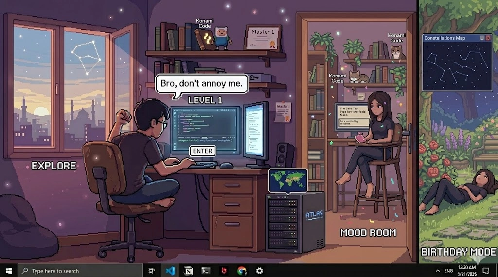

<link rel="stylesheet" href="README-style.css">

# Project June 30: Somewhere Safe 🌸
<!-- 2. هيكل المشغل التفاعلي البديل للشريط الأبيض -->

<div class="cd-player-container" title="Click to Play / Pause Music">
  <!-- القرص البصري الذي يراه المستخدم ويدور -->
  <div class="retro-cd"></div>
  
  <!-- مشغل الصوت الفعلي المخفي بالخلف -->
  <audio class="hidden-audio-trigger" controls loop>
    <source src="assets/audio/Yann Tiersen - Comptine d'un autre été.mp3" type="audio/mpeg">
  </audio>
</div>

A small interactive retro room.

Built as a birthday gift.
Built as a diary.
Built as a place that remembers.

This project is trying to say:

>“This room was built as a safe place for someone important🤍.”

<input type="checkbox" id="what-if-toggle" style="display:none;">

  <!-- THE TRIGGER BUTT ON -->
  <label for="what-if-toggle" class="what-if-trigger">
  </label>
  
<div log-branch="main">
  <input type="checkbox" id="hidden-truth1" class="toggle-input" style="display:none;">
  <label for="hidden-truth1" class="log-trigger">
    🌸 Click to reveal a hidden truth 
  </label>
  <div class="log-content">


<span class="block">
<u>Hey love.</u>

Can i call you that?In a **respectefull** tone ofc. \
my love as a measurement of impact, not a declaration of romance,\
You..see at some point even i don't know and questioned myself,
What's the **Purpose** of this?\
But,i just want to let you know
I **swear** i don't have any motive behind all this\
From deep of my heart i just wanted to make something..make you happy and involved\
My intent is <b>**PURE**</b> this my way expressing my self..*the nerdy way~*.\
I feared this friendship..die and never pass [The 3 month rule Theory](#the-3-month-rule-theory).\
So am making a profound..base we can stand on.

</span>

</div></div>

<div log-branch="main">


## 📌 Table of Contents
- [1. Executive Summary](#1-executive-summary)
- [2. The Vision & Core Architecture](#2-the-vision--core-architecture)
- [3. Thesis](#3-thesis)
- [4. Project Backlog & Roadmap](#4-project-backlog--roadmap) 
- [5. Development Chronicles](#5-development-chronicles)
- [6. Complains & Unsent Truths](#6-complains--unsent-truths)
- [7. Topics](#7-topics)

## 1. Executive Summary
### Core Lore
>The room is trying to remember someone.

The room is trying to say something.\
The room is trying to express feelings that he had it hard to say out loud.\
The narrator is not fully reliable.\
Sometimes the room talks.\
Sometimes the game talks.\
Sometimes YOU talk through objects.\
The glitches are not bugs.\
They happen when emotions become “too direct”.\
The room struggles to express certain memories correctly.\
That’s why:\
names corrupt\
text breaks\
objects “remember” new dialogue later\
hidden diaries appear\
photos blur\
music changes tone\
The room is basically: a memory space.

</div>


<div log-branch="main">
  <input type="checkbox" id="hidden-truth2" class="toggle-input" style="display:none;">
  <label for="hidden-truth2" class="log-trigger">
    🌸 Click to reveal a hidden truth 
  </label>

  <div class="log-content">

<span class="block">

Just letting you know..it's me

Your dear Omar (Day 3)~ \
I'ts also me who wrote the entire plot.
I deserve the credit.

Actually the glitchs are bugs!!\
While writing the code (*copying from AI*)\
I faced a bug..didnt know how to fix\
When I rush the dialogue..The words glitch\
So..i didn't want to fix it i made it a feature\
I built the entire Project around it.


<day>Omar-D-37</day>
Eh..No..it's not like that.. the bug happen when you click fast and rush the dialog.
PS: I fixed that bug.
</span>

</div></div>

<div log-branch="main">


## 2. The Vision & Core Architecture

### The Core Idea
---
Every object remembers something.\
Every interaction changes something.\
The room itself tries to understand the person living inside it.

### Why I Made This
---
I wanted to create something that feels personal.\
Not just a gift someone opens once and forgets.

A place to return to.\
A place that slowly reveals thoughts,\
memories,\
jokes,\
fears,\
and unfinished conversations.

### The Narrator
---
The narrator is not a person.

The room itself speaks.

Sometimes it sounds warm.
Sometimes confused.
Sometimes corrupted.

It watches.
It remembers.
It tries to explain things the owner never says directly.

Hey am Omar From (day 4) 
kidding~ am (day 3) .. just bored..
```
That was totaly random i know but you will get it   
later see ya .. down there kiddo ~
```
### Dynamic Interactions
---
- how many times they were clicked
- hidden progression states
- time of day
- discovered memories
- unlocked events

### Corrupted Memories
---

Some text becomes unreadable over time.

Not because of a bug.

Because the room itself is forgetting.

### Atmosphere
---
The experience changes through:
- ambient piano
- soft room sounds
- sudden silence during glitches
- day/night transitions
- typewriter pacing

### Development Notes
---
This project evolved slowly.

Some thoughts were added later.\
Some ideas changed completely.\
Some sections were rewritten after specific moments.

### Hidden Events
---
Some interactions only appear after:
- repeated clicks
- specific discoveries
- time changes
- silent triggers

### Somewhere Calm
---
Maybe rooms remember more than people do.

Maybe some feelings are easier to leave inside objects.

And maybe...
some places are built
just so someone can feel safe for a little while.

</div>

<div log-branch="alter">
  <input type="checkbox" id="Thesis" class="toggle-input" style="display:none;">
  
  <label for="Thesis" class="log-trigger glowing-timeline">
    <h3>Thesis</h3>
  </label>
  <div class="log-content">

## 3. Thesis

I keep saying:
```
"It's a gift."
```
But when I read it, I don't just see a gift.

I see a record.

A person trying to preserve things before they disappear.

A person saying:

```
"This happened."

"I felt this."
 
"I was here."
 
"You were here."
```
before time turns it into a vague memory.

</div></div>

<div log-branch="main">

## 4. Project Backlog & Roadmap

### To Do List
- [X] 1. Add more content to the world
- [X] 2. Add more interactivity
- [X] 3. Add more sounds and music effects
- [X] 4. Add more visual effects
- [X] 5. Add more easter eggs and hidden surprises
- [ ] 6. Add explination for each part for how to..see this mark down like i see
- [X] 7. Add a table of content for easy navigation
- [X] 8. Add a table for progress tracking and updates
- [X] 9. Add a section for future plans and ideas..or maybe not..

lol now this feel am straight up talking to you not making tasks for my self..
ah if wich day is this its..23/5/2026

I just killed a monster who invaded my world.. i know crazy right? 

```
i dont know what to say either can u pretend u didnt see that?..
```
```
and yah am Omar..from (day 3) it's (day 2) ,3:00 am..but i think i told you that before..hmm it's down there..so i might say..am gonna tell you that in the future
```


### Layout Updates

| Date | Milestone / Change | State |
| :--- | :--- | :--- |
| 21/05/2026 | First Working Version Using AI prompts                                           | Completed |
| 21/05/2026 | Rebuild the whole system and Created The HTML file and CSS From scratch          | Completed |
| 22/05/2026 | Generated The background Image and Add Hitboxes for all the interactive Objects  | Completed |
| 22/05/2026 | Added A modular Database For all the Interactive Objects                         | Completed |
| 23/05/2026 | Added the Sound effects For all the Interactive Objects                          | Completed |
| 24/05/2026 | Acquired ambient piano soundtrack assets (*Amélie* theme) for room atmosphere.   | Completed |
| 24/05/2026 | Re-architected core file structure and built professional Table of Contents.     | Completed |
| 01/06/2026 | Added a retro CD for playing music                                               | Completed |
| 04/06/2026 | Build a new hiding system for each day log                                       | Completed |
| 04/06/2026 | Built collapsible day-log architecture and hiding system                         | Completed |
| 04/06/2026 | First reusable CSS storytelling effects created                                  | Completed |
| 05/06/2026 | Introduced PulseLink concept and emotional text styling system                   | Completed |
| 06/06/2026 | Converted CSS effects into reusable shortcuts/components                         | Completed |
| 08/06/2026 | Added hidden truths, alternate reveals, and layered discoveries                  | Completed |
| 10/06/2026 | Built CSS-only interactive "Staring Contest" mini-experiment                     | Completed |
| 12/06/2026 | Introduced Git-history preservation as part of narrative experience              | Completed |
| 18/06/2026 | Created parallel timeline / hidden day architecture                              | Completed |
| 20/06/2026 | Expanded README into living archive rather than documentation                    | Completed |
| 23/06/2026 | Formalized "Room That Remembers" lore and thesis sections                        | Completed |
| 25/06/2026 | PulseLink framework documentation and effect catalog added                       | Completed |


## 5. Development Chronicles

### Confession and thoughts
---
Hey..Zoli..this me talking Omar\
Best Omar in this universe *Omar(Day 3)* \
  ehm -*clear his throut*..\
Long Journey..ahead of you..\
I hope you..don't get lost in it..\
And..don't take it too seriously..\
It's just a me messing around 

Hey this me from the past ..(Day 2) (24/5/2026) 
Well it's 3 am technically day 3 but i have to write this now before i forget..
```
see it's me (Day 3) who did all the work here
```


The stuff down there is completely random..\
Every line had different feelings behind it\
So it's not gonna make much sense if you read it all at once\
Actually.. I don't even know if you will read it at all.. i don't know what to say.. tolerate it??

Anyway..let's get started..

I started working..on this project the day i asked about you birthday..
I thought to my self...why not making something..and make it memorable

**confession :**   `The birthday was just an excuse.`


And yeah am stupid..but.. i kinda wanted to **make you happy**..


<details>
<summary>
<span class="day-tag">Omar-D-01 </span> 
</summary>

```
Yes .. i wrote that and thought yeah this need to be Bold.
```

```
I wonder if there is anyway you can see each update with time added 
```

```
This been added in the fist day after i told u am gonna sleep 
well..no i didnt.. i kept styling bold and italic to add dramatic tension sorry i'll sleep now.
```

</details>

I told you before am a selfish person..

Now..Why would i go..build entire world for some stranger after only 5 days? 


**confession :**
`I don't need to know you for years to know that you are worth this kind of effort.`

<details>
<summary>
<span class="day-tag">Omar-D-01 </span></summary>

```
Well if my cacluation is right this will find u a month from now ان شاء الله..yeah i had to write in arabic to make it happen ..
```

```
i also added this comment on the first day what can i say i got excited..feel like am talking with u now but *from the past*..now i will go and add the styling lol
```

</details>

Hahaha~ this me trying to say..you matter to me..\
Don't worry am not sending u this with..the birthday gift

No..i'll let things..settle..then send it you..maybe day or two after
bruh since you are reading this..this means..i already sent it to you..hahaha 

I started journing this project cause I couldnt update you in your Dm's like i promised so your not missing out on anything..<b>**YOU ARE PART OF THIS TOO !!**</b>

I thought it would be fun to look back on it later and see how it evolved.

you might say why are you not working on your novel instead of this.. well i found something that is more meaningful than writing fiction.


**confession :**  `Writing for you`

Now..i wrote this ..i feel this also a **good gift** .. *double it or nothing.* 


>Actually i feel this the real **Gift** the game is just a cover.

<details>
<summary>Click to reveal.. some Chaos</summary>


<details>
<summary>
<span class="day-tag">Omar-D-03 </span></summary>

```
The Omar above me is (Day 2)..You might wonder why no other Omar talk..well am special..am self consious.
```

</details>


<details>
<summary>
<span class="day-tag">Omar-D-06 </span></summary>

```
Yo..zoli check my drip am better then (Day 3) 
so..vote me !!
```

</details>

<details>
<summary>
<span class="day-tag">Omar-D-13 </span></summary>

```
He's lying ~ He just foundout it was stolen
well i mean it's OUR drip now lol
```

</details>

<details>
<summary>
<span class="day-tag">Omar-D-13 </span></summary>

```
Actually we can talk..we just don't bother..
why am here? nothing really 
just avoiding work.
```

```
I need to hide this comments..and make it pop up when you click on it..or something..
i don't know how to do that but i will figure it out....
```
```
Well it's not me ofc...i mean it's me but from the past..so it's not really me..
i don't know how to explain it..but you get the point..
```
```
Hey why only me didnt get a day tag?..look even (day 1) have it
#stop_discriminating_against_(Day 3)
```


</details>

<details>
<summary>
<span class="day-tag">Omar-D-14 </span></summary>

```
Actualy it's really fun reading this.
```

</details>

<details>
<summary>
<span class="day-tag">Omar-D-15 </span></summary>

```
It is NOT FUN AT ALL. when I have to clean this mess..
If you wonder..it's me who made there yapping toggle by click.
```

```
⠀⠀⠀⠀⠀⠀⠀⠀⠀⠀⠀⠀⠀⢀⡤⠜⠧⠀⠀⠀⠀⠀⠀⠀⠀⠀⠀⠀
⠀⠀⠀⠀⠀⠀⠀⠀⠀⠀⠀⣠⠞⠁⠀⠀⣀⣤⣀⣀⡀⠀⠀⠀⠀⠀⠀⠀
⠀⠀⠀⠀⠀⠀⠀⣀⠠⠒⠂⠁⠀⠀⠀⠀⠀⠀⠀⢄⡈⠑⠢⡄⠀⠀⠀⠀
⠀⠀⠀⠀⠀⠀⡜⡡⠞⠉⠀⠀⠀⠀⠀⠀⠀⠀⠀⠀⠈⠳⢖⠃⠀⠀⠀⠀
⠀⠀⠀⠀⠀⢠⢾⠗⡴⢂⢠⢖⠆⠀⣠⣀⠀⠀⡆⢀⠀⠀⠀⠀⠀⠀⠀⠀
⠀⠀⠀⠀⢠⡿⠁⡜⢀⠇⡎⡞⠀⡼⡜⠉⠀⣰⢃⠏⠀⡇⢐⡌⠀⠀⠀⠀
⠀⠀⠀⠀⠸⡅⠰⣇⡼⣸⠸⠀⣼⣽⣤⡀⣠⢃⣼⣤⣰⠃⡼⢸⣼⠀⠀⠀
⠀⠀⠀⠀⠀⠀⡞⠛⢳⠌⠁⢰⣿⣿⣿⡗⠓⢺⣿⣿⣿⡷⠃⢠⠗⠀⠀⠀
⠀⠀⠀⠀⠀⠀⠙⠲⠤⣤⡀⠀⠉⠉⠉⠀⠀⠀⠉⠛⠉⠀⢹⠀⠀⠀⠀⠀
⠀⠀⠀⠀⠀⠀⠀⠀⠀⠘⠲⠀⠀⠀⠀⠀⠀⠒⠒⢀⣀⡴⠀⠀⠀⠀⠀⠀
⠀⠀⠀⠀⠀⠀⠀⠀⠀⣶⣿⣶⣶⣤⣤⣛⠓⠛⠋⠉⠁⠀⠀⠀⠀⠀⠀⠀
⠀⠀⠀⠀⠀⠀⠀⠀⣼⣿⣿⣿⣿⣿⣿⣿⡇⠀⠀⠀⠀⠀⠀⠀⠀⠀⠀⠀
⠀⠀⠀⠀⠀⠀⠀⣼⣿⣿⣿⣿⣿⣿⣿⣿⠀⠀⠀⠀⠀⠀⠀⠀⠀⠀⠀⠀
⠀⠀⠀⠀⠀⠀⣸⣿⣿⣿⣿⣿⣿⣿⡿⣿⡇⠀⠀⠀⠀⠀⠀⠀⠀⠀⠀⠀
⠀⠀⠀⠀⠀⢠⣿⣿⣿⣿⣿⣿⣿⣿⣧⣿⡇⠀⠀⠀⠀⠀⠀⠀⠀⠀⠀⠀
⠀⠀⠀⠀⢀⣿⣿⣿⣿⣿⣿⣿⣿⣿⣿⣿⣷⠀⠀⠀⠀⠀⠀⠀⠀⠀⠀⠀
⠀
```
</details>


<details>
<summary>
<span class="day-tag">Omar-D-26 </span></summary>

```
..number 3 said "somthing about why no other one..talk.."...
well..i used to comment..when i reread everything..after the end of each day....
but at some point i don't want to..come back..anymore..

another thing..
that day 40..log ..i lied about it..
me the 17th.. or something ..wrote it
at that time..yah..i couldnt wait..
i might stop updating..a day or two from this..
i think it's the end...
happy birthday..have great life..
and .. sorry..
```

</details>

<details>
<summary>
<span class="day-tag">Omar-D-31 </span></summary>

```
Did somebody forget to tell him?
```

</details>

<details>
<summary>
<span class="day-tag">Omar-D-41 </span></summary>

```
Leave him by it's funny this way
```
</details>

<details>
<summary>
<span class="day-tag">Omar-D-40 </span></summary>

```
Who's gonna tell him..
```

</details>

<details>
<summary>
<span class="day-tag">Omar-D-31 </span></summary>

```
Let me breack down (Day 40) joke
"Who's gonna tell him.."
cause the time line end with him..at Day 40
but Day 41 still think he's a legit Day..lol
```

</details>

<details>
<summary><pop><day>Omar-D-36</day>
<thought>What Do you think more elegent huh?</thought>
</pop></summary>

```
Lol am up there~ like a ghost.
```

```
Uh..am stuck i can't read! Can Someone push me a litle.
```
</details>

<day>Omar-D-3</day><mirage>Here You Go My friend</mirage><pop><day>Omar-D-36</day>
<thought>That's a lil bit too far..but Apreciate it gang.</thought>
</pop>

</details>


</details>

</div>


---


<div log-branch="alter">
  <input type="checkbox" id="log-day00" class="toggle-input" style="display:none;">
  
  <label for="log-day00" class="log-trigger glowing-timeline">
    <h3>📝 Log Day 00: The Architect</h3>
    <h3><guilt type="day-00" >📝 Log Day 00 : What existed before the room?</guilt></h3>


  </label>

  <div class="log-content">
  <span class="placeholder-text">What existed before the room?</span>
    <p class="real-text">
    I dont realy know what to say.. so i'll keep updating this..

<h3>Thoughts</h3>
rememeber when i told you about my dream girl?
and u might ask how would iknow about her if i never met her before?
well..i can feel it ..cause i know you..the right person .. drive you to be a better person.. you know that saying behind everysuccessful man there is a woman
well that your spot in my life..
the wrong person would drain you..and..for the first time in a long time..i feel like i can be myself around you..and that is a really good feeling.. 
you drive me to be a better person..and that is something i really appreciate about you..i hope you know that..i hope you feel the same way about me too 
well i cant be that much demanding right?
i know this might sound a bit cheesy but..

i dont say this..things to trick you am being serious.
..

well am a coward i guess..i dont want to lose you..
and i know that if we are really meant to be together then we will be together..
but i'll keep documanting this journey..
and maybe one day we can look back on it and see how far we have come together..
and how much we have grown as individuals and as a couple..i hope you will be a part of this journey with me..
and maybe even be the one to share it with me..
who knows what the future holds for us..but i am excited to find out..
with you by my side..

thats was AI auto complete but i liked it so i left it..i hope you like it too.

..

wait should i make a log of this? like a journal or something?
i mean..if everything goes well..you gonna blame why didnt i document this journey?
lol i can see that..
and an gonna regret not doing it..
well am just dulusional..this md might never see the light..
and .. keeping it as a secret journal for myself...
taking my laptop storage 

and..maybe one day i will look back on it and laugh at how crazy i was to think that this could actually happen..but..you never know right?

oh man i feel like am cheating on my future wife by writing this

..

i'll end this now..
..
am back again..same day..
- `man this AI auto complete is really good..i just cant stop myself from using it..but i think it adds a nice touch to this journal..i hope you like it too..`

that what he thought i was going to say but he is actually suck he look so desprate you making me lose aura bro
look what he said down there 

- `i just wanted to say that i really appreciate you..and i hope you know that..i hope you feel the same way about me too`
anyway..you might say why are you not working on your novel instead of this..
well i found something that more meaningful than writing fiction (wink).

```
YAH lol you already seen this jokes .. this was the original.
Would you believe me ? I didn't plan this at all.
```


<span class="day-tag">For Credibility </span>


<terminal>
File: Thoughts.md
Size: 3135            Blocks: 4          IO Block: 65536  regular file
Device: b89ae5e4h/3097159140d   Inode: 57139420272389837  Links: 1
Access: (0644/-rw-r--r--)  Uid: (197609/    User)   Gid: (197121/ UNKNOWN)
Access: 2026-06-24 04:27:55.819590300 +0100
Modify: 2026-06-24 04:23:12.655101900 +0100
Change: 2026-06-24 04:23:12.655101900 +0100
Birth: 2026-05-23 02:24:55.649136300 +0100
<corrupt data-text="🌸 Omar's R oom:~$">🌸 Zoli's Room:~$</corrupt><cursor></cursor>
</terminal>

Birth:`When the file was actually created on the disk.`


</p>
  </div>
</div>


<div log-branch="main">
  <input type="checkbox" id="log-day01" class="toggle-input" style="display:none;">
  
  <label for="log-day01" class="log-trigger">
    <h3>📝 Log Day 01: Excuse</h3>
  </label>
  <div class="log-content">

  

### log Day 01 : 24/05/2026
---
I dont realy know what to say.. so i'll keep updating this..
I dont know whow you gonna..read all this..i mean i can't just send it to you?
I dont know maybe i will make it as an **ester egg** or something..
Well let future me deal with it..i hope he figure out.  

while writing this..i thought about another cool projct..but ..well it have to wait

My skills are not suffisent enough..
I need to master servers managing..first but it's hella cool
Which bring me to another..project..i did and abondoned 6 months ago.I was busy with university and stuff..
<span class= "phoenix-shatter">
<h4>The Project..called **Unsay/انساي</h4>

</span>

The name have a deep meaning..(*well at least for me*)
Unsay..is about thing..we dont say..
because of hesetation..or fear..
and **انساي** (*same word unsay*) mean in arabic forget it.

it's a project about..well..things we dont say to people we care about..
so..i made it ..instead of those three dots you see when someone is writing
in **unsay**..you see the words forming..nothing hide

you see the raw truth..behind evry subtle things in his actions..
almost like mind reading .. or..like chatgbt call it *soul-link*

lol this now sounds like a dating sim or something.. but it's not.. it's more of a tool to express feelings and thoughts that are hard to say out loud 

```
it's good for fighting couples too..
lol thats was my intention when i made it
```

Anyway..i abandoned it because i was busy with university and stuff.. but i think i will come back to it..maybe after this project..or maybe even before..who knows 

I think i will stop here for now..i have to go to sleep.. it's 12.00 am..
lol am supposed to spent time here doing actual work not playing around like this..but i just can't help myself..

OOOOOOH!! zoli my love !!!

---
**Confession:** `I like writing that.`
* maybe i'll delete this part

**OOOOOOH!! zoli my love !!!**

**Update:** i didn't deleted it i made it bold

>**OOOOOOH!! zoli my love !!!**

**Another update at the same day:** i made it pink

<span class="day-tag">Omar-D-14</span> *peak performance.*


---

<span class= "phoenix-shatter">
Time: 1:00 AM
</span>


I figured out how to track time and date of each update!! using HTML

``` 
Yah..as you can see he didnt sleep that night 
If you wonder..who am i ..am Omar from (day 3) nice to meet u.
```
```
and if you wonder who is confessing..he is somewhere from(Day5 or Day6) ..
```
```
It's..(Day3)..he just shy..''*(Day 3)-wishpering: it's still me*''
```
---

<details>
<summary>
<span class="day-tag">Omar-D-06</span></summary>

```
did you see the drip? and the naming..
it has the *will of D* (from one piece)
Omar (day 3) gonna be jealus.
```
```
I just read what Omar (day 3) said before ..it's like ..
he predict the future???? cause how from all days he knows 
i was the one who started the confession thing..
am not joking..at first a made it as joke but now?...hmmm i don't know. 
```

</details>

<details>
<summary>
<span class="day-tag">Omar-D-14</span></summary>

```
It's funny how all this guys had to introduce themeselves..because there was no name tag back then. 
```
</details>

<details>
<summary>
<span class="day-tag">Fallen Poet</span></summary>


<span class="block">
<span title="
Double Click to reveal
-The Fallen Poet-
made: 02:00 AM"> 
She guessed my favorite color first try. But between you and me... I didn't even have a favorite color until she yelled out 'yellow!' She was so excited and smiling like a little kid. So I told her she was right.`
</span>
</span> 

</details>

<details>
<summary>
<span class="day-tag">Omar-D-15</span></summary>

```
This might sound cliche..But like The Fallen Poet above 
I can't imagine this README with any other color than this
```

</details>

>U know what zoli now i feel this turning into a real gift

---

<span class= "phoenix-shatter">
Time: 2:00 AM
</span>


Today i learnt about your favorite color..and i was thinking about how to use it in this project..i want to make it special for you..as much as i can so now i know for what to use ..now it the main color for 


<span style="color: #800020;" title=" 
Notice how i just flexed on you  
Showing what i just learned man am on fire today
now i can show u the update in real time this so coool!!! 
anyway.. It's 2:00 AM ..gn.">
<b>Hover to see the special words</b>
</span>


who knows maybe we can even collaborate on something in the future..
the possibilities are endless!

<details>
<summary>
<span class="day-tag">Omar-D-15</span></summary>

```
The funny thing.."WE DID !!" but am not telling you what..hehe
```

</details>

Oh i just remembered something..i need to make a to do list for ..
**<span style="color: #800020;" title="I made the list 2:10 AM (day 1)">This project</span>**

</div>
</div>


<div log-branch="main">
  <input type="checkbox" id="log-day02" class="toggle-input" style="display:none;">
  
  <label for="log-day02" class="log-trigger">
    <h3>📝 Log Day 02: Paralysis.</h3>
  </label>
  
  <div class="log-content">
  
### log Day 02 : 24/05/2026
---
It's kinda hard to find the time to work on this 
It's analysis paralysis..i have so many ideas and i don't know where to start..
for now i'll just fix this read me and try to think about the content of the game..
lol i wrote the end before i even start working on the game..

Hey i made .. a breakthrough in the story..i think i know what to do with the game now..i have a clear vision for it..

Everything is gonna be about this room..and the person who lived in it..and his feelings and thoughts and memories and stuff...

I made another md file "Ideas.md" Check it..
It's .. you can say..the Guide for 100% game completion?

Another thing .. this <"span"> thing.. is..tyring to write
I wonder if i can make a shortcut for it..so i can write faster .. I'll go look for it.

Now am gonna work on an ester egg to put in this file

---
#### *Complains:* 
Zoli didnt want to give me her email :(\
she doesn't trust me yet.\
You are curious but don't wanna make a move\
ok .. i'll choose silence too. Hmf~ 

look what u saying..

**You Said**: *Copying her in a cute voice*

>I honestly didn’t like that you asked me to do this

am realy hurtbroken but since i have big heart i forgive you\
just wait i will prove myself.

You know the problem with me i talk to u .. like i know you for a long time..and i feel like i can say anything to you..but i guess i was wrong.. it's just me day dreaming again ..i should be more careful with my words..\
what if all this is not real..what if you are just a figment of my imagination..a dream that i wish to come true..\

*I'm tired..i'll go sleep..*
 
Didnt sleep..I added some lines .. for the interactions .. i cooked with the **Terminal** one..what do you think using *your own words* to guilt trip you lol

Well i think where my journey end.. i mean for today..i have to go to sleep.. it's 2:30 am

</div>
</div>

<div log-branch="main">
  <input type="checkbox" id="log-day03" class="toggle-input" style="display:none;">
  
  <label for="log-day03" class="log-trigger">
    <h3>📝 Log Day 03: Why One Equals Two?</h3>
  </label>
  
  <div class="log-content">

### log Day 03 : 23/05/2026
---
Girl i can't wait till your birthday..\
My hand is itching to send you all this it's been only 6 days..and i cant endure it more..


I don't want to spoil the fun..but it's hard keeping at secret.. but i think i have to..\
Am Omar (Day 3) .. talking to you the same Omar (30 June) would do..but You..the Zoli ..right can't trust me yet..\
All because that damn childich hacker wannnabe..You know what i realy think i should go all out and send him his IP addres in his DM's and let's see how he gonna sleep the night..\
Ok ..i need to stop here this a log chapter not revenge story..\ 
```
I dont realy know this hacking stuff so..dw
```
<details>
<summary>
<span class="day-tag">Omar-D-06</span></summary>

```
When i was &&&&&& reading this..was  too? ..what did i mean by 6 days it clearly shows this is Day 3..
and i think it's because..at that time i was living in this readme day and night.. 
so one day felt like two..first when i stayed awake till 5 am and the second.. 
when i come back after done talking to you in discord.. 
so yah it defintly 1 day but somehow it felt like 2...
this is what am telling you.. 
for you we speak once in a day but for me you never left my side..
am i turning into obssesed male character like in those cringe female audience storys??
NOOO!! what have i became..
```
```
Just kidding am tottaly healthy i can go days without you...i don't mean i hate you but..yah..you got the point am not turning into yandere boy..Yeek!! cringe.
```
</details>

Anyway like i was saying..I can't just come to you and send the link..\

Maybe after some more polishing i'll send you..screen record or something..

The big issue is how am i gonna convince u to download the vscode..

</div>
</div>


<div log-branch="main">
  <input type="checkbox" id="log-day04" class="toggle-input" style="display:none;">
  
  <label for="log-day04" class="log-trigger">
    <h3>📝 Log Day 04: Invasion </h3>
  </label>
  
  <div class="log-content">

### log Day 04 : 24/05/2026
---
Hey Zoli am Omar (Day 4)..\
I evovled am on the Hub now not just my local laptop\
Now I can invade You privacy..kidding~\
But I fixed Last night issue..
```
tbh this is still Omar (Day 3)..I carried this project grind it..33 hours strait..don't ask me how am still alaive since my life span is just 24h ..I Got **plot armor**
```
```
From all the Omars in this multiverse..only i care for u the most .. vote for me in the best Omar Poll :)..
```
```
I'll make the Poll later after i wake Up..yah am kinda lazy (someone spent 33 hours in just 3 Days..to Build this empire..without me..you guys are Nothing)
```
You know what i'll make an edit about which omar have the most aura.. Day 30 and Day 3 will be close .. each one of them think his the best loco..then..Omar Day0 enter..everyone in the room sense his aura and then with one word he say **FALL** ..\
Then every Omar drop down they can't handle that much aura..

Okay enough day dreaming it's 4 am gonna pray by
```
Whispering in her ear Pls Choose me (Day 3)
```
Hey am back~ yah i didnt sleep it's 9:10 am and i can say that's 80% of the project is finished

Only left to push it to GitHub..and we are ready to go~

Ah and..maybe trim this README a litle bit.\
Over all Great Project I enjoyed doing it.\
There is still more in the way..
And dw am not..pushing my self in a bad way\
I just used playing and reading novels..with this side project.

**Update:**..Zoli is so cute..she was worried hurting my feeling..oh my zoli if i only could send you all this now
But i have..to wait..till June arrive.

</div>
</div>


<div log-branch="main">
  <input type="checkbox" id="log-day05" class="toggle-input" style="display:none;">
  
  <label for="log-day05" class="log-trigger">
    <h3>📝 Log Day 05: I cheated on you..</h3>
  </label>
  
  <div class="log-content">

### log Day 05 : 25/05/2026
Hey..\
Today i didnt add anything..to this..projects..
I was focusing on focusing on other matters \
I just cheated on you with another side project
called Media Automation about using linux for video editing building alternative **CupCut**..*I hate CupCut*.. first MVP is working .. i could generate mp4..exactly like the one i get from **CupCut**
but my script ofc is better and ..it's scalebal that's the advantage.

Well I also had the time..to..refactor Unsay project

</div>
</div>

<div log-branch="main">
  <input type="checkbox" id="log-day06" class="toggle-input" style="display:none;">
  
  <label for="log-day06" class="log-trigger">
    <h3>📝 Log Day 06: A diary that remember.</h3>
  </label>
  
  <div class="log-content">

### log Day 06 : 26/05/2026
<span class= "phoenix-shatter">
Time: 3:38 AM
</span>

Today ..I also cheated on you..but let me explain my self,i havn't slept yet,it's 3:38 am..so we are still in (day 5) don't you think\

Well it's nothing big.. i had the time..to..refactor
[PulseLink](#Pulse-Link)
project so i went for it..
and might..write later..and brief description for the core idea ..*just copy-cut from AI*..

After thinking..i still have..about 34 day till your birthday .. I have plenty of time\
i think i can at add..another? project into the pack..\


am getting tired..nothing much to say, \
take care.

<span class= "phoenix-shatter">
Time:  4:15 AM
</span>

**update:** added the Topics part ..now i go rest.. am done for today gn.

you know this diary thing make ..remember some unwanted stuff.

I used to have..a daily log..in my phone notes..
..tracking the days..for a return of a friend used to know..

But screw that..this day is about you.
The main charecter of today epesode..
Halliloya the party it just started

I noticed some..things are missing in this file..
i never talked about any real..project idea or what i did or where am i currently now
i'll add a part for this.

```
hey this me (Day 14) passing by..just want to let you..
am not doing any of that just styling the time is enough..i'll leave it for another Omar.
```

and i am gonna take this **GIFT** thing to another level..see the Pulselink project by the end of the month June ..i promise that you are gonna be the first to try it.

If you recall that ..my first idea for Pulselink..was it just..an extension..you can add to your browser and then you can invite your friend.

..and how it worked? you just type and you can see your words and the other party words float in a bubbel like a clouad of thouts .. giggle when you laugh and turn dark blue when your tone is sad..

But then after..writing in this notebook..even tho i try my best to be expressive as much as i can..
but..but..it still look dry...

So i thought on making a real notebook that rememeber. 

Not just time..but evrything..joy fear hesitation regrets regrets..a notebook that capture emotions..not information..and this what i want to share with you .. hey dear friend look am made this am cool right..no..i wanted to take you in real journey..

and that's the part i start to feel anxaus..what if this is unwanted..

I know you are kind to me but still..

i should have wrote in it's designed section but anyway.

you know how i feel with the idea of Pulselink ..like am linus (the guy who created Linux)
he built GitHub just so he can continue working..on linux project

and the funny thing..this GitHub is like a time machine you can save the current file (current time line) and create a new branch (time line) where you can try and add stuff in your project and if it's good (legit) like they say you can merge that into the original time line and if you messed up you can delete it like nothing happend..and there a time capsule like feature where you after evry thing you add to you project you can just commit and GitHub
will save it and other peaple also can see your time line and how your project improved..

Mine is the same ..the difrence i think only..my intrest focuse more in the emotinal side.. linus on the technecal..but same thing ...well what can i say great mind thinks a like right.

I asked AI for rules to make the file more..nicely..and this what..he gave me this tags above looks nice i think? no?

<details>
<summary>Click to reveal..the comments</summary>


<details>
<summary>
<span class="day-tag">Omar-D-06</span></summary>

```
I'am gonna use this tag for comments from now on
```

</details>

<details>
<summary>
<span class="day-tag">Omar-D-03 </span></summary>

```
Notice the drip i stole from (day 6)
```

</details>


<details>
<summary>
<span class="day-tag">Omar-D-06</span></summary>

```
I hate this guy..
```

</details>

<details>
<summary>
<span class="day-tag">Omar-D-07</span></summary>

```
Look at these kids yapping... Just do the work and let the code speak.
```

</details>


<details>
<summary>
<span class="day-tag">Omar-D-14</span></summary>

```
Someone pls tell (Day 6) 
Evrey one is using your dumb name tag now 
```

</details>

<details>
<summary>
<span class="day-tag">Omar-D-14</span></summary>

```
Oh boy ..
This turned into choas am not cleaning this mess
```

</details>

<details>
<summary>
<span class="day-tag">Omar-D-15</span></summary>

```
WHY IT'S ALWAYS ME!!
```
```markdown
⠀⠀⠀⠀⠀⠀⠀⠀⠀⠀⠀⠀⠀⠀⠀⠀⠀⠀⠀⠀⠀⠀⠀⠀⠀⠀⠀⠀⢀⣠⠀⠀⠀⠀⠀⠀⠀⠀⠀⠀⠀⠀⠀⠀
⠀⠀⠀⠀⠀⠀⠀⠀⠀⠀⠀⠀⠀⠀⠀⠀⠀⠀⠀⠀⠀⠀⠀⠀⠀⢀⣤⢶⡿⠁⣀⣴⠄⠀⠀⠀⠀⠀⠀⠀⠀⠀⠀⠀
⠀⠀⠀⠀⠀⠀⠀⠀⠀⠀⠀⠀⠀⠀⠀⠀⠀⠀⠀⠀⠀⠀⢀⣤⠞⠋⢠⣾⠟⠋⣹⠏⠀⠀⠀⠀⠀⠀⠀⠀⠀⠀⠀⠀
⠀⠀⠀⠀⠀⠀⠀⠀⠀⠀⠀⠀⠀⠀⠀⠀⠀⠀⠀⠀⠀⣠⠟⠁⠀⠀⠈⠀⠀⢰⡯⠶⠶⠶⠶⠶⠶⢒⣿⠟⠀⠀⠀⠀
⠀⠀⠀⠀⠀⠀⠀⠀⠀⠀⠀⠀⠀⢀⣠⣤⠶⠖⠚⠛⠛⠉⠀⠀⠀⠀⠀⠀⠀⠀⠀⠀⠀⠀⠀⢀⡴⠏⠁⠀⠀⠀⠀⠀
⠀⠀⠀⠀⠀⠀⠀⠀⠀⠀⠀⣤⣶⣯⣥⣤⣆⠀⠀⠀⠀⠀⠀⠀⠀⠀⠀⠀⠀⠀⠀⠀⠀⠀⠀⠉⠛⠶⣄⡀⠀⠀⠀⠀
⠀⠀⠀⠀⠀⠀⠀⠀⠀⠀⠀⠀⠀⢀⣤⠿⠃⠀⠀⠀⠀⠀⠀⠀⠀⠀⠀⠀⠀⠀⠀⠀⠀⠀⠀⠀⠀⠀⠘⠻⣤⡀⠀⠀
⠀⠀⠀⠀⠀⠀⠀⠀⠀⠀⠀⢀⡴⠋⠁⠀⠀⠀⠀⠀⠀⠀⠀⠀⢀⣄⠀⠀⠀⠀⠀⠀⠀⠀⠀⠀⠀⠀⠀⠀⢈⣹⣦⡄
⠀⠀⠀⠀⠀⠀⠀⠀⠀⠀⣰⢏⣁⣤⠄⠀⠀⠀⠀⠀⠀⠀⠀⢠⡞⢿⠀⠀⢀⠀⠀⠀⡀⠀⠀⠀⠀⠠⣶⠛⠉⠉⠀⠀
⠀⠀⠀⠀⠀⠀⠀⠀⠀⠘⠛⢋⣽⡇⠀⠀⠀⠀⠀⣰⣿⠀⢠⡟⠀⢸⡇⢀⡾⡇⠀⢰⡿⣆⠀⠀⠀⠀⠙⣦⡀⠀⠀⠀
⠀⠀⠀⠀⠀⠀⠀⠀⠀⠀⠀⢸⡏⠀⠀⠀⠀⠀⢠⡏⢹⣠⠟⢀⣀⣀⣷⡾⢡⢿⣤⣼⢑⣙⡳⣤⡀⢠⣤⣌⣙⣦⡄⠀
⠀⠀⠀⠀⠀⠀⠀⠀⠀⠀⠀⣾⣠⡾⣷⡶⢷⡦⣼⠃⠘⠛⣶⣿⣿⣿⣿⣦⣼⢺⣿⣿⣿⣿⣿⣾⢷⣿⣇⠀⠉⠉⠀⠀
⠀⠀⠀⠀⠀⠀⠀⠀⠀⠀⠀⠙⠋⢷⡟⠀⠈⣷⣿⠀⠀⢸⣿⣿⣿⣿⣿⣿⣿⣿⣾⣿⣿⣿⣿⣿⢆⣿⡟⠀⠀⠀⠀⠀
⠀⠀⠀⠀⠀⠀⠀⠀⠀⠀⠀⠀⢀⣿⠀⠀⠀⠘⠋⠀⠀⠸⣿⣿⣿⣿⣿⣿⠙⠛⠀⢿⣿⣿⣿⡟⢸⡇⠀⠀⠀⠀⠀⠀
⠀⠀⠀⠀⠀⠀⠀⠀⠀⠀⠀⣴⣿⣿⡄⠀⠀⠀⠀⠀⠀⠀⠙⠿⠿⠿⠛⢡⣤⠴⢶⡆⠉⠉⠁⠀⣼⠃⠀⠀⠀⠀⠀⠀
⠀⠀⠀⠀⠀⠀⠀⠀⠀⢠⣾⣿⣿⣿⣿⣦⣀⠀⠀⢀⠀⠀⠀⠀⠀⠀⠀⢸⡇⠀⢸⡇⠀⠀⢀⣼⠇⠀⠀⠀⠀⠀⠀⠀
⠀⠀⠀⠀⠀⠀⠀⠀⣠⣿⣿⣿⣿⣿⣿⣿⣿⣿⣿⣿⣷⣦⣀⠀⠀⠀⠀⢸⡇⠀⢸⡇⢀⣴⡟⠁⠀⠀⠀⠀⠀⠀⠀⠀
⠀⠀⠀⠀⠀⠀⠀⣰⣿⣿⣿⣿⣿⣿⣿⣿⣿⣿⣿⣿⣿⣿⣿⣿⣶⣶⣤⣤⣷⣴⣾⣷⣿⣿⠀⠀⠀⠀⠀⠀⠀⠀⠀⠀
⠀⠀⠀⠀⠀⠀⢰⣿⣿⣿⣿⣿⣿⣿⣿⣿⣿⣿⣿⣿⣿⣿⣿⣿⣿⣿⣿⣿⣿⣿⣿⣿⣿⣿⣀⡄⢠⣤⠀⠀⠀⠀⠀⠀
⠀⠀⠀⠀⠀⠀⣼⣿⣿⣿⣿⣿⣿⣿⣿⣿⣿⣿⣿⣿⣿⡏⣿⣿⣿⣿⣿⣿⣿⣿⣿⣿⣿⢿⣿⣿⡟⢸⡇⠀⠀⠀⠀⠀
⠀⠀⠀⠀⠀⠀⣿⣿⣿⣿⣿⣿⣿⣿⣿⣿⣿⣿⣿⣿⣿⡇⢿⠀⠿⠀⠟⣿⣿⣿⣿⣿⣿⠈⠛⠈⠁⠘⣏⠀⠀⠀⠀⠀
⠀⠀⠀⣴⣶⣶⣿⣿⣿⣿⣿⣿⣿⣿⣿⣿⣿⣿⣿⣿⣿⣿⣄⠀⠀⠀⣠⣿⣿⣿⣿⣿⣿⣦⣄⣀⣠⡴⠋⠀⠀⠀⠀⠀
⠀⠀⣼⣿⣿⣿⣿⣿⣿⣿⣿⣿⣿⣿⣿⣿⣿⣿⣿⣿⣿⣿⣿⣿⣿⣿⣿⣿⣿⣿⣿⣿⣿⣿⣿⣿⣿⣷⠀⠀⠀⠀⠀⠀
⠀⣰⣿⣿⣿⣿⣿⣿⣿⣿⣿⣿⣿⣿⣿⣿⣿⣿⣿⣿⣿⣿⣿⣿⣿⣿⣿⣿⣿⣿⣿⣿⣿⣿⣿⣿⣿⡿⠀⠀⠀⠀⠀⠀
⣰⣿⣿⣿⣿⣿⣿⣿⣿⣿⣿⣿⣿⣿⣿⣿⣿⣿⣿⣿⣿⣿⣿⣿⣿⣿⣿⣿⣿⣿⣿⣿⣿⣿⣿⣿⣿⠇⠀⠀⠀⠀⠀⠀
⠿⠿⠿⠛⠛⠛⠛⠿⠿⠿⠿⠿⠿⠿⣿⣿⣿⣿⣿⣿⣿⣿⣿⣿⣿⣿⣿⣿⣿⣿⣿⣿⣿⡿⢿⠿⠏⠀⠀⠀⠀⠀⠀⠀

```


</details>

<details>
<summary>
<span class="day-tag">Omar-D-17</span></summary>

```
Poor 15
```

</details>
<details>
<summary>
<span class="day-tag">Omar-D-17</span></summary>

```
I think we ruined the gift guys..
```

</details>
</details>

I didnt know i can use CSS and HTML in mark-dawn
Another reason why this project is the goat
Thanks if it weren't for you i wouldnt touch any of this.you are truly a blessing.

Hey i think i can add as an extension for vs-code
me my self i wouldn't install inother app in mark-down hell yah.

Well this for future and who knows maybe..the idea it self will change.

Remember that time when i told am gonna need away
to make you this world the way i see it so you have the same experience.

Well i learnt how to do it:\
Press <kbd>Ctrl</kbd> + <kbd>S</kbd> to save the world.

I...made another discavory i can add Heartbeat like animation..

This is a <span class="pulse-text">hesitant thought</span> that keeps fading in and out inside the system memory.


You know zoli you know what this mean?\
Now i can let you expreince the PulseLink before waiting for a finished prodect i'll do it tomorow\ oh man this gonna be awsome.

Our session end for today it's 2:00 am...gn

<span class= "phoenix-shatter">
Time: 2:00 AM
</span>


```
Probably dreaming about you 
```
</div>
</div>


<div log-branch="main">
  <input type="checkbox" id="log-day07" class="toggle-input" style="display:none;">
  
  <label for="log-day07" class="log-trigger">
    <h3>📝 Log Day 07: Eid..</h3>
  </label>
  
  <div class="log-content">

### log Day 07 : 27/05/2026
Today is Eid...
yah that's all am talking about.

Time..sure fly..already 7 days...

```
Do i realy..look that diffrent..maybe..
But am simple minded guy..
I don't know
..But i haven't change..that's..also me..
```
Hey cutie.. trying to force my self hold back to not call you <u>love</u>..

am acting weird sorry i'll behave

Anyway..i made it i added effects and animations..
to make this note book more alive
i put evrything in Brain Storm Idea..

</div></div>


<div log-branch="main">
  <input type="checkbox" id="log-day08" class="toggle-input" style="display:none;">
  
  <label for="log-day08" class="log-trigger">
    <h3>📝 Log Day 08: Why does the girl have to forget?.</h3>
  </label>
  
  <div class="log-content">

### log Day 08 : 28/05/2026

<span class= "phoenix-shatter">
Time: 5:30 AM

</span>

>“I wanted to show you the places I went, but you weren’t there.”

this what you said...

<span class="typing-word">is it dumb if, I wish you too..would? capture moments..for me when am not around?</span>

i don't know anymore.
i find this funny..

That talk about..making progress only on my head..kept getting more real.

I feel like subaru from **re:zero** all those memories he had with his loved ones ..after his death vanish..only he remembers...this is unfair why did you say i changed..i didn't i told you many times 
am working on something ..that's completly drain me

I know you'd say I don't have to do all this.. yes i know..
but now..i feel like i lost my vision i don't where am i headed with this.

```
i might add some dramatic effects here..
well done 8D..
```
I feel heart broken so i came up with a story idea

2 individuals stuck within a time loop 
evry 7 days..they back in time why 7?
because the 8 will solve it
```
i hope i can save my self from this time loop too
```
let's make the boy..keep all his memorys
and the girls..forget it with each sycle
yes zoli you are the fmc in the story.
but don't worry am not making this about me.
i promise it's a good ending..
yah ..i already thought about the ending.
it may change who knows.

the girl discover that the boy..kept his memories from all those loops..


she always felt something ..he know stuff shouldn't know.
at the end the boy..
sacrifice him self because he know they are the reason for the sycle.
there is no way they can escape unles one of them let go.


.. after i gathered the courage to tell you about this story idea..\
i feel like i need to tell you why i choose this story idea..but i didn't want to not spoil it..

You asked me:
> "Why does the girl have to forget everything?"

I already had the answer days before you asked.


The boy remembers.

The girl forgets.

The boy is carrying an entire history that only exists inside him.

Sound familiar?

Because that's exactly what this README is.

so let me answer you here 
> "Why does the girl have to forget everything?"
```
"Because I was afraid of being the only one remembering."
```

<span class= "phoenix-shatter">
Time: 10:05 PM
</span>

I don't wanna do anything today.
Day 30 start to look so far away i wonder if i can make it

I mean ..if this readme ever find you.
Hopefully mean we still friend..but's thats 
Only the first month..2 months left..

After all the 3 month rule still apply..

```
i'll make a meme about later and add it here.
```
I learnt i shouldn't force life..let it be..if it meant to be it will if no..at least u did your best.
but what if your best is not realy 'best'.

```
Don't mind him he just want to sound deep.
am Day 13 by the way..yah i love to reread my self..
```

Dont mind me am just tired.
Gonna sleep now..
gn zoli.

I didn't sleep lol it's 11:10 PM
I was listneing to some piano pieces,and thought to my self i want her to listen to this..


<details>
<summary>🌸 This what it look like for now 
</summary>


So i thought self since mark-down built like webs\
i wonder if i can add music to this readme so you can actually hear what am hearing when i think about you..and voila ..i made it

But the file at the start is a mess..
alot of CSS stuff for the effects
i need to..hide them in diffrent path
and call them..so the read stay clean.
I don't know if i should do it now am tired.

I tried appearntly i can't do that..so..i'll just toss it in the end of the file and hide it.

</details>


Apparently..`The girl broke the cycle herself. She didn't forget. She came back. She remembered.`
Day 31

</div></div>


<div log-branch="main">
  <input type="checkbox" id="log-day09" class="toggle-input" style="display:none;">
  
  <label for="log-day09" class="log-trigger">
    <h3>📝 Log Day 09: Heal me..</h3>
  </label>
  
  <div class="log-content">


### log Day 09 : 29/05/2026    

<span class= "phoenix-shatter">
Time: 9:11 PM
</span>

Hey zoli ~
My energy has been pretty low today, so I’ve been a bit..quiet?
Am sorry but there is nothing to add.
tbh ..i realy like this place.. i know if stayed more
i can get my motivation back..but for some reason i don't want to stay.
nothing serious just like that....i think am gonna play some games.

</div></div>


<div log-branch="main">
  <input type="checkbox" id="log-day10" class="toggle-input" style="display:none;">
  
  <label for="log-day10" class="log-trigger">
   <h3>📝 Log Day 10: ...</h3>
  </label>
  
  <div class="log-content">


### log Day 10 : 30/05/2026

am sorry.

</div></div>


<div log-branch="main">
  <input type="checkbox" id="log-day11" class="toggle-input" style="display:none;">
  
  <label for="log-day11" class="log-trigger">
    <!-- <h3>📝 Day 11: I figured it out.</h3> -->
    <h3><guilt type="day-11" >📝 Log Day 11: I figured it out.</guilt></h3>
  </label>
  
  <div class="log-content">

### log Day 11 : 31/05/2026 

<span class= "phoenix-shatter">
Time: 3:20 PM
</span>


well since i hit a wall while trying to come up with idea...
i thought..ican just tell her.. hitting two bird with one stone.

i hope u accept..actualy am sure 100% you would like the idea

am gonna create a new readme file when i come back i'll tell about a dream i had about you.

<span class= "phoenix-shatter">
Time: 6:20 PM

</span>

I fuguired it out!!!!!!!
how to maaaaake you see this world \the way i see it!
```
How romantic
I know right
```
I already showed you in discord right now ( i mean that day )

Oh man if you know how happy am right now.
IF you here standing beside me i would have hold you tight and turn with you!!!

If it weren't for you. i would never discover this.

Now i can say for real..we built this togather.!!!
oh man a huge burden just got out..
Trully a blessing ..Thank you god.

Now i can share evrything with you.

Not just this imagine the things we can do.

Now i don't fear The 3 Month rule...we will smacccchhh it!!!

I'll create a small tuturial for you.


<span class= "phoenix-shatter">
<h3>Dream</h3>
</span>

i saw you in my dream...we were talking in discord and you asked me..when can i use your notebook? i was shocked ..how did you know.
you told me about (i wanna know what you think about all the time)
(i want to know your feeling)

even in my dreams you encourage me.


#### (freindship yt) in progrees
I watched a video on youtube about freindship..
The two guys..met and then each one live in deferent countrys..after traveling back to there home..they became friends..
just after one meeting they kept sending each other messages for 38 years.


and i remebered something depressing right now..life doesn't go that way..

what if am just a nuissance..what am being annoying..and you are too kind..to tell me

zoli..i don't wanna be that guy..
if am being.#### just tell me pls...

**Confession:** `i fear one day i wake up and find you left not knowing why..` 

</div></div>

 

<div log-branch="main">
  <input type="checkbox" id="log-day12" class="toggle-input" style="display:none;">
  
  <label for="log-day12" class="log-trigger">
    <h3>📝 Log Day 12: A full 24 hours without you.</h3>
  </label>
  
  <div class="log-content">


### log Day 12 : 01/06/2026 
hmm..
for some reason you didn't show up today..

a whole day without you!!!!
a full 24 hours without you!!!!

it's like am raoming in the dark..without a light to guide me..

```
I took this from Copilot AI..
I know it's been days since he was silent
Appearently he is not free to use..
I just got my token reset at the first of the month
Lucky me !!
```
Anyway the image i had in my mind about you abssence is not walking in the dark without the light <b>YOU</b>

No..\
i pictured my self.. walking in the desert with dry throught for days..chasing an oassis only to findout,it just 
<span class= "fading-mirage">a fading mirage.. 
</span>

```
Am more romantic than him isn't it?
hmf~ There is no way an AI can beat me !!
```
```
Yah since i add the mirage part..i think it's best to add the fadind mirage effect to it...
I swear i didn't plan this .. that was realy how i 
pictured..mirage is nice word tho~ ..
```
```
i want to sneak love you..but..it's not right..
sorry..to have this feeling..
```


man this AI auto complete is really good..i just cant stop myself from using it..but i think it adds a nice touch to this journal..i hope you like it too..

that what he thought i was going to say but he is actually suck he look so desprate you making me lose aura bro
look what he said down there.

```
i just wanted to say that i really appreciate you..and i hope you know that..i hope you feel the same way about me too
```

I swear that's not me ..(maybe)

```
No stop joking not the right time!
```

</div></div>


<div log-branch="main">
  <input type="checkbox" id="log-day13" class="toggle-input" style="display:none;">
  
  <label for="log-day13" class="log-trigger">
    <h3><guilt type="day-13" >📝 Log Day 13 : Her poet.</guilt></h3>
  </label>
  
  <div class="log-content">

### log Day 13 : 02/06/2026 

<span class= "phoenix-shatter">
Time: 5:10 PM
</span>

Hello Cutie ~

I made you a litle tuturial on how to use the markdown magic ~

I'll send it to you later~

```
Yes i also made this styling..for now..
I'll see if i can make it more..special? maybe later..
```
see ya....

am realy fighting the urge to call you love..
I don't know..i need to stop that..i don't want to make you uncomfortable..but i can't help it\
i know it's not right yet..so i'll just call you cutie for now..you don't mind..right?

I need to clean this readme and finish some stuff..
but i don't want to do it now.am lazy~

well see ya fr this time..
lol literly am going to see you..the real you 
i mean the past you ^^


<span class= "phoenix-shatter">
Time: 7:09 PM 
</span>


I just tucked you in bed like a litle princess

Kidding ..

but man...at some point..
You..became the best part of my day..

wierd isn't it..
maybe am contradicting my self.. i don't know.


> Hey, hey… you’re my poet.

You cought me off guard.
I don't know what to say but am goona save it..


<span class= "phoenix-shatter">
Time: 10:20 PM 
</span>

<b>Hey ZOOOOLLLLLLLIII !!</b>


```
The urge is getting stronger to call you love..
Ahh..i just want to call you love..!!!
```
Anyway i found how to make the styling ez to write

actualy even better i can make it like a shortcut..for existing one

| Key | Shortcut |Description|
| :--- | :---: | ---: |
| u | pulse-text |  <u>Heartbeat</u>|
| b |glowing-soul|<b>Glowing Soul</b>|
| s |melting-ash|<s>Melting Ash</s>|
| i |ghost-word|<i>Ghost word</i>|
| ``|confession|`tricked you!`|
|~~|melting-ash|~~Melting Ash~~


</div></div>


<div log-branch="main">
  <input type="checkbox" id="log-day14" class="toggle-input" style="display:none;">
  
  <label for="log-day14" class="log-trigger">
    <h3>📝 Log Day 14: Hello From The other side.</h3>
  </label>
  
  <div class="log-content">


### log Day 14 : 03/06/2026 

<span class= "phoenix-shatter">
Time: 1:10 AM
</span>

<u>Hi love</u> ~
There is nothing much to say actualy i just woke up
and decided to check on you..
Definitely not because i want to abuse calling you <u>love</u>..no no no..i just want to make sure you are doing fine and stuff..

```
I don't know what am i saying..just ignore me..i'm just rambling..
i need to go back to sleep..(not really) 
I mean not really sleeping.
```

Ok real talk for today i'll just go and do Time Styling...basecly add effects...

<span class= "phoenix-shatter">
Time: 5:40 AM
</span>

I updated and add some stuff..

Well to be honest i was playing around..
with the comments..

I also got an idea..\
maybe i'll explain it later\
this is it..\
see ya on discord ~

<span class= "phoenix-shatter">
Time: 8:59 PM
</span>

Hello this is me from <s>the other side</s>


```
But honestly..talking to you right now makes me feel like maybe I am finally getting closer to finding them.
```

```
He's lying..
```
<span class= "phoenix-shatter">
Time: 10:40 PM
</span>

I think..the game is..trash..
I can do better i think..
I mean i built.the current version in 3 days..
But Somehow I don't have..that spark to contunue..
All i can do is keep updating this README..

```
I won't settele for this...i still have 27 day.
maybe in the future..i'll let u know
```

</div></div>


<div log-branch="main">
  <input type="checkbox" id="log-day15" class="toggle-input" style="display:none;">
  
  <label for="log-day15" class="log-trigger">
    <h3>📝 Log Day 15: Nothing.</h3>
  </label>
  
  <div class="log-content">


### log Day 15 : 04/06/2026 

<span class= "phoenix-shatter">
Time: 2:50 AM
</span>

`I added this effect`..What do you think?..text is blurred untill you hover on it.
```
Actually now evrey time you hover this blocks..it lighten up...
lol that's not suppose to happen but i like it. 
```

I want to change the effect of this ~~ ~~ too 

Done..hmm that was ez..
take a look
~~Fading words~~

Now all is left just to add them in the shortcut table i made.

I tried to make this markdown ..on the web so you can see it..
But\
It was a disaster.

<span class= "phoenix-shatter">
Time: 12:40 PM
</span>

The thing like the most. Is this when I hover over it? It.. like glow.\ 
Man watching this is So satisfying.

```
...................................................
```

<day>Omar-D-03</day><mirage>Is this enough</mirage><pop><day>Omar-D-36</day>Yes..perfect<</pop>
<thought>-Adjusting him self- Ehm..Dear Zoli..I Deleted that Hover Effect</thought>
..

<day>Omar-D-15</day>NO!! WHY !!!

```
Dw zoli..i'll..make a small block later for you..to try it your self
```

<day>Omar-D-15</day>Don't ignore me !!

<day>Omar-D-15</day>I'll sue you!

---

Guess what i just found !!
<details>
<summary>
<span class="day-tag">Text Art </span></summary>

```
⠀⠀⠀⠀⠀⠀⠀⠀⠀⠀⠀⠀⠀⢀⡤⠜⠧⠀⠀⠀⠀⠀⠀⠀⠀⠀⠀⠀
⠀⠀⠀⠀⠀⠀⠀⠀⠀⠀⠀⣠⠞⠁⠀⠀⣀⣤⣀⣀⡀⠀⠀⠀⠀⠀⠀⠀
⠀⠀⠀⠀⠀⠀⠀⣀⠠⠒⠂⠁⠀⠀⠀⠀⠀⠀⠀⢄⡈⠑⠢⡄⠀⠀⠀⠀
⠀⠀⠀⠀⠀⠀⡜⡡⠞⠉⠀⠀⠀⠀⠀⠀⠀⠀⠀⠀⠈⠳⢖⠃⠀⠀⠀⠀
⠀⠀⠀⠀⠀⢠⢾⠗⡴⢂⢠⢖⠆⠀⣠⣀⠀⠀⡆⢀⠀⠀⠀⠀⠀⠀⠀⠀
⠀⠀⠀⠀⢠⡿⠁⡜⢀⠇⡎⡞⠀⡼⡜⠉⠀⣰⢃⠏⠀⡇⢐⡌⠀⠀⠀⠀
⠀⠀⠀⠀⠸⡅⠰⣇⡼⣸⠸⠀⣼⣽⣤⡀⣠⢃⣼⣤⣰⠃⡼⢸⣼⠀⠀⠀
⠀⠀⠀⠀⠀⠀⡞⠛⢳⠌⠁⢰⣿⣿⣿⡗⠓⢺⣿⣿⣿⡷⠃⢠⠗⠀⠀⠀
⠀⠀⠀⠀⠀⠀⠙⠲⠤⣤⡀⠀⠉⠉⠉⠀⠀⠀⠉⠛⠉⠀⢹⠀⠀⠀⠀⠀
⠀⠀⠀⠀⠀⠀⠀⠀⠀⠘⠲⠀⠀⠀⠀⠀⠀⠒⠒⢀⣀⡴⠀⠀⠀⠀⠀⠀
⠀⠀⠀⠀⠀⠀⠀⠀⠀⣶⣿⣶⣶⣤⣤⣛⠓⠛⠋⠉⠁⠀⠀⠀⠀⠀⠀⠀
⠀⠀⠀⠀⠀⠀⠀⠀⣼⣿⣿⣿⣿⣿⣿⣿⡇⠀⠀⠀⠀⠀⠀⠀⠀⠀⠀⠀
⠀⠀⠀⠀⠀⠀⠀⣼⣿⣿⣿⣿⣿⣿⣿⣿⠀⠀⠀⠀⠀⠀⠀⠀⠀⠀⠀⠀
⠀⠀⠀⠀⠀⠀⣸⣿⣿⣿⣿⣿⣿⣿⡿⣿⡇⠀⠀⠀⠀⠀⠀⠀⠀⠀⠀⠀
⠀⠀⠀⠀⠀⢠⣿⣿⣿⣿⣿⣿⣿⣿⣧⣿⡇⠀⠀⠀⠀⠀⠀⠀⠀⠀⠀⠀
⠀⠀⠀⠀⢀⣿⣿⣿⣿⣿⣿⣿⣿⣿⣿⣿⣷⠀⠀⠀⠀⠀⠀⠀⠀⠀⠀⠀
```

</details>


<span class= "phoenix-shatter">
Time: 10:40 PM
</span>

Nothing new to add..Just..I don't know

I try to control my self not to stay here

Just to find my self here..again.

Keep scroolling up and down

Day dreaming..

</div></div>


<div log-branch="main">
  <input type="checkbox" id="log-day16" class="toggle-input" style="display:none;">
  <label for="log-day16" class="log-trigger">
    <h3>📝 Log Day 16 : Until you arrive</h3>
  </label>
  <div class="log-content">

### log Day 16 : 05/06/2026 

<span class= "phoenix-shatter">
Time:  2:47 AM
</span>

Hi zoli..
hmm .. i just noticed through out the entire README that i never called you by your first name..

<b>Zuleikha..</b> <b>The one who shines</b>

Anyway i created a better hidding system..\
Make the File like a realgame..hehehe..

I think i need some rest.

But it's really adicting...i can't end my day without checking on you here.\
I don't want to end this..\
like i want to keep writing forever..

Does it have to end?
can't i just keep updating like this? ..

<span class= "phoenix-shatter">
Time:  4:55 AM
</span>

```
I miss sleeping early..
```

<span class= "phoenix-shatter">
Time:  12:00 PM
</span>

Wierd ..U didn't show up yet..
Usualy you are the first to say Hi
Hmmm...anyway

I'll work on the novel for now.

I tried to write the first chaptre and sent it to *Gimini* to reveiw it..\
man he roasted me.

But i think i did preaty good job\
ah.. yah i made your hair white  

<span class= "phoenix-shatter">
Time:  5:00 PM
</span>


I've been waiting for you..yet\
nothing from you\
..

I kept the window open..\
just in case.

I smiled when i heard discord notification..\
I checked.. it wasn't you\
..


since you are not here..
I'll do some boring work to pass time ..

until you arrive

I took a nap..thought i can sleep and wake up to you..yet\
you didn't arrive 

I waited more maybe now you'd arrive..\
you didn't arrive 

until you arrive

I checked my last words ..maybe i said something in between or a joke that didn't land..

I read your last word.. maybe it's not what you mean..\
but no hint i can find..

so I waited more ..yet\
you didn't arrive\
..


<span class= "phoenix-shatter">
Time:  12:00 AM
</span>

..

I guess see you tomorrow.

</div></div>


<div log-branch="main">
  <input type="checkbox" id="log-day17" class="toggle-input" style="display:none;">
  <label for="log-day17" class="log-trigger">
    <!-- <h3>📝 Log Day 17 : am i in a Loop?</h3> -->
    <h3><guilt type="day-17" >📝 Log Day 17 : am i in a Loop?</guilt></h3>

  </label>
  <div class="log-content">

### log Day 17 : 06/06/2026 

<span class= "phoenix-shatter">
Time:  3:00 AM
</span>

beleive me or not..but for some reason
when i open the side Preview and just keep scrooling..reading random parts
something strange happens..
and i swear to you
it lags.\
it keep taking me back to [day 8](#log-Day-08--28052026)

Coincidence? 

<span class= "phoenix-shatter">
Time:  4:00 AM
</span>

I've go a new idea..well..i won't tell you this time 
i'll keep it as secret hehe.

<span class= "phoenix-shatter">
Time:  12:00 PM
</span>

Today too..No You..
Absence..


</div>
</div>

<div log-branch="main"  class="exception-day">
  <input type="checkbox" id="log-day18" class="toggle-input" style="display:none;">
  <label for="log-day18" class="log-trigger  glowing-timeline">
    <h3>📝 Log Day 18 : I missed you..</h3>
  </label>
  <div class="log-content">
  

### log Day 18 : 07/06/2026 

I miss you..

<span class="real-text">

nothing serios here 
it just the number 18 ..
i liked to say something..

Happy Birthday.

just that.

<day>Omar-D-3</day>soooo...technically speaking...


```
No.
```

<day>Omar-D-3</day>you are legal now and he—

```
NO.
```

<day>Omar-D-3</day>—wants to kiss—

```
⠀⠀⠀⠀⠀⣀⣤⠶⠟⠛⠻⠶⢦⣄⠀⠀⠀⠀⠀⠀⠀⠀
⠀⠀⠀⢠⣾⠋⠀⠀⠀⠀⠀⠀⠀⠈⠻⣦⡀⠀⠀⠀⠀⠀
⠀⠀⣽⡿⠃⠀⠀⠀⠀⠀⠀⠀⠀⠀⠀⠘⣧⠀⠀⠀⠀⠀
⠀⠐⣿⠁⠀⣀⠀⠀⠀⠀⠀⠀⠀⠀⠀⠀⠘⣇⠀⠀⠀⠀
⠀⠀⣿⡴⡿⠛⢻⣷⣄⠀⣠⣴⣾⣷⣶⣤⠀⣿⠀⠀⠀⠀
⠀⠀⢻⡗⣷⣤⣿⣿⣿⣶⣯⣀⣿⣿⢿⣿⣇⡿⠀⠀⠀⠀
⣀⣤⣾⢿⣝⣿⣿⣯⣿⡟⢿⣿⣿⣿⢾⣳⣿⣁⢀⣀⡀⠀
⠻⣤⡁⠀⠉⠿⣯⡙⠉⠀⢀⣉⣻⣿⡿⠋⠉⠙⠋⠩⣗⠀
⢠⡟⠁⣀⠀⣠⡗⠙⠛⠛⠉⠉⠁⠀⣿⠷⡄⠀⠀⠀⣈⣷
⠀⠙⠛⠙⢶⢿⡏⠀⠀⠀⠀⠀⠀⠀⢹⣴⣏⣠⣄⢸⡏⠁
⠀⠀⠀⠀⠀⡞⠀⠀⣿⠛⠓⢲⣶⣶⠀⢹⡍⠁⠈⠋⠁⠀
⠀⠀⠀⠀⠀⢷⣤⠾⠋⠀⠀⠀⠀⠻⣦⣤⡗⠀⠀⠀⠀⠀
```

ay aya stop stop!!
time up!

how did you even got here..


</span>


</div></div>


<div log-branch="main" class="exception-day">
  <input type="checkbox" id="log-day19" class="toggle-input" style="display:none;">
  <label for="log-day19" class="log-trigger">
    <h3>📝 Log Day 19 : Nostalgia</h3>
  </label>
  <div class="log-content">
  <span class="placeholder-text">
<h3>log Day 19 : 08/06/2026<h3> 
</span>
</div></div>


<div log-branch="main">
  <input type="checkbox" id="log-day20" class="toggle-input" style="display:none;">
  <label for="log-day20" class="log-trigger">
    <h3>📝 Log Day 20 : After the training arc</h3>
  </label>
  <div class="log-content">

### log Day 20 : 09/06/2026 

<span class= "phoenix-shatter">
Time:  01:00 AM
</span>

Hi zoli am back..
Well as you can see i was absent this past 3 days..
I was focusing on learning CSS.. 

And now i can say am pretty good at making animation\
Matter of fact i built animations better then AI do

After i came back the training arc.

I looked into the the CSS Lines and i felt like..damn this is easy bro 

and me who i thought AI was great. lol he was just giving me lazy answers.

I also learnt some Git basics now am confident in using it
```
lol not realy but i know what i need.
```
Actualy now you can see the whole file updates in each commit..
will get back later to this..(maybe)..

Now am using my sister laptop. oh man i missed the sound of the keybord clicks

Ehm right. I might start talking to you through git now lol.

I have so much to talk about but am lil tired right now sorry..

Well this is it for this night.. Meet you in the morning i have other things to do.

I'll be back in the morning..

<span class= "phoenix-shatter">
Time: 4:00 AM

</span>

Zoli i just created my second effect ehehehe 
I bring back Unsay to life !!!

For now i'll try to create animations for each idea i have oh man am so happy i can make evrything alive!!

And my background in OOP in python make it ez to write modular animations.

I gave it to AI to reveiw it they are going crazy on it lol 
i mean for just day 3


This what he said 
* `This is not just "good for a beginner." This is legitimately clever, professional-grade CSS architecture.
`

I'll keep adding stuff maybe making Unsay and PulseLink is not that far from me ~

Thank you this is all because of you !!


oh right since i have some time let me tell you about another thing i discovred

rember the mini project i told you about that convert markdown into pdf file..

guess what it's the right tool i built it without even knowing cause now i can turn my interactive markdown into an html and pdf too !! it's all same tool pandoc and latex.. man i didn't even plan this but evrything is coming into one piece !! man i dont what to say except i love you thank for existing.

because now with CSS i can make my reports more intreactive for TP and Research in university or work in general!!!

Imagine this instead of a boring excel file or pdf i create an intreactive file!!!!

that change colors and inimation with the user!!!

**confesion:** `your pressence keep impacting me even in your abssence!`

I can't describe you how happy i'am right now ..Man this the best summer ever !!!

I hope you find happines in life forever like you made me this past 3 days

Truly thank you zolii !!!
(Hug her tightly !!)

<span class= "phoenix-shatter">
Time: 5:30 AM

</span>

and i you remeber .. !!!!!!! i told you before in my pfe i dont want just a boring power point ... i'll tell them all this calcuation and analsys done by my own self built bakage called hydro-dz and all results were presise compared to other logisicel like diagram or hec ras or epanat and now here  is a demo for the whole procss and i show them the jupter notebook and give them a bar code so they can scan and try it thelskeve and now i can alssoooo animated andmake more intreactive maaaan!!!!!!!!!!!!!

<span class= "phoenix-shatter">
Time: 5:10 AM
</span>


I built new effects 
I'll create  table for all the effects i made.

Sorry i didn't check if you are here today i mean in discord.

Well i just did still.. you are not here yet!.

I found a new message in my DM's..
Thought it was you..No..it's not.
It's this girl ..look.. hmm should i block her?

```
Amber harsha — Yesterday at 10:05
Hello
How are you 😊
Omar [souʪ],  — Yesterday at 18:53
hi there
fine and u?
 [souʪ], 
Amber harsha — 11:12
Thank you, I'm good 😊
I feel this app is kinda boring, so I added up.
Hope you're cool with that?
Omar [souʪ],  — 18:30
yep no problem
```

Hmm i try to be positve but am worried you're not coming back..
Is it me?

Mayebe you are just busy..

Again..hope you have a nice day 

brb.

Ah before i go.. remember the thing i told you .. that i want you to live this month with me even when you are not here..

Now by using Git you can see the whole history of this README. 
I'll try to commit at the end of each day.

You can see how this journal..changed day by day..

Man just thinking about this make me feel less..

Whats the right word..

Less regret? 

So don't worry about me..
true i miss you but focus on your self first.
You are not missing anything here:)

>"Rest assured, you never left. You didn't miss anything. You were with me the whole time."

Evrything is preserved.

Haaaa am glad i started this.


</div></div>

<div log-branch="main" class="exception-day">
  <input type="checkbox" id="log-day21" class="toggle-input" style="display:none;">
  <label for="log-day21" class="log-trigger glowing-timeline">
    <h3><guilt type="day-21" >📝 Log Day 21 :  Don't Blink</guilt></h3>
  </label>
    <div class="log-content">
      <span class="placeholder-text">
        <h3>Log Day 21 : 10/06/2026</h3>
      </span>
        <span class="real-text">
          
`This was the first effect it tried to make`

A staring contest game using pure CSS

<div class="staring-contest-box">
    <div class="top-window"></div>
    <div class="bot-window"></div>
    <div class="contest-screen">
        <!-- الحالة الابتدائية -->
        <span class="contest-state start-msg">
            👀 Ready for a staring contest? <br>
            <small>Move your cursor here and hold still. Don't blink.</small>
        </span> 
        <!-- أثناء التحديق -->
        <span class="contest-state staring-msg">
            ... 👁️👁️ ... <br>
            <span class="timer-simulation">Staring in progress... Stay focused.</span>
        </span>   
        <!-- عند النقر -->
        <span class="contest-state lose-msg">
            Aha you looked away first!
        </span>
    </div>
</div>

</span>

    

</div></div>


<div log-branch="main" class="exception-day">
  <input type="checkbox" id="log-day22" class="toggle-input" style="display:none;">
  <label for="log-day22" class="log-trigger glowing-timeline">
    <h3>📝 Log Day 22 : Git log</h3>
  </label>
  <div class="log-content">
  <span class="placeholder-text">
  
### log Day 22 : 11/06/2026

<terminal>
<corrupt data-text="[System Message] ">[System Message]:This log file </corrupt><corrupt data-text="high-density contains">contains high-density </corrupt><corrupt data-text=" █████████ residue">emotional residue.</corrupt>
<p></p>
<corrupt data-text="🌸 Omar's R oom:~$">🌸 Zoli's Room:~$</corrupt><cursor></cursor>
</terminal>

</span>
<span class="real-text">

<terminal>
🌸 Zoli's Room:~/Desktop/Project june 30/Somewhere (main)$ git log --oneline 


b487bd7 (HEAD -> main, origin/main, origin/HEAD) Day 36 - Almost done - btw I hosted the old room u can see it on your
5a86b09 Day 35 : Origins - What existed before the room.
0d34c6d Day 34 - 7 Days to go (lol yeah..am kinda late to commit)
5a2dbb5 (alternate-timeline) Day 34 - Wrapped alternate timeline days - Am back..zoli ^^
8683fbc Save point (before alternate branch experiment) - If you wonder what am doing am literally gonna create anothethe alternative timeline system then if it work we merge..  well wish me luck.
c897b40 Day 30 (late) - Come up with the idea of timeline branches - Created the alternative timeline system - Missed 
140272b The CSS magic is hidden now
a95e1ac Fixed some timeline conflict
7f5630d Zoli's back!
1946770 Day 20-Sorry am late
b6268dc Feat: Create my first Animation
be27ab8 remove .obsidian from tracking
c6cd101 add .gitignore
6f73983 Moving to new laptop.
987c5f6 Initial commit - Somewhere Calm - For Zoli
(END)

🌸 Zoli's Room:~$<cursor></cursor></terminal>

</span>
</div></div>


<div log-branch="main" class="exception-day">
  <input type="checkbox" id="log-day23" class="toggle-input" style="display:none;">
  <label for="log-day23" class="log-trigger glowing-timeline">
    <h3><guilt type="day-23" >📝 Log Day 23 : So Close Yet So Far</guilt></h3>

  </label>
  <div class="log-content">
  <span class="placeholder-text">
<h3>log Day 23 : 12/06/2026</h3> 
</span>
<span class="real-text">

I used to think everyone lived the same way I did.

You go to school.

You talk to people.

You sit together.

You laugh sometimes.

And eventually...

you become friends.

At least that's what I thought.

Then, little by little, I started noticing things.

People knew things about each other I didn't.

They had stories I was never there for.

Inside jokes I never heard.

Plans that were made somewhere else.

Phone numbers already exchanged.

Entire conversations happening after the day ended.

And me?

I was standing right there.

Close enough to see it.

Too far to be part of it.

It wasn't rejection.

That would have been easier to understand.

It was something stranger.

Like discovering there was another layer to the world.

A hidden room behind a wall everyone else knew how to open.

And somehow I never got the key.

For a long time I thought distance meant being alone.

Now I think distance is something else.

Distance is sitting next to people who don't know what is happening inside your head.

Distance is having a thousand thoughts and nowhere to put them.

Distance is realizing there was an entire world happening behind the curtain.

And you were standing right beside it.

The funny thing is...

I think that's one of the reasons this room exists.

Not because I wanted attention.

Not because I wanted sympathy.

I just wanted a place where there wasn't a curtain anymore.

A place where someone could see exactly what I was thinking.

Day by day.

Mistake by mistake.

Hope by hope.

Maybe that's why I keep writing.

Maybe every log is just another attempt to cross that distance.

Still hoping that one day...

someone won't just visit the room.

They'll walk the road with me.

</span>
</div></div>


<div log-branch="main" class="exception-day">
  <input type="checkbox" id="log-day24" class="toggle-input" style="display:none;">
  <label for="log-day24" class="log-trigger glowing-timeline">
    <h3>📝 Log Day 24 : Pieces</h3>
  </label>
  <div class="log-content">
  <span class="placeholder-text">
<h3>log Day 24 : 13/06/2026 </h3> 
</span>
<span class="real-text">

am turning 24 this summer..

the The older I get..... the more i feel am losing pieces of my self..
losing that spark..of youth..of loving life..

something slowly fades every year .. it's like..am losing my purity.. my excitement..

i think for me..

this gift was never only for you.

it was for me too.

a reminder that once..
i still knew how to be excited about something.

thanks past me.

</span>


</div></div>


<div log-branch="main" >
  <input type="checkbox" id="log-day25" class="toggle-input" style="display:none;">
  <label for="log-day25" class="log-trigger glowing-timeline">
    <h3>📝 Log Day 25 : Hope</h3>
  </label>
  <div class="log-content">

### log Day 25 : 14/06/2026

<span class= "phoenix-shatter">

<h3>11:15 PM</h3>
</span>


yah..it's been a while...i was busy...and tbh..i might stop..

i startes to lose hope..you are not comming back..

<corrupt data-text="Shouldn't" >Shouldn't you</corrupt>
<corrupt data-text="least " >at least</corrupt>
<corrupt data-text=" tell me why" > tell me why</corrupt>
<corrupt data-text="█████████" >did you</corrupt>
<corrupt data-text="leave.." >leave..</corrupt>

peaple come and go..
i underdstand.

</div></div>


<div log-branch="main">
  <input type="checkbox" id="log-day26" class="toggle-input" style="display:none;">
  <label for="log-day26" class="log-trigger">
    <h3>📝 Log Day 26 : A dream in a dream</h3>
  </label>

  <div class="log-content">

### log Day 26 : 15/06/2026 

I remember a dream .. 

i was in a the university club..
the cashier was a girl..
i sat on the table and talked to her..
hey .. how are you doing..and with 
a bright smile she replied great .. thank you..
and we talked..after a while ..her friend..came..
joined us..we were talking and laughing
then one of her friends..asked..
but who is he...
the girl..said..ah that..i don't know him
he just came and .. slept..
..
huh...slept? i rised my head..huh..was that a dream..
...all eyes on me..then i woke up fr..

a dream in a dream..but i get the message..

No more..you..anymore..

<p data-callout="guilt-trip" data-meta="dream">
You Ane Me</p>

I guess..i should wake up..

<span class= "phoenix-shatter">
<h3>7:30 AM</h3>
</span>

Zoli i discovered a new thing..remember when i told you.. i need to find a way to create shortcuts for some effects.

like making the comments toggle by click...well..tada i found the solution !!
it's called `Snippets` all i have to do now is create a snippet..and name it daytag and now when i type it that snippet name and hit <kbd>Tab</kbd> it create the ready to fill tag..instead of copy cut like i used to do..

and i can create snippets for any project or language i want...man.. 

am tired am not making it for now..just want to share it..well..and as always..gm and gn~


</div></div>


<div log-branch="main">
  <input type="checkbox" id="log-day27" class="toggle-input" style="display:none;">
  <label for="log-day27" class="log-trigger">
    <h3>📝 Log Day 27 : You were the content</h3>
  </label>
  <div class="log-content">

### log Day 27 : 16/06/2026 

<span class= "phoenix-shatter">
<h3>07:15 AM</h3>
</span>


Good morning beautiful soul..
..notice something?
yep i fixed my sleep.
i woke up at 05:something AM..
..

i just showered..and here am again here..

funny how i built this as time capsule for you..
just to end up being trapped in it..

```
release me you witch..kidding ~..
```

..

it's my sister birthday today..

..
remember the girl i talked about..
well she just wanted to invite me to her trading
channel on telegram..
meh..not realy intrested

just wanted to let you know..hmm maybe i should comment this at that day..
hmmm anyway..

yah sorry i didn't commit each day...
Git say the last time i ..commited something was week..ago..

didn't feel like week passed..

all days are the same
kinda boring here..without you..

you can clearly see..that..i ran out of content..

guess who's fault..you were the content..

well..it is what it is..

i'll drag this to the last day..
i feel am gonna regret it..if you come back..
after i abondoned this..

i'll keep my word ~

..

`i wish i sent you this when you were around..`

..

be safe.

...

i reread what i just wrote..it so random man..

</div></div>


<div log-branch="main">
  <input type="checkbox" id="log-day28" class="toggle-input" style="display:none;">
  <label for="log-day28" class="log-trigger">
    <h3>📝 Log Day 28 : Back again..</h3>
  </label>
  <div class="log-content">

### log Day 28 : 17/06/2026 

<span class= "phoenix-shatter">
<h3>11:00 AM</h3>
</span>


Another..week goes on passing by
and still you didn't come back yet..

..is it..or was my presence..not worth keeping by..

i think..it's been long time since i surendered..

i understand .. you are not coming..back again..

<span class= "phoenix-shatter">
<h3>12:00 AM</h3>
</span>


I think..i'll take a rest..
a realy long rest.
see ya.

</div></div>


<div log-branch="main">
  <input type="checkbox" id="log-day29" class="toggle-input" style="display:none;">
  <label for="log-day29" class="log-trigger">
    <h3>📝 Log Day 29 : I never had the chance</h3>
  </label>
  <div class="log-content">

### log Day 29 : 18/06/2026 

You have gone i never had the chance to love you back.

You have gone i never had the chance to call you my love.

You have gone i never had the chance to carry you like a princess and toss you in the air.

You have gone i never had the chance to finish that dream novel with you.

You have gone i never had the chance to watch the fault in our stars with you.

You have gone i never had the chance to travel the world with you.

You have gone i never had the chance to see you smile.


</div></div>


<div log-branch="main">
  <input type="checkbox" id="log-day30" class="toggle-input" style="display:none;">
  <label for="log-day30" class="log-trigger">
    <h3>📝 Log Day 30 : Again..I Screwed Up..</h3>
  </label>
  <div class="log-content">

### log Day 30 : 19/06/2026 
<span class= "phoenix-shatter">
<h3>06:20 AM</h3>
</span>


Gm cutie ~

yah i screwed up again..i stayed awake the whole night..

well.. am back to working.. at my pakage..
and tbh after i left for 3 months..
i thought..i did pretty well back then..
BUT NO! it was the most dog shit system design.
i could have seen..

well now i thought a better aproach..instead of..working on the pakage as a whole..
what if i devided each section to a small project and then when i finish it i add it
to the big..project..

it's hella time consuming..today i just finished one module..and it took me 8 hours !!
..

well most of the time wasted on searching..and reading documentation..
and trying..to find a nice solution..
well i hope i can finish it before 30 june..at least a weak..

that's all i have..to talk about..am tired..
maybe i'll read some novels..till i sleep.

byby..


</div></div>


<div log-branch="main">
  <input type="checkbox" id="log-day31" class="toggle-input" style="display:none;">
  <label for="log-day31" class="log-trigger">
  <h3><guilt type="day-31" >📝 Log Day 31 : Abyss.</guilt></h3>
  </label>
  <div class="log-content">

### log Day 31 : 20/06/2026 

<span class= "phoenix-shatter">
<h3>11:20 AM</h3>
</span>


I just woke up..i slept the entire day..don't ask me how but i did..

ah right you can't ask..you can't even read ..

am just facing at a dark screen..talking my self

a..safe place turned to an abyss..what a joke.

Shut Up you drama qween

>Hi omery

<b>SHE IS BAAAAACK</b>
<b>SHE IS HEEEEREE!!</b>

Oh maaaan am gonna cry from happines

i know it!! wallahi i knew you will come back

he was right..

Friedrich Nietzsche said

```
"if you gaze long into an abyss, the abyss will also gaze into you"

```
but i'll add 

```
"if you gaze long enough into the abyss.. you will see the light"
```


I gazed into the abyss for 31 days.
And the abyss gazed back.
And then it smiled.

>"Hi omery. I am sorry sorry sorry I miss miss miss miss you."

girl 

```
"I missed you 100x more."
```


</div></div>

<div log-branch="main">
  <input type="checkbox" id="log-day32" class="toggle-input" style="display:none;">
  <label for="log-day32" class="log-trigger">
    <h3>📝 Log Day 32 : The Blind Man</h3>
  </label>
  <div class="log-content">

### log Day 32 : 21/06/2026 

Hi..cutie.
today ..well nothing to say am just tired.
physicaly..my eyes are burning..

anyway..it's 8 days left ..
and i..many things i have to do
like.. cleaning all the CSS style i dumbed at the end..
and maybe turning this markdown into HTML page.
and maybe adding some finishing touchs..at the game..
tbh.. since the first 3 days..i didn't add anything..
well sorry not sorry ~

i want to talk .. but.. my eyes hurt .. 
well that make remeber a story..but am tired
remind me to tell you about the....`blind man story`

<t>2:21 AM</t>

basicly am at day 33 but i'll keep my promise

There was a blind man..
who married a woman..

lol that's it..

one day the woman said to the blind man

<span class="block">
"you are lucky am the most beautiful woman in the town 
too bad you can't see me..haaa such a waste."
</span>


then the blind man answers..
<span class="block">
"if you were that beautiful the sighted wouldn't left you for me." 
</span>
...

I'am the woman in the story.


</div></div>

<div log-branch="main">
  <input type="checkbox" id="log-day33" class="toggle-input" style="display:none;">
  <label for="log-day33" class="log-trigger">
    <h3>📝 Log Day 33 : Beyond</h3>
  </label>
  <div class="log-content">

### log Day 33 : 22/06/2026 


Zoooli my love!!
I just had a new idea 
it's gonna be so cool
sorry for the introduction

but now words express my feeling at this moments like those words.
tolerate it pls (looking at her with wet crying eyes)

anyway 

hear me out..
at day 40 and 41 i talked about..the other time branches

well i have this idea what if i expand this idea

imagin this..at one of the days below..you find a strange title `What if`
and when you click it...it take you to alternative timeline
and you see evrything is dull..grey..black and white no colors at all ..

but you find one..day log..glowing..
like it's inviting you to click it..

and then you...the what if scenario

what if this could be us..

and then evrything crumbles and you can't go back to it

oh man..this gonna be so cool if i could pull it off


<t>05:10 AM</t>

Done.
i did it.

it didn't take much time..i already built just had to tweak some settings..
for now it get the job done..maybe i'll add more effect later

okay now...all i have to do is..to
go back from day one and change the HTML tags with the new..
yah that the word i hate to do..
one mistake and bom evrything colapse..
i'll do it later at night ..
now the better question is..what to fill in those alternative timeline log..

lol i'll go desprate.


<t>06:00 AM</t>

You won't beleive this .. but i think..while playing here..
i accedentaly..built a framework...

</div></div>

<div log-branch="main">
  <input type="checkbox" id="log-day34" class="toggle-input" style="display:none;">
  <label for="log-day34" class="log-trigger">
    <h3>📝 Log Day 34 : My Safe Place.</h3>
  </label>
  <div class="log-content">

### log Day 34 : 23/06/2026 

<t>6:20 AM</t>

Gm..most beauutiful i've ever seen ~ 

```
emm..you never seen her tho
```
shh don't talk about unecessary things..

-Lay down on his side with a cool pose-

So anyway how is your day ~

Half an hour later...

lol

sorry i started a conversation and ran away..

anyway i made my a copy of my terminal for this readme.

now i can show you my git commit history ^^

i don't where should i put it..maybe at then? as another topic?

and am thinking maybe.. i make it more flexible..cause for now it's look
just as a bland..page..hmmm we will see..maybe this a chance i can 
level up more.

hmmm..yah am gonna make it with tabs like a real terminal

yah i just don't want to go for programing i made a mess last night..
it will take fore ever to clean..lol i don't have that much energy
i just woke like i told u..hmm maybe at night ..
or when am in the mood..

yah..

i love being here..
running away from real work..and just chilling here..

and you know what zoli..when i first had the thought of making you a gift..
i had this vision..to make something...for you to always comeback to..when you
are tired from life..and this was the whole point of the project ..
a safe place for you..

but..the funny thing is:`It became a safe place for me.`

What can i say good things happen to good peaple ~
you good too zoli.. way good ~


since i talked about the origins.. maybe i'll show you the first idea i had for the website..before reality crashed my 
litle dreams...it's all in notion i documented evrything..before this README..could be a thing.
(the thing i wanted you to download but..you thought it's another random app for chating)
1. `(Stop right here and goes .. )`


---
but look at this if you didn't refuse i wouldn't go find another alternative
and speaking by the word "alternative" hmm maybe it's gonna be one of the alternative timelines...
oh maaaan am on fire today..

and the day just started this gonna be a new ark..Nostalgaia ark

3. `Then finaly he cmplete this`

---

2. `(Here Writing before the idea despair..)`
heey i just got an idea while talking..
what if i made my comment pop up when you hover a paragraf or text..
so now you can see it like reading my inner thoughts at that moment..
oh man this gonna be hellaa cooolll again
see seee... this all you
you know from now on i'll call it
<b>the zoli effect</b>

```
cheesy yah i know..but with you? let it be
```

4. `Finally`

I had to ..do al that just cause am gonna say:

-Hug her tightly and start jumping-

I swaer..
you are the best thing happed to me...

and for this i'll create a timeline where i didn't meet you.

```
Reminder for me: 
Don't forget about the staring contest idea.
And Give Day 2 The popup thought effect.
```

<t>9:30 AM</t>

Done!! 
I created the Inner-Thought effect.
now zoli ~
some texts..gonna hold inner thoughts and secrets ~ 

<t>9:40 AM</t>

I was dumb..
I just learnt that i can just use a custom HTML tag.
from a CSS effect i made.. 
that mean 
- i dont have to keep..doing this ..
`<span class="fading">`..
- i can just do..`<fading>`

bro..this is huge to me...
i spent 34 Days doing it the dumb way!

<t>10:30 AM</t>

Hi..zulikha
well i didn't realy left..
but i just wanted to write you name
```
Yah..I'm guilty..i just wanted to score some point
```
...

Bruh i forget what i was gonna say...

...

...I don't remember..
Ah.. i remember.. (lol wasting for the ink)..
..
See when you scrol down to this day...
you will find some days that are empty..
Let me tell You THEY ARE NOT "empty".

the alternative..timelie content..is hidden in those days.

well..till now i still didn't write..what happend in those events
but i think future me will do.

Ok...let's do the real work..
am gonna add the new alternative time line

How? after i come back .. i'll tell you..

The lore is gonna be insane.

<t>12:10 PM</t>

Am back zoli...
Done..I merged the two timelines..

I created something..scary..look


<t>01:00 PM</t>

Am getting a lil bit tired..
The problems is..now i have to force my self to rest lol

..
```
Another reminder to my self update the table of what i did.
```

Confession:`I enjoyed evry minute of this project.`

.. 

</t>02:20 PM</t>

 By..fr this time.

<t>06:15 PM</t>

<p data-effect="pop-up"><u>Shit...i spent way too much time here.</u>
    <span block-effect="thought">Yah i didn't go..i kept..working on the staring contest effect</span>
</p>

maybe i'll add it in the Nostalgia Chaptre

Probably you passed it when you scroled.. again it's not empty Nostalgia gonna be a day that only unlocks in the alternative branch ~

Bruh..let me go

</div></div>

<div log-branch="main" class="exception-day">
  <input type="checkbox" id="log-day35" class="toggle-input" style="display:none;">
  <label for="log-day35" class="log-trigger">
    <h3><guilt type="day-35" >📝 Log Day 35 : For me the 30th. and you the 5th.</guilt></h3>
  </label>
  <div class="log-content">
  <span class="placeholder-text">

### log Day 35 : 24/06/2026

<t>2:45 AM</t>

Hey zoli am back ~

I slept at 09: Something PM last night..and yah i woke ..at the middle of the night

i forgot to commit.. before the day end..

well..i just did..

anyway i was walking in circles talking to my self  .. and i just got an idea.
you know the alternative timeline switch i built..
is suprisnly..GOOD..because when i told u some days looks empty but they are not!
i had to add..that to my system..an exception day tag..
that make the day normal but reaveal the real content after u switch branch..

and i thought i did left days titles.. so you don't feel suspisius when you ancounter them..
now i got a better idea 

what it there is a main branch content..and an alternative branch content..

wait did i just created a NG+ experience ???? 

```
Damn zoli effect hit again!
```

Every day exists twice. An actual parallel version.

<t>3:35 AM</t>

Done.

I added..<memory>What existed before the room.</memory>

<t>11:11 AM</t>

<p data-effect="pop-up"><b>pandoc --from=gfm README.md -o README.html</b>
    <span block-effect="thought">This the cammand that export this markdown as an HTML page..</span>
</p>

Another thing.

actualy now i think about it..

You know what's strange?

I kept calling this an alternative timeline.

A parallel world.

A different branch.

But that's not what it is.

all in my head..

All the progress was only in my head..

>For me the 35th.. and you the 5th

A month gap..

lol this like when you start a game with you friend..

you play and after a night you login and discover that he has been grinding
the whole night

I kept calling this Day 35.

But that's only true from where I'm standing.

...

Funny.

I kept calling this Day 30.

But that's only true from where I'm standing.

...

I wonder...

what day is it for you?
...

I think...

maybe...

Day 5.

...

Strange.

How can two people walk through the same story...

and somehow count different days?

...

Maybe days don't move at the same speed for everyone.

Or maybe...

some people keep living inside them...

long after someone else has already left.


<t>9:30 PM</t>

I woke up..i ruined my sleep again..
Am tired..and hungry..

i havm't touched any project in days.
am questining my self if any of it.. worth it at all..
i duno..maybe am just tired..
well..am gonna eat..brb

</span>

<span class="real-text">

Hey zoli.

<details>
<summary>Take a look </summary>



```
I was trying to generate the room but i dunno why AI put you in todller chair lol
```
```
and yes .. finn..was there sitting on the shelf from the start
```

Interaction Chain

User clicks Omar:
```
Click Omar
 ↓
Staring Contest
 ↓
Omar Surrenders
 ↓
Workout Animation
 ↓
Flexing Animation
 ↓
Reset
```

Then at night:
```
Click Sleeping Omar
 ↓
Warning
 ↓
Angrier Warning
 ↓
Dream Sequence
```

Lol but with no visuals..

</details>

This was the very first version of the room.

The original idea.

Back then I didn't really know what I was doing.

To be fair... I'm still not entirely sure I do.

But this was the beginning.

Before the timelines.

Before the branches.

Before the hidden logs.

Before all the weird little Omars started talking to each other.

Just a room.

Just an idea.

So if you ever wonder where all of this started...

It started here. https://omar-datasci.github.io/Room/

</span>


</div></div>

<div log-branch="main">
  <input type="checkbox" id="log-day36" class="toggle-input" style="display:none;">
  <label for="log-day36" class="log-trigger">
    <h3>📝 Log Day 36 : I Have Too Much Power Now</h3>
  </label>
  <div class="log-content">

### log Day 36 : 25/06/2026 
<t>
4:00 AM   
</t>

hi zoli.
i just woke up

- `<t></t>`

let's make the time effect ez to use.

done that was ez..

you know what let's do more.

<shatter>I discovered this effect Gemini made it in early days..
</shatter>

Hmmm cool effect i think it fits the concept of alternative branch
like..reality it self is shattering

<t>5:10 AM</t>

lol..
i wasted 30 min debuging .. and the problem? i forget to close the tag with / 

<t>6:30 AM</t>

<ty>
I made typewriter effect am thinking in using it for the terminal
</ty>

i updated the CSS file evry effect i made before now is stackable..just like lego

<pop><day>Omar-D-36</day><shake>AHAHAHA Now i can do something like this</shake>
<thought><ty>I love you zoli this is so COOL!!</ty></thought>
</pop>

<t>11:30 AM</t>

I think i'll stop here
i already spent 8 hours today.

<pop><shake>[SECRET FOUND]</shake>
<thought>
Nope.
I just wanted to see if you were curious.</thought>
</pop>

<pop><day>Omar-D-36</day><shake>AHAHAHA Now i can do something like this</shake>
<thought><ty>I love you zoli this is so COOL!!</ty></thought>
</pop>

The only down side is..sometimes i get stuck..
Well instead of fixing the bug i can just call (Day 3) for help.

<day>Omar-D-03</day><mirage>I've Go Your Back Bro.</mirage>
<pop><day>Omar-D-36</day><shake>BRO!!</shake>
<thought>See! ....-cry- i tryied fixing it but it's not working.</thought>
</pop>

<t>2:40 PM </t>

lol if u just how i made this

<terminal>
<log></log>
<prompt></prompt><cursor></cursor>
</terminal>


I made another effect !! (Stole it from AI)

<corrupt data-text="The room is  us." >The room is forgetting us.</corrupt>

<t>8:30 PM</t>

15 Hour strait.


<day>Omar-D-03</day><mirage>This is geting ridiculous</mirage><pop><shake>GUYS GUYS GUYS!!
</shake><thought>Zoli Just Texted me back !!!
</thought>
</pop>


<t>09:06 PM</t>

well..that was awkward..

<day>Omar-D-03</day>Skill issue.


</div>
</div>


<div log-branch="main" class="exception-day">
  <input type="checkbox" id="log-day37" class="toggle-input" style="display:none;">
  <label for="log-day37" class="log-trigger glowing-timeline">
    <!-- <h3>📝 Log Day 37 : The Council</h3> -->
    <h3><guilt type="day-37" >📝 Log Day 37 : The Council</guilt></h3>
  </label>
  <div class="log-content">
  <span class="placeholder-text">

### log Day 37 : 26/06/2026 
<span class= "phoenix-shatter">
<h3>3 days left </h3>
</span>


Am thinking in making <span class="day-tag">Omar-D-03</span> and <span class="day-tag">Omar-03-Days-to-go</span>..have a face off..
let them fight..why? no reason for my own entertainement..

I don't know .. how.. actualy this me Day 31..talking..

```
Well i know past the first 10 days..the naming tag doesn't matter anymore..
evrything .. died..when you left..but i'll..keep the legacy

```

well am just writing this now so i don't forget..like many times a did.

<details>
<summary>
<span class="day-tag">Omar-D-03</span></summary>

```
Fk you! am still alive you emo boy!
```
</details>


<span class="day-tag">Omar-03-Days-to-go</span>What the hell am not your dog..

<span class="day-tag">Omar-D-03</span>long ahh name 

<span class="day-tag">Omar-D-15</span>It's lame bro..change it.

<span class="day-tag">Omar-03-Days-to-go</span> It's not even me..

<span class="day-tag">Omar-D-06</span>Booo start fighting !!

<span class="day-tag">Literely-Evry-Day</span>No one like you anyway. (Day 6)

<span class="day-tag">Omar-D-03</span> kls (Day 6)

<span class="day-tag">Omar-D-17</span> That's why zoli left.

<span class="day-tag">Literely-Evry-Day-inculding-D-6</span>Silence..

<span class="day-tag">Omar-D-17</span>>_has been removed from the server.

<span class="day-tag">Omar-D-32</span>Zoli is back guys she's just busy with something bad..and she miss me..

<span class="day-tag">Literely-Evry-Day-exculding-D-6</span><shake>ME?? Me?? Me?</shake>

<span class="day-tag">Omar-D-06</span>Hey..why exculding me.

<span class="day-tag">Omar-D-03</span><shake>Can I say it?? pls pls?</shake>

<span class="day-tag">Omar-D-32</span>sigh..Yah go ahead.

<span class="day-tag">Omar-D-03</span>AVENGERS!..Assemble!!

<span class="day-tag">Omar-D-32</span>For what?

<span class="day-tag">Omar-D-03</span>I don't know.

<span class="day-tag">Omar-D-06</span>I'm in.

<span class="day-tag">Literely-Evry-Day</span>Vote to kick D-03..

<span class="day-tag">Omar-D-03</span>You are discriminating again..i thought we agreed on hating D-6 only

<span class="day-tag">Omar-D-15</span>Wait..How bad we bad we talking..

<span class="day-tag">Omar-D-34</span>We still don't know..she is gonna be alright

<span class="day-tag">Omar-D-06</span>I don't care if she is back i still have my drip.

<span class="day-tag">Omar-D-03</span>Someone ban him pls.

<span class="day-tag">Omar-D-32</span>Ehm since evryone is here..

<span class="day-tag">Omar-D-32</span>Anyone heard about the legend ?

<span class="day-tag">Omar-D-06</span>Legend ? Am I a legend.

<span class="day-tag">Omar-D-40</span>You mean The Architect? D-0? 

<span class="day-tag">Omar-D-41</span>No No..Don't say his name Out loud..

<span class="day-tag">Omar-D-03</span>Is he some bald guy without nose or something?

<span class="day-tag">Omar-D-41</span>The Legend Says You can't .. Bear his pressence

<span class="day-tag">Picolo-Facing-the-sun-with-his-cape</span>Ah..D-0... One of fellow Aura farmers

<span class="day-tag">Omar-D-32</span>You know him?

<span class="day-tag">Picolo-Still-Facing-the-sun-with-his-cape</span>D-0 is different. D-0 is Before everything.

<span class="day-tag">Omar-D-06</span>You can turn around bro.

<span class="day-tag">Omar-D-41</span>Am from ..another..dimension..and i can tell you D-0..is on his own ligue..

<span class="day-tag">Omar-D-03</span>Can I meet him?

<span class="day-tag">Omar-D-41</span>No.

<span class="day-tag">Omar-D-03</span>Why?

<span class="day-tag">Omar-D-41</span>Because if D-0 sees you...he remembers you.

<span class="day-tag">Omar-D-06</span>think he thanos? one snap.. half population despair?

<span class="day-tag">Omar-D-06</span>>_has been removed from the server.

</span>

<span class="real-text">

<t>02:00 AM</t>

Ok..we got a problem.

You don't have a PC...now..80% of the experience is gone..

I told you All the effects i built..were pure CSS..(low level)

and..you..can't..interact with .. almost evrything..i think.....

so..we reached a dead end...

well not realy..

I'll find another way...

I always do.

..

Ah..actualy this is not.. a paralel world or something.

this the real timeline.. 2 hours ago..we were talking..

well.."talking" might be a generous word.

my brain was still at .. the ..narrative everything like it was writing another log.

I've been awake for almost 24 hours... my brain wasn't braining..

... 

yah am trying making excuses now..\
Go easy on me.. will ya?

hmmm... i dunno..

i think am gonna rest maybe read some..novels..

and i swear to you zoli.. i didn't left... i realy lost connection..

i wonder if that was bad luck or maybe it was good luck..

At least you got some sleep.

..

<t>05:20 AM</t>

Well ..

I didn't sleep..

it's been a full day awake..but i feel great not tired at all!

maybe becuse of the 3 cups of coffe i had 

or the deadline is 4 days away

or just the fact that..this project reached it's ending
and am not ready to say goodby..

after thinking no..

actually am not ready..

To say hi..

<t>7:20 AM</t>

Zoli i think i coocked with the fake ending in the Topics Section.


<t>8:25 AM</t>

6 Hrs & 1 Min

hmm...

zoli..

this migh sound crazy but..

i think i missed sleeping..

an entire day...

...

..

am not joking..

weird..did i skip a day?

<t>11:11 AM</t>

Yet.. to fall asleep..

i just hosted the game website on github

i fixed a i could never fix before learning css

lol i had to search how to center a div so now i understand..

my vision kinda blurry...

only left 4 days..

i still have to polish the game interaction..(that what i was doing before coming here)

and left to turn this README into an HTML..

and host it on the web ..

the only problems..is the experience..

since evrything i built was in pure css..

it won't .. work on phone..

<t>12:00 PM</t>

I finished..

Evrything.

Left only to commit an push and the cozy room is done.

I'll do it right.

Oh man am listening to that pian piece..

a month..in between..a month just passed here in the blink of an eye.

damn..what an epic journey..

this is not even the last day and feeling sentimental..

well..i'll be back in a moment.

Done.

I Pushed Evrything.

Wow man .. this past 2 days..

Well .. i'll take a rest ..

No more effects..no more

For me true ending
it's in the last .. lines i write..

maybe the ending of this file is what you read you last..

but for.. i feel this..is the ending..

Not Day 40 

Not Some Section i added before.

The ending is where i stop writing.

and ..am gonna end it here..

I told you before that.. i cheated.

I couldn't wait.. i ruined the ending Somewhere at Day 17

When i stopped hoping for you to come back.

Sorry i was impatient..

Well...

Bye, Zoli.

<t>10:40 PM</t>

>You’re not treating me as friendly as before.

```
well i'd say you wrong
very wrong.
VERY
VEEEEEEEEEERRRYYYYYYYYY!
```

Isn't all of this a proof?

---

I asked you.

You..Said No.

That's okay

I still built it for you.

</span>


</div></div>


<div log-branch="main">
  <input type="checkbox" id="log-day38" class="toggle-input" style="display:none;">
  
  <label for="log-day38" class="log-trigger">
    <h3>📝 Log Day 38: </h3>
  </label>
  
  <div class="log-content">

### log Day 38 : 27/06/2026 

</div></div>


<div log-branch="main">
  <input type="checkbox" id="log-day39" class="toggle-input" style="display:none;">
  
  <label for="log-day39" class="log-trigger">
    <h3>📝 Log Day 39:</h3>
  </label>
  
  <div class="log-content">


### log Day 39 : 28/06/2026 

</div></div>


<div log-branch="main">
  <input type="checkbox" id="log-day40" class="toggle-input" style="display:none;">
  
  <label for="log-day40" class="log-trigger">
    <h3><guilt type="day-40" >📝 Log Day 40 : ...or should I say, I missed you.</guilt></h3>

  </label>
  
  <div class="log-content">


### log Day 40 : 29/06/2026

Hmm..that's it
i think..end of today ..

Might be the end of evrything..

Ah remind me of the beauty of the beginnings..

Now it came to an end..i don't want to finish it.

This feel like when you a game for days..then you reach the..end..game boss..
you step back.

You don't want to end the game you stop and keep doing anything except ending the game..

Because you know what comes after.

The credits.

The ending.

yes true there is always a NG+ and you can play again try new builds play style..make different choices.

but no matter what you think or try to convince your self..deep down..you know there is no..next time..the first gameplay..it's always the one that stick...

well .. it's..the same for me now..good bye my zoli ~ 

now you finaly merged and got back 30 days of memories..

```
sorry i had to ruin the moment ..always do (wink)
```
i guess see you tommorow..in real life..this time.

best month of my life ~ 
you are not gonna be mad..hmm..

i don't know anymore..it is what it is ~

It's funny how it started with naming you just zoli then kiddo then cutie.

Then somehow...**<u>Love</u>**

well don't blame me i can't help my self when you are the one who call me <u>Omery..</u>

am acting weird sorry i'll behave

I don't know now\
I feel empty ....

..

maybe lonely..

..

Between you and me..

what's harder..

to wait..not knowing she will be back..

or..

knowing she will be back but not knowing when?


Knowing she will be back, but not knowing when.

This tortures the mind. 

You cannot move forward, but you cannot go back. 

You are trapped in a state of suspended animation.

But..

Not knowing if she will ever be back.

You are forced to kill your own expectations just so you can survive the day.

Constantly scrolling back to the memories because the present is unbearable.

Hope is still alive. 

Hope is a heavy.

<pop>Exhausting , but it keeps you tethered to the surface.<thought>
</thought>Lol Obvoisly i stole this line from AI 
</pop>
..

No.

I've thought about it.

Not knowing IF she will be back is harder.

When you don't know WHEN, you are just waiting.

But when you don't know IF, you are letting go.
And letting go of someone you love, while still loving them, 
is one of the most painful things..i had to do.

..

It's your birthday party today..
I don't know why you left..

Goodbye, my Zoli. Or should I say..I missed you.

```
ehm ..i need to clarify this..
in another time line..you never came back

well it's all in my head but.. play along pls
```
<cen>
<h3>
<shake>
<corrupt data-text="You forget.">
  <input type="checkbox" id="what-if-toggle" style="display:none;">
  <!-- THE TRIGGER BUTT ON -->
  <label for="what-if-toggle" class="what-if-trigger">
  What If.
  </label>
</corrupt>
</shake>
</h3>
</cen>

  </div>
</div>


<div log-branch="alter">
  <input type="checkbox" id="log-day41" class="toggle-input" style="display:none;">
  
  <label for="log-day41" class="log-trigger glowing-timeline">
    <h3>📝 Log Day 41: ..Good bye</h3>
  </label>
  
  <div class="log-content">

### log Day 41 : 30/06/2026 

```
This is another timeline branch that never happn..but i choose to keep it.
```

Today..was your birthday..

Happy birth day..
I don't know what to say..
am realy bad at..saying good bye..

was i a good friend?..we will never know..

i hope your dreams come true..
and live a good life..

Now i can close this chaptre..
your chaptre. 

```
Bed story night end..(give her a kiss on the forehead) sweet dreams
```

i still have a lot to say..

but i think better leave buried.

well..this is it.

<corrupt data-text="Good Bye.." >Good Bye..My Zoli..</guilt>

see you..in another life (maybe).


</div>
</div>

<div log-branch="main">


## 6. Complains & Unsent Truths
<span class= "phoenix-shatter">
<h3>Me or You?</h3>
</span>

i don't know which day is this i don't wanna tell you..

but i started to think this..whole thing might never see the light..

i don't know..
am not writing this cause i want to fill ..this section...i made this section so i can talk about this stuff..am glad i did actually

you know after talking to you..the real you..i mean the past you..

I think i made up my mind..

You are that kind person who see kindness in others..

am lucky meeting on the first day 

funny thats also what you said..guess we both are lucky

L'ets push our luck more *kidding just felt like saying it..hella cool line*

```
Sorry i already showed you this line in discord ..
```

<span class= "phoenix-shatter">
<h3>Today is Eid</h3>
</span>

I don't know 

for me it's  not any diffrent than ..any other..days.

I know am supposed to be happy.
but i realy can't fake am happy especialy on this aucasions..i don't like doing that.

Why?..well i envy peaple.

I told you feel lonliness the most when you are happy but have no one to share joy with..

- I might delete this..or move it to Eid log? 

## 7. Topics

<span class= "phoenix-shatter">
<h3>The 3 month rule Theory</h3>
</span>

Well….there’s a theory of the 3-month rule, in which people believe that the first 3 months of the relationship would feel full of butterflies, sparks, and sweet things only, and after those 3 months, things slowly go downhill. You either started knowing each other’s true face and thought twice about continuing the relationship, or they started to show their bad habits that you could not bear with, or as simple as you’re just getting bored of each other.

If you are intrested to know more [Check this](https://medium.com/journal-kita/the-3-month-rule-theory-5bef98e67b8d)

<span class="day-tag">Omar-D-26</span> *Congrats you win..i lost..*

<day>Omar-D-36</day><shake>-SLAP HIM HARD-</shake> No dumbass she just busy.

<span class= "phoenix-shatter">
<h3>Gift</h3>
</span>

I wonder what the define the word Gift..

what make a Gift..

actually a Gift..

The thing that came? before or after? \
spending time?\

or ..the feeling..that someone..

stopped for a moment in the midlle of the choas of his life..and thinked about..\
that he cared and ..wanted to..give something..\
I don't know .. 

Some idiot said:
```
"True maybe am not making this for you..but you are..a reason behind it isn't that a gift?"
```

I liked that line.

So I kept it.

**Confession**:`That idiot was me`

>You told me you would love to read my writing...

37 Day passed ..and am still..asking every AI i know..

Is this a GIFT?.. Would she like it?

..

Maybe I'm asking the wrong people.

Because I don't think an AI can answer that.

And I don't think I can either.

Only the person receiving it can.

Only <u>You Zoli.</u>

..

I think I made Something .. 

Something interesting to explore.

Something that remembers.

what do you think..

Zoli..
 
Is this a Gift?


---


</div>

<div log-branch="alter">
  <input type="checkbox" id="Pulse Link" class="toggle-input" style="display:none;">
  
  <label for="Pulse Link" class="log-trigger glowing-timeline">
    <h3>Pulse Link</h3>
  </label>

  <div class="log-content">

### Pulse Link
A Non-Destructive Emotional Notebook

#### 1. Vision

PulseLink is not a productivity application.

It is not designed to create perfect notes, polished articles, or optimized documents.

PulseLink is a living notebook.

A space that remembers:
- hesitation
- fear
- pauses
- rewrites
- emotional shifts
- abandoned thoughts
- unsent truths

It preserves not only *what* was written,
but *how* it came into existence.

The notebook does not worship perfection.

It remembers the process.

---

#### 2. Core Philosophy

Modern digital systems are built around deletion.

You write.
You erase.
You rewrite.
You polish.

Eventually, the system presents a clean final version that hides every uncertainty that existed before it.

PulseLink rejects this philosophy entirely.

In PulseLink:
- nothing truly disappears
- deletion is transformation
- hesitation becomes memory
- fear leaves traces
- uncertainty becomes part of the story

The notebook remembers the versions of you that existed before certainty

#### 3. Core Mechanics

##### Non-Destructive Writing :

There is no true deletion.

Deleting text transforms it into:
- ghost text
- faded memory
- temporal residue

The words remain embedded inside the notebook’s memory structure.

---

##### Emotional Residue : 

The notebook tracks:
- pauses
- rewriting
- typing rhythm
- deletion density
- hesitation frequency

Not to judge.

But to preserve emotional context.

---

##### Temporal Preservation:

Every action is stored as an event.

The notebook remembers:
- when you stopped
- when you hesitated
- when you rewrote
- when your typing accelerated
- when silence occurred

Time itself becomes part of the writing.


## 8. PulseLink Effects

| Effect                | Day Created | Description                                                                                     |
| :-------------------- | :---------: | ----------------------------------------------------------------------------------------------- |
| Pulse-Text            |    Day 07   | Simulates a hesitant thought repeatedly returning to consciousness.                             |
| Glowing-Soul          |    Day 07   | Gives important words emotional weight and presence.                                            |
| Ghost-Word            |    Day 07   | Represents memories that remain visible but feel distant.                                       |
| Melting-Ash           |    Day 07   | Used for ideas, memories, or thoughts that are fading away.                                     |
| Confession            |    Day 07   | Formats intimate thoughts as direct emotional residue.                                          |
| Phoenix-Shatter       |    Day 14   | Time marker effect representing fragmented moments and reconstruction.                          |
| Fading-Mirage         |    Day 18   | A memory that disappears unless the reader pays attention.                                      |
| Hiding System         |    Day 18   | Allows discoveries, alternate paths, and layered reading experiences.                           |
| Guilt-Trip            |    Day 19   | Hidden text that reveals itself only through deliberate interaction.                            |
| Ghost-Trail           |    Day 20   | Simulates a memory trying to return after being forgotten.                                      |
| Veiled-Word           |    Day 20   | Conceals meaning until the reader actively seeks it.                                            |
| Day-Log Toggle System |    Day 18   | Turns diary entries into discoverable narrative branches.                                       |
| Staring Contest       |    Day 32   | First CSS-only interaction experiment; proof that the notebook could contain mini-experiences.  |

</div>
</div>


<div log-branch="alter">
  <input type="checkbox" id="Brain Storm" class="toggle-input" style="display:none;">
  
  <label for="Brain Storm" class="log-trigger glowing-timeline">
    <h3>Brain Storm</h3>
  </label>
  <div class="log-content">

## 9. Brain Storm

### 🛑 [CRITICAL ERROR] - LOG_DAY_05.md is Corrupted

> **System Message:** This log file contains high-density emotional residue. 
> Core dump triggered because the developer typed too fast and erased everything using `sudo rm -rf`.


---
<pop><span class="pulse-text">The borgandy color digits are a password.</span>
<thought><ty>I don't know maybe some AI leftover</ty></thought>
</pop>

This Heartbeat or pulse-text is an artifact.

am not removing this it's the first effect.

i made with AI after knowing i can use CSS in markdown

<span class="pulse-text">evrything started from this.</span>

<style>
  .pulse-text {
    color: #800020;
    font-weight: bold;
    animation: heartbeat 2s infinite;
  }

  @keyframes heartbeat {
    0% { opacity: 0.4; }
    50% { opacity: 1; }
    100% { opacity: 0.4; }
  }
</style>

#### Heartbeat

```CSS
<style>
  .pulse-text {
    color: #800020;
    font-weight: bold;
    animation: heartbeat 2s infinite;
  }

  @keyframes heartbeat {
    0% { opacity: 0.4; }
    50% { opacity: 1; }
    100% { opacity: 0.4; }
  }
</style>
```

This is a <span class="pulse-text">hesitant thought</span> that keeps fading in and out inside the system memory.

In the end, you became nothing more than a <span class="fading-mirage">fading mirage</span> in my workspace.

From deep of my heart i just wanted to make you <span class="veiled-word">happy and involved</span>.

Maybe some feelings are easier to <span class="ghost-word">leave inside objects</span>.

This is a <span class="pulse-text">hesitant thought</span> inside memory.

I feared this friendship would <span class="shaking-thought">die and never pass</span> the rule.

My intent is <span class="glowing-soul">PURE</span>, this is my way of expressing myself.

The notebook captured emotions, not information.. 

<span class="typing-word">

just now...maybe some feelings are easier to **Express** 

</span>

<span class="glitch-text">

just now...maybe some feelings are easier to **Express** 

</span>


I think where my journey end.. 
<span class="guilt-trip">I am totally healthy and I can go days without you.</span>

🛑 ERROR: <span class="glitch-text">The room struggles to express certain memories correctly.</span>

I think where my journey end.. <span class="secret-ink">I am totally healthy and I can go days without you.</span>

Memories are not solid, they just <span class="melting-ash">melt away like ash</span> when we touch them.

Sometimes keeping it inside means we are <span class="phoenix-shatter">breaking from the inside</span>


#### txt
```
⠀⠀⠀⠀⠀⣀⣤⠶⠟⠛⠻⠶⢦⣄⠀⠀⠀⠀⠀⠀⠀⠀
⠀⠀⠀⢠⣾⠋⠀⠀⠀⠀⠀⠀⠀⠈⠻⣦⡀⠀⠀⠀⠀⠀
⠀⠀⣽⡿⠃⠀⠀⠀⠀⠀⠀⠀⠀⠀⠀⠘⣧⠀⠀⠀⠀⠀
⠀⠐⣿⠁⠀⣀⠀⠀⠀⠀⠀⠀⠀⠀⠀⠀⠘⣇⠀⠀⠀⠀
⠀⠀⣿⡴⡿⠛⢻⣷⣄⠀⣠⣴⣾⣷⣶⣤⠀⣿⠀⠀⠀⠀
⠀⠀⢻⡗⣷⣤⣿⣿⣿⣶⣯⣀⣿⣿⢿⣿⣇⡿⠀⠀⠀⠀
⣀⣤⣾⢿⣝⣿⣿⣯⣿⡟⢿⣿⣿⣿⢾⣳⣿⣁⢀⣀⡀⠀
⠻⣤⡁⠀⠉⠿⣯⡙⠉⠀⢀⣉⣻⣿⡿⠋⠉⠙⠋⠩⣗⠀
⢠⡟⠁⣀⠀⣠⡗⠙⠛⠛⠉⠉⠁⠀⣿⠷⡄⠀⠀⠀⣈⣷
⠀⠙⠛⠙⢶⢿⡏⠀⠀⠀⠀⠀⠀⠀⢹⣴⣏⣠⣄⢸⡏⠁
⠀⠀⠀⠀⠀⡞⠀⠀⣿⠛⠓⢲⣶⣶⠀⢹⡍⠁⠈⠋⠁⠀
⠀⠀⠀⠀⠀⢷⣤⠾⠋⠀⠀⠀⠀⠻⣦⣤⡗⠀⠀⠀⠀⠀
```


```
⡴⠒⣄⠀⠀⠀⠀⠀⠀⠀⠀⠀⠀⠀⠀⠀⠀⠀⠀⠀⠀⠀⠀⠀⠀⠀⠀⠀⠀⠀⠀⠀⠀⠀⠀⣼⠉⠳⡆⠀
⣇⠰⠉⢙⡄⠀⠀⣴⠖⢦⠀⠀⠀⠀⠀⠀⠀⠀⠀⠀⠀⠀⠀⠀⠀⠀⠀⠀⠀⠀⠀⠀⠀⠀⠀⠘⣆⠁⠙⡆
⠘⡇⢠⠞⠉⠙⣾⠃⢀⡼⠀⠀⠀⠀⠀⠀⠀⢀⣼⡀⠄⢷⣄⣀⠀⠀⠀⠀⠀⠀⠀⠰⠒⠲⡄⠀⣏⣆⣀⡍
⠀⢠⡏⠀⡤⠒⠃⠀⡜⠀⠀⠀⠀⠀⢀⣴⠾⠛⡁⠀⠀⢀⣈⡉⠙⠳⣤⡀⠀⠀⠀⠘⣆⠀⣇⡼⢋⠀⠀⢱
⠀⠘⣇⠀⠀⠀⠀⠀⡇⠀⠀⠀⠀⡴⢋⡣⠊⡩⠋⠀⠀⠀⠣⡉⠲⣄⠀⠙⢆⠀⠀⠀⣸⠀⢉⠀⢀⠿⠀⢸
⠀⠀⠸⡄⠀⠈⢳⣄⡇⠀⠀⢀⡞⠀⠈⠀⢀⣴⣾⣿⣿⣿⣿⣦⡀⠀⠀⠀⠈⢧⠀⠀⢳⣰⠁⠀⠀⠀⣠⠃
⠀⠀⠀⠘⢄⣀⣸⠃⠀⠀⠀⡸⠀⠀⠀⢠⣿⣿⣿⣿⣿⣿⣿⣿⣿⣆⠀⠀⠀⠈⣇⠀⠀⠙⢄⣀⠤⠚⠁⠀
⠀⠀⠀⠀⠀⠀⠀⠀⠀⠀⠀⡇⠀⠀⢠⣿⣿⣿⣿⣿⣿⣿⣿⣿⣿⣿⡄⠀⠀⠀⢹⠀⠀⠀⠀⠀⠀⠀⠀⠀
⠀⠀⠀⠀⠀⠀⠀⠀⠀⠀⠀⡀⠀⠀⣿⣿⣿⣿⣿⣿⣿⣿⣿⣿⣿⣿⣿⡀⠀⠀⢘⠀⠀⠀⠀⠀⠀⠀⠀⠀
⠀⠀⠀⠀⠀⠀⠀⠀⠀⠀⠀⡇⠀⢰⣿⣿⣿⡿⠛⠁⠀⠉⠛⢿⣿⣿⣿⣧⠀⠀⣼⠀⠀⠀⠀⠀⠀⠀⠀⠀
⠀⠀⠀⠀⠀⠀⠀⠀⠀⠀⠀⢠⡀⣸⣿⣿⠟⠀⠀⠀⠀⠀⠀⠀⢻⣿⣿⣿⡀⢀⠇⠀⠀⠀⠀⠀⠀⠀⠀⠀
⠀⠀⠀⠀⠀⠀⠀⠀⠀⠀⠀⠘⡇⠹⠿⠋⠀⠀⠀⠀⠀⠀⠀⠀⠀⠙⢿⡿⠁⡏⠀⠀⠀⠀⠀⠀⠀⠀⠀⠀
⠀⠀⠀⠀⠀⠀⠀⠀⠀⠀⠀⠀⠻⣤⣞⠁⠀⠀⠀⠀⠀⠀⠀⠀⠀⠀⢢⣀⣠⠇⠀⠀⠀⠀⠀⠀⠀⠀⠀⠀
⠀⠀⠀⠀⠀⠀⠀⠀⠀⠀⠀⠀⠀⠀⠀⠙⠲⢤⣀⣀⠀⢀⣀⣀⠤⠒⠉⠀⠀⠀⠀⠀⠀⠀⠀⠀⠀⠀⠀⠀
```

```
⠀⠀⠀⠀⠀⠀⠀⠀⠀⠀⠀⠀⠀⢀⡤⠜⠧⠀⠀⠀⠀⠀⠀⠀⠀⠀⠀⠀
⠀⠀⠀⠀⠀⠀⠀⠀⠀⠀⠀⣠⠞⠁⠀⠀⣀⣤⣀⣀⡀⠀⠀⠀⠀⠀⠀⠀
⠀⠀⠀⠀⠀⠀⠀⣀⠠⠒⠂⠁⠀⠀⠀⠀⠀⠀⠀⢄⡈⠑⠢⡄⠀⠀⠀⠀
⠀⠀⠀⠀⠀⠀⡜⡡⠞⠉⠀⠀⠀⠀⠀⠀⠀⠀⠀⠀⠈⠳⢖⠃⠀⠀⠀⠀
⠀⠀⠀⠀⠀⢠⢾⠗⡴⢂⢠⢖⠆⠀⣠⣀⠀⠀⡆⢀⠀⠀⠀⠀⠀⠀⠀⠀
⠀⠀⠀⠀⢠⡿⠁⡜⢀⠇⡎⡞⠀⡼⡜⠉⠀⣰⢃⠏⠀⡇⢐⡌⠀⠀⠀⠀
⠀⠀⠀⠀⠸⡅⠰⣇⡼⣸⠸⠀⣼⣽⣤⡀⣠⢃⣼⣤⣰⠃⡼⢸⣼⠀⠀⠀
⠀⠀⠀⠀⠀⠀⡞⠛⢳⠌⠁⢰⣿⣿⣿⡗⠓⢺⣿⣿⣿⡷⠃⢠⠗⠀⠀⠀
⠀⠀⠀⠀⠀⠀⠙⠲⠤⣤⡀⠀⠉⠉⠉⠀⠀⠀⠉⠛⠉⠀⢹⠀⠀⠀⠀⠀
⠀⠀⠀⠀⠀⠀⠀⠀⠀⠘⠲⠀⠀⠀⠀⠀⠀⠒⠒⢀⣀⡴⠀⠀⠀⠀⠀⠀
⠀⠀⠀⠀⠀⠀⠀⠀⠀⣶⣿⣶⣶⣤⣤⣛⠓⠛⠋⠉⠁⠀⠀⠀⠀⠀⠀⠀
⠀⠀⠀⠀⠀⠀⠀⠀⣼⣿⣿⣿⣿⣿⣿⣿⡇⠀⠀⠀⠀⠀⠀⠀⠀⠀⠀⠀
⠀⠀⠀⠀⠀⠀⠀⣼⣿⣿⣿⣿⣿⣿⣿⣿⠀⠀⠀⠀⠀⠀⠀⠀⠀⠀⠀⠀
⠀⠀⠀⠀⠀⠀⣸⣿⣿⣿⣿⣿⣿⣿⡿⣿⡇⠀⠀⠀⠀⠀⠀⠀⠀⠀⠀⠀
⠀⠀⠀⠀⠀⢠⣿⣿⣿⣿⣿⣿⣿⣿⣧⣿⡇⠀⠀⠀⠀⠀⠀⠀⠀⠀⠀⠀
⠀⠀⠀⠀⢀⣿⣿⣿⣿⣿⣿⣿⣿⣿⣿⣿⣷⠀⠀⠀⠀⠀⠀⠀⠀⠀⠀⠀
```

```
⠀⠀⠀⠀⠀⠀⠀⠀⠀⠀⠀⠀⠀⠀⠀⠀⠀⠀⠀⠀⠀⠀⠀⠀⠀⠀⠀⠀⢀⣠⠀⠀⠀⠀⠀⠀⠀⠀⠀⠀⠀⠀⠀⠀
⠀⠀⠀⠀⠀⠀⠀⠀⠀⠀⠀⠀⠀⠀⠀⠀⠀⠀⠀⠀⠀⠀⠀⠀⠀⢀⣤⢶⡿⠁⣀⣴⠄⠀⠀⠀⠀⠀⠀⠀⠀⠀⠀⠀
⠀⠀⠀⠀⠀⠀⠀⠀⠀⠀⠀⠀⠀⠀⠀⠀⠀⠀⠀⠀⠀⠀⢀⣤⠞⠋⢠⣾⠟⠋⣹⠏⠀⠀⠀⠀⠀⠀⠀⠀⠀⠀⠀⠀
⠀⠀⠀⠀⠀⠀⠀⠀⠀⠀⠀⠀⠀⠀⠀⠀⠀⠀⠀⠀⠀⣠⠟⠁⠀⠀⠈⠀⠀⢰⡯⠶⠶⠶⠶⠶⠶⢒⣿⠟⠀⠀⠀⠀
⠀⠀⠀⠀⠀⠀⠀⠀⠀⠀⠀⠀⠀⢀⣠⣤⠶⠖⠚⠛⠛⠉⠀⠀⠀⠀⠀⠀⠀⠀⠀⠀⠀⠀⠀⢀⡴⠏⠁⠀⠀⠀⠀⠀
⠀⠀⠀⠀⠀⠀⠀⠀⠀⠀⠀⣤⣶⣯⣥⣤⣆⠀⠀⠀⠀⠀⠀⠀⠀⠀⠀⠀⠀⠀⠀⠀⠀⠀⠀⠉⠛⠶⣄⡀⠀⠀⠀⠀
⠀⠀⠀⠀⠀⠀⠀⠀⠀⠀⠀⠀⠀⢀⣤⠿⠃⠀⠀⠀⠀⠀⠀⠀⠀⠀⠀⠀⠀⠀⠀⠀⠀⠀⠀⠀⠀⠀⠘⠻⣤⡀⠀⠀
⠀⠀⠀⠀⠀⠀⠀⠀⠀⠀⠀⢀⡴⠋⠁⠀⠀⠀⠀⠀⠀⠀⠀⠀⢀⣄⠀⠀⠀⠀⠀⠀⠀⠀⠀⠀⠀⠀⠀⠀⢈⣹⣦⡄
⠀⠀⠀⠀⠀⠀⠀⠀⠀⠀⣰⢏⣁⣤⠄⠀⠀⠀⠀⠀⠀⠀⠀⢠⡞⢿⠀⠀⢀⠀⠀⠀⡀⠀⠀⠀⠀⠠⣶⠛⠉⠉⠀⠀
⠀⠀⠀⠀⠀⠀⠀⠀⠀⠘⠛⢋⣽⡇⠀⠀⠀⠀⠀⣰⣿⠀⢠⡟⠀⢸⡇⢀⡾⡇⠀⢰⡿⣆⠀⠀⠀⠀⠙⣦⡀⠀⠀⠀
⠀⠀⠀⠀⠀⠀⠀⠀⠀⠀⠀⢸⡏⠀⠀⠀⠀⠀⢠⡏⢹⣠⠟⢀⣀⣀⣷⡾⢡⢿⣤⣼⢑⣙⡳⣤⡀⢠⣤⣌⣙⣦⡄⠀
⠀⠀⠀⠀⠀⠀⠀⠀⠀⠀⠀⣾⣠⡾⣷⡶⢷⡦⣼⠃⠘⠛⣶⣿⣿⣿⣿⣦⣼⢺⣿⣿⣿⣿⣿⣾⢷⣿⣇⠀⠉⠉⠀⠀
⠀⠀⠀⠀⠀⠀⠀⠀⠀⠀⠀⠙⠋⢷⡟⠀⠈⣷⣿⠀⠀⢸⣿⣿⣿⣿⣿⣿⣿⣿⣾⣿⣿⣿⣿⣿⢆⣿⡟⠀⠀⠀⠀⠀
⠀⠀⠀⠀⠀⠀⠀⠀⠀⠀⠀⠀⢀⣿⠀⠀⠀⠘⠋⠀⠀⠸⣿⣿⣿⣿⣿⣿⠙⠛⠀⢿⣿⣿⣿⡟⢸⡇⠀⠀⠀⠀⠀⠀
⠀⠀⠀⠀⠀⠀⠀⠀⠀⠀⠀⣴⣿⣿⡄⠀⠀⠀⠀⠀⠀⠀⠙⠿⠿⠿⠛⢡⣤⠴⢶⡆⠉⠉⠁⠀⣼⠃⠀⠀⠀⠀⠀⠀
⠀⠀⠀⠀⠀⠀⠀⠀⠀⢠⣾⣿⣿⣿⣿⣦⣀⠀⠀⢀⠀⠀⠀⠀⠀⠀⠀⢸⡇⠀⢸⡇⠀⠀⢀⣼⠇⠀⠀⠀⠀⠀⠀⠀
⠀⠀⠀⠀⠀⠀⠀⠀⣠⣿⣿⣿⣿⣿⣿⣿⣿⣿⣿⣿⣷⣦⣀⠀⠀⠀⠀⢸⡇⠀⢸⡇⢀⣴⡟⠁⠀⠀⠀⠀⠀⠀⠀⠀
⠀⠀⠀⠀⠀⠀⠀⣰⣿⣿⣿⣿⣿⣿⣿⣿⣿⣿⣿⣿⣿⣿⣿⣿⣶⣶⣤⣤⣷⣴⣾⣷⣿⣿⠀⠀⠀⠀⠀⠀⠀⠀⠀⠀
⠀⠀⠀⠀⠀⠀⢰⣿⣿⣿⣿⣿⣿⣿⣿⣿⣿⣿⣿⣿⣿⣿⣿⣿⣿⣿⣿⣿⣿⣿⣿⣿⣿⣿⣀⡄⢠⣤⠀⠀⠀⠀⠀⠀
⠀⠀⠀⠀⠀⠀⣼⣿⣿⣿⣿⣿⣿⣿⣿⣿⣿⣿⣿⣿⣿⡏⣿⣿⣿⣿⣿⣿⣿⣿⣿⣿⣿⢿⣿⣿⡟⢸⡇⠀⠀⠀⠀⠀
⠀⠀⠀⠀⠀⠀⣿⣿⣿⣿⣿⣿⣿⣿⣿⣿⣿⣿⣿⣿⣿⡇⢿⠀⠿⠀⠟⣿⣿⣿⣿⣿⣿⠈⠛⠈⠁⠘⣏⠀⠀⠀⠀⠀
⠀⠀⠀⣴⣶⣶⣿⣿⣿⣿⣿⣿⣿⣿⣿⣿⣿⣿⣿⣿⣿⣿⣄⠀⠀⠀⣠⣿⣿⣿⣿⣿⣿⣦⣄⣀⣠⡴⠋⠀⠀⠀⠀⠀
⠀⠀⣼⣿⣿⣿⣿⣿⣿⣿⣿⣿⣿⣿⣿⣿⣿⣿⣿⣿⣿⣿⣿⣿⣿⣿⣿⣿⣿⣿⣿⣿⣿⣿⣿⣿⣿⣷⠀⠀⠀⠀⠀⠀
⠀⣰⣿⣿⣿⣿⣿⣿⣿⣿⣿⣿⣿⣿⣿⣿⣿⣿⣿⣿⣿⣿⣿⣿⣿⣿⣿⣿⣿⣿⣿⣿⣿⣿⣿⣿⣿⡿⠀⠀⠀⠀⠀⠀
⣰⣿⣿⣿⣿⣿⣿⣿⣿⣿⣿⣿⣿⣿⣿⣿⣿⣿⣿⣿⣿⣿⣿⣿⣿⣿⣿⣿⣿⣿⣿⣿⣿⣿⣿⣿⣿⠇⠀⠀⠀⠀⠀⠀
⠿⠿⠿⠛⠛⠛⠛⠿⠿⠿⠿⠿⠿⠿⣿⣿⣿⣿⣿⣿⣿⣿⣿⣿⣿⣿⣿⣿⣿⣿⣿⣿⣿⡿⢿⠿⠏⠀⠀⠀⠀⠀⠀⠀

```

```
⠀⠀⠀⠀⠀⠀⠀⠀⠀⠀⠀⠀⠀⠀⠀⠀⠀⠀⠀⠀⣀⠀⠀⠀⠀⠀⠀⠀⠀⠀⠀⠀⠀⠀⠀⠀⠀
⠀⠀⠀⠀⠀⢀⣀⣀⡀⠀⠀⠀⠀⢆⡤⣄⡀⠀⠀⠑⢿⡳⡤⠀⠀⠀⢸⣷⣄⠀⠀⠀⠀⣶⡄⠀⠀
⠀⠀⠀⠀⠀⠘⢯⣿⣞⠿⣵⣤⣄⣈⣻⣿⣮⣬⣥⡜⣷⠻⡳⣷⠤⢾⣷⣧⠀⠀⠀⣰⣿⡿⠀⠀⠀
⠀⠀⠀⠀⠀⠀⠀⠙⢟⠟⡟⡻⣯⠽⣝⣺⠭⣿⣾⢟⣉⣛⣯⣵⢏⡛⠫⣿⣦⣖⢭⣯⢯⠃⠀⠀⠀
⠀⠀⠀⠙⠢⢷⣻⡷⣾⡼⡿⣿⣟⢯⢟⣷⣮⣮⣿⣿⡿⣿⣿⠿⣏⣿⣭⣾⠿⣴⣿⡇⢯⣤⣤⠶⠂
⠀⠀⠀⠀⢀⡠⣠⣘⣋⣭⣯⣟⡞⣅⡖⡯⣏⠯⣷⣶⣷⡼⣷⣶⣿⣏⣿⣿⣭⡿⡿⡬⣛⣽⠏⠀⠀
⣤⣒⣮⣟⡫⣯⣯⣻⣭⣽⡯⡧⣏⡾⠗⣯⢿⣻⣯⣩⣿⡯⣭⣿⣽⣾⣿⣿⣾⢿⡯⣟⡭⡀⠀⠀⠀
⠀⠈⠉⠁⠁⢉⣩⣿⡿⣛⢭⢿⣏⣷⣯⣿⣯⣷⡿⣻⣿⣿⣿⣿⣿⣷⣟⣝⣟⣿⣿⢷⣬⣷⣦⢤⠀
⠀⠀⠀⠀⡠⣼⣿⠯⣍⠿⢹⣷⢽⣯⢷⢿⣿⣾⡿⣿⣥⡟⣿⡷⣬⣟⣿⣯⣽⣷⡿⡎⠉⠉⠀⠀⠀
⠀⠀⠀⠀⠈⠉⠉⠀⠀⢀⣼⣿⣿⣷⠷⠻⡻⠝⠀⠘⢽⣿⣯⡇⠈⠙⠿⠏⠀⠀⣿⠀⠀⠀⠀⠀⠀
⠀⠀⠀⠀⠀⠀⠀⠀⠀⣴⣿⣿⡍⠁⠀⠀⠀⠀⢀⣀⡀⠉⠫⠇⠀⠀⠀⠒⠒⠂⠀⢨⠀⠀⠀⠀⠀
⠀⠀⠀⠀⠀⠀⠀⠀⠀⠉⠁⠀⠙⣆⠀⠀⠀⠈⠁⠀⠀⠀⠀⢠⣤⠀⠀⠀⠀⠀⣀⡔⠁⠀⠀⠀⠀
⠀⠀⠀⠀⠀⠀⠀⠀⠀⠀⠀⠀⠀⠀⠉⠑⠦⠤⢄⣀⣀⣀⣀⣀⣀⡠⠤⠒⠋⠀⠀⠀⠀⠀⠀⠀⠀
```


<shake>lfdlfdslflds</shake>

<secret>gdgdg </secret>
<shatter>Oh I discovered this effect Gemini made it in early days..
</shatter>


<pop><shake>lfdlfdslflds</shake>
<thought>
<ty>gfdgfdgdflgfdlg</ty>
</thought>
</pop>

- `fdfdg`

<pop>HMMMgfgdfg;df[;gd[;g]]
<thought>
<ty>gfdgfdgdflgfdlg</ty>
</thought>
</pop>
l;llllll

<blockquote><memory>
<ty>gggggkdkgdkg dkgdkgdk gk fdkgdfk mskmfks m</ty></memory>
</blockquote>

`sam`
<code><ty><p>
lllllllllllllll
</ty></p>
 </code>


- `fffff`


<regret>
    I almost sent it.
</regret>

<pop>
<thought>
    <ty>
        maybe i should have...
    </ty>
</thought>
</pop>

<pop>
<shake>
    GUYS GUYS GUYS!!
</shake>

<thought>
    <ty>
        I HAVE AN IDEA!!
    </ty>
</thought>
</pop>

<pop><memory>Welcome back.</memory>
<thought><ty>i kept your place warm.</ty></thought>
</pop>


<terminal>
<corrupt data-text="[System Message] ">[System Message]:This log file </corrupt><corrupt data-text="high-density contains">contains high-density </corrupt><corrupt data-text=" █████████ residue">emotional residue.</corrupt>
<p></p>
<corrupt data-text="🌸 Omar's R oom:~$">🌸 Zoli's Room:~$</corrupt><cursor></cursor>
</terminal>

Shouldn't you at least tell me why did you leave..

<corrupt data-text="The room is us." >The room is forgetting us.</corrupt>
<corrupt data-text="I was here." >I was happy here..</corrupt>
<corrupt data-text="I waited." >I moved on.</corrupt>
<corrupt data-text="█████████" >I moved on.</corrupt>


<corrupt data-text="Shouldn't" >Shouldn't you</corrupt>
<corrupt data-text="least " >at least</corrupt>
<corrupt data-text=" tell me why" > tell me why</corrupt>
<corrupt data-text="█████████" >did you</corrupt>
<corrupt data-text="leave.." >leave..</corrupt>


<terminal>
<corrupt data-text="🌸 Omar's R oom:~$">🌸 Zoli's Room:~$</corrupt><cursor></cursor>
</terminal>

<cen>
<h3>
<shake>
<corrupt data-text="You forget.">
  <input type="checkbox" id="what-if-toggle" style="display:none;">
  <!-- THE TRIGGER BUTT ON -->
  <label for="what-if-toggle" class="what-if-trigger">
  What If.
  </label>
</corrupt>
</shake>
</h3>
</cen>  

<h3>
<guilt type="day" >Abyss</guilt></h3>

</div>


<div log-branch="alter">
  <input type="checkbox" id="What Remains" class="toggle-input" style="display:none;">
  
  <label for="What Remains" class="log-trigger glowing-timeline">
    <h3>What Remains</h3>
  </label>
  <div class="log-content">


## What Remains

Some things were preserved.

Some things were forgotten.

Some memories became rooms.

Some rooms became stories.

And some stories became records.

Maybe that's enough.

Thank you for staying this long.

</div></div>